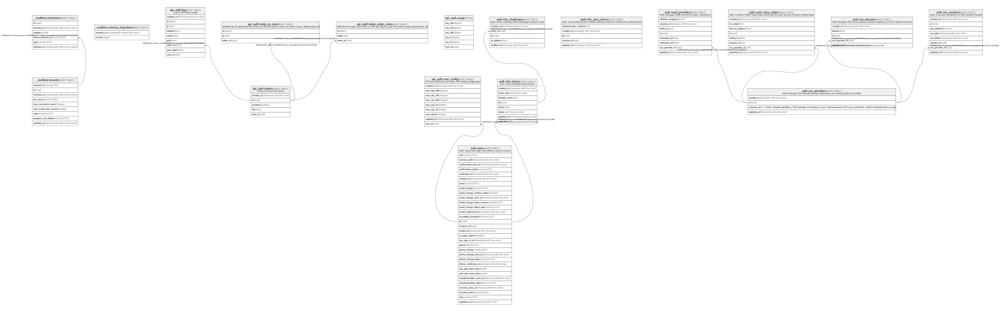

# Dansdata

## Tables

| Name | Columns | Comment | Type |
| ---- | ------- | ------- | ---- |
| [api_auth.log](api_auth.log.md) | 9 | Log for API token usage | BASE TABLE |
| [api_auth.token_ip_rules](api_auth.token_ip_rules.md) | 3 | Whitelist for IP addresses from which an API key may be used. No entries means allowed from all. | BASE TABLE |
| [api_auth.token_origin_rules](api_auth.token_origin_rules.md) | 3 | Whitelist for origins from which an API key may be used. No entries means allowed from all. | BASE TABLE |
| [api_auth.tokens](api_auth.tokens.md) | 5 | Listing of known API tokens | BASE TABLE |
| [api_auth.usage](api_auth.usage.md) | 6 |  | VIEW |
| [api_auth.user_config](api_auth.user_config.md) | 9 | API Key restrictions and other API related configuration | BASE TABLE |
| [auth.users](auth.users.md) | 32 | Auth: Stores user login data within a secure schema. | BASE TABLE |
| [internal.language_translations](internal.language_translations.md) | 4 | Language codes and their names in different languages | BASE TABLE |
| [internal.languages](internal.languages.md) | 1 | List of supported languages | BASE TABLE |
| [internal.profile_owners](internal.profile_owners.md) | 5 | Determines which users may edit and control what profiles | BASE TABLE |
| [internal.profile_translations](internal.profile_translations.md) | 6 | Translated texts relating to a given profile | BASE TABLE |
| [internal.profiles](internal.profiles.md) | 3 | The basic unit of "person, organization, or object" data.  Profiles are related to events, e.g. as organizers, venues, performers, etc. but are not events themselves.  A profile may be owned by multiple users but does not directly represent individual users. | BASE TABLE |

## Stored procedures and functions

| Name | ReturnType | Arguments | Type |
| ---- | ------- | ------- | ---- |
| pgsodium.sodium_base642bin | bytea | base64 text | FUNCTION |
| pgsodium.crypto_sign | bytea | message bytea, key bytea | FUNCTION |
| pgsodium.crypto_sign_open | bytea | signed_message bytea, key bytea | FUNCTION |
| pgsodium.crypto_sign_detached | bytea | message bytea, key bytea | FUNCTION |
| pgsodium.crypto_sign_verify_detached | bool | sig bytea, message bytea, key bytea | FUNCTION |
| pgsodium.crypto_pwhash_saltgen | bytea |  | FUNCTION |
| pgsodium.crypto_pwhash | bytea | password bytea, salt bytea | FUNCTION |
| pgsodium.crypto_pwhash_str | bytea | password bytea | FUNCTION |
| pgsodium.crypto_pwhash_str_verify | bool | hashed_password bytea, password bytea | FUNCTION |
| pgsodium.crypto_box_seal | bytea | message bytea, public_key bytea | FUNCTION |
| pgsodium.crypto_box_seal_open | bytea | ciphertext bytea, public_key bytea, secret_key bytea | FUNCTION |
| pgsodium.crypto_kx_client_session_keys | crypto_kx_session | client_pk bytea, client_sk bytea, server_pk bytea | FUNCTION |
| pgsodium.crypto_kx_server_session_keys | crypto_kx_session | server_pk bytea, server_sk bytea, client_pk bytea | FUNCTION |
| pgsodium.crypto_auth_hmacsha512_keygen | bytea |  | FUNCTION |
| pgsodium.crypto_sign_update_agg | bytea | message bytea | a |
| pgsodium.crypto_sign_update_agg | bytea | state bytea, message bytea | a |
| pgsodium.crypto_box_new_seed | bytea |  | FUNCTION |
| pgsodium.crypto_sign_new_seed | bytea |  | FUNCTION |
| pgsodium.crypto_sign_seed_new_keypair | crypto_sign_keypair | seed bytea | FUNCTION |
| pgsodium.crypto_hash_sha256 | bytea | message bytea | FUNCTION |
| pgsodium.crypto_hash_sha512 | bytea | message bytea | FUNCTION |
| pgsodium.derive_key | bytea | key_id bigint, key_len integer DEFAULT 32, context bytea DEFAULT '\x7067736f6469756d'::bytea | FUNCTION |
| pgsodium.pgsodium_derive | bytea | key_id bigint, key_len integer DEFAULT 32, context bytea DEFAULT decode('pgsodium'::text, 'escape'::text) | FUNCTION |
| pgsodium.randombytes_new_seed | bytea |  | FUNCTION |
| pgsodium.crypto_secretbox_keygen | bytea |  | FUNCTION |
| pgsodium.crypto_auth_keygen | bytea |  | FUNCTION |
| pgsodium.crypto_box_noncegen | bytea |  | FUNCTION |
| pgsodium.crypto_aead_ietf_keygen | bytea |  | FUNCTION |
| pgsodium.crypto_kdf_derive_from_key | bytea | subkey_size bigint, subkey_id bigint, context bytea, primary_key bytea | FUNCTION |
| pgsodium.crypto_shorthash_keygen | bytea |  | FUNCTION |
| pgsodium.crypto_generichash_keygen | bytea |  | FUNCTION |
| pgsodium.crypto_kdf_keygen | bytea |  | FUNCTION |
| pgsodium.crypto_kx_new_keypair | crypto_kx_keypair |  | FUNCTION |
| pgsodium.crypto_kx_new_seed | bytea |  | FUNCTION |
| pgsodium.crypto_kx_seed_new_keypair | crypto_kx_keypair | seed bytea | FUNCTION |
| pgsodium.crypto_auth_hmacsha256_keygen | bytea |  | FUNCTION |
| pgsodium.crypto_box_seed_new_keypair | crypto_box_keypair | seed bytea | FUNCTION |
| pgsodium.crypto_box_new_keypair | crypto_box_keypair |  | FUNCTION |
| pgsodium.crypto_sign_new_keypair | crypto_sign_keypair |  | FUNCTION |
| pgsodium.crypto_secretbox | bytea | message bytea, nonce bytea, key bytea | FUNCTION |
| pgsodium.crypto_secretbox_open | bytea | ciphertext bytea, nonce bytea, key bytea | FUNCTION |
| pgsodium.crypto_auth | bytea | message bytea, key bytea | FUNCTION |
| pgsodium.crypto_auth_verify | bool | mac bytea, message bytea, key bytea | FUNCTION |
| pgsodium.crypto_box | bytea | message bytea, nonce bytea, public bytea, secret bytea | FUNCTION |
| pgsodium.crypto_box_open | bytea | ciphertext bytea, nonce bytea, public bytea, secret bytea | FUNCTION |
| pgsodium.crypto_aead_ietf_encrypt | bytea | message bytea, additional bytea, nonce bytea, key bytea | FUNCTION |
| pgsodium.crypto_aead_ietf_decrypt | bytea | message bytea, additional bytea, nonce bytea, key bytea | FUNCTION |
| pgsodium.crypto_auth_hmacsha256 | bytea | message bytea, secret bytea | FUNCTION |
| pgsodium.crypto_auth_hmacsha256_verify | bool | hash bytea, message bytea, secret bytea | FUNCTION |
| pgsodium.crypto_auth_hmacsha512 | bytea | message bytea, secret bytea | FUNCTION |
| pgsodium.crypto_auth_hmacsha512_verify | bool | hash bytea, message bytea, secret bytea | FUNCTION |
| pgsodium.crypto_sign_init | bytea |  | FUNCTION |
| pgsodium.crypto_sign_update | bytea | state bytea, message bytea | FUNCTION |
| pgsodium.crypto_sign_final_create | bytea | state bytea, key bytea | FUNCTION |
| pgsodium.crypto_sign_final_verify | bool | state bytea, signature bytea, key bytea | FUNCTION |
| pgsodium.crypto_sign_update_agg1 | bytea | state bytea, message bytea | FUNCTION |
| pgsodium.crypto_sign_update_agg2 | bytea | cur_state bytea, initial_state bytea, message bytea | FUNCTION |
| pgsodium.randombytes_random | int4 |  | FUNCTION |
| pgsodium.randombytes_uniform | int4 | upper_bound integer | FUNCTION |
| pgsodium.randombytes_buf | bytea | size integer | FUNCTION |
| pgsodium.randombytes_buf_deterministic | bytea | size integer, seed bytea | FUNCTION |
| pgsodium.crypto_secretbox_noncegen | bytea |  | FUNCTION |
| pgsodium.crypto_aead_ietf_noncegen | bytea |  | FUNCTION |
| pgsodium.crypto_secretbox | bytea | message bytea, nonce bytea, key_id bigint, context bytea DEFAULT '\x7067736f6469756d'::bytea | FUNCTION |
| pgsodium.crypto_secretbox_open | bytea | message bytea, nonce bytea, key_id bigint, context bytea DEFAULT '\x7067736f6469756d'::bytea | FUNCTION |
| pgsodium.crypto_aead_ietf_encrypt | bytea | message bytea, additional bytea, nonce bytea, key_id bigint, context bytea DEFAULT '\x7067736f6469756d'::bytea | FUNCTION |
| pgsodium.crypto_aead_ietf_decrypt | bytea | message bytea, additional bytea, nonce bytea, key_id bigint, context bytea DEFAULT '\x7067736f6469756d'::bytea | FUNCTION |
| pgsodium.crypto_auth | bytea | message bytea, key_id bigint, context bytea DEFAULT '\x7067736f6469756d'::bytea | FUNCTION |
| pgsodium.crypto_auth_verify | bool | mac bytea, message bytea, key_id bigint, context bytea DEFAULT '\x7067736f6469756d'::bytea | FUNCTION |
| pgsodium.crypto_generichash | bytea | message bytea, key bytea DEFAULT NULL::bytea | FUNCTION |
| pgsodium.crypto_shorthash | bytea | message bytea, key bytea | FUNCTION |
| pgsodium.crypto_secretstream_keygen | bytea |  | FUNCTION |
| pgsodium.crypto_stream_xchacha20_keygen | bytea |  | FUNCTION |
| pgsodium.crypto_stream_xchacha20_noncegen | bytea |  | FUNCTION |
| pgsodium.crypto_stream_xchacha20 | bytea | bigint, bytea, bytea | FUNCTION |
| pgsodium.crypto_stream_xchacha20_xor | bytea | bytea, bytea, bytea | FUNCTION |
| pgsodium.crypto_stream_xchacha20_xor_ic | bytea | bytea, bytea, bigint, bytea | FUNCTION |
| pgsodium.crypto_stream_xchacha20 | bytea | bigint, bytea, bigint, context bytea DEFAULT '\x7067736f6469756d'::bytea | FUNCTION |
| pgsodium.sodium_bin2base64 | text | bin bytea | FUNCTION |
| pgsodium.crypto_stream_xchacha20_xor | bytea | bytea, bytea, bigint, context bytea DEFAULT '\x70676f736469756d'::bytea | FUNCTION |
| pgsodium.crypto_stream_xchacha20_xor_ic | bytea | bytea, bytea, bigint, bigint, context bytea DEFAULT '\x7067736f6469756d'::bytea | FUNCTION |
| pgsodium.crypto_cmp | bool | text, text | FUNCTION |
| pgsodium.crypto_generichash | bytea | message bytea, key bigint, context bytea DEFAULT '\x7067736f6469756d'::bytea | FUNCTION |
| pgsodium.crypto_shorthash | bytea | message bytea, key bigint, context bytea DEFAULT '\x7067736f6469756d'::bytea | FUNCTION |
| pgsodium.crypto_auth_hmacsha512 | bytea | message bytea, key_id bigint, context bytea DEFAULT '\x7067736f6469756d'::bytea | FUNCTION |
| pgsodium.crypto_auth_hmacsha512_verify | bool | hash bytea, message bytea, key_id bigint, context bytea DEFAULT '\x7067736f6469756d'::bytea | FUNCTION |
| pgsodium.crypto_auth_hmacsha256 | bytea | message bytea, key_id bigint, context bytea DEFAULT '\x7067736f6469756d'::bytea | FUNCTION |
| pgsodium.crypto_auth_hmacsha256_verify | bool | hash bytea, message bytea, key_id bigint, context bytea DEFAULT '\x7067736f6469756d'::bytea | FUNCTION |
| pgsodium.crypto_signcrypt_new_keypair | crypto_signcrypt_keypair |  | FUNCTION |
| pgsodium.crypto_aead_det_keygen | bytea |  | FUNCTION |
| pgsodium.crypto_signcrypt_sign_before | crypto_signcrypt_state_key | sender bytea, recipient bytea, sender_sk bytea, recipient_pk bytea, additional bytea | FUNCTION |
| pgsodium.crypto_signcrypt_sign_after | bytea | state bytea, sender_sk bytea, ciphertext bytea | FUNCTION |
| pgsodium.crypto_signcrypt_verify_before | crypto_signcrypt_state_key | signature bytea, sender bytea, recipient bytea, additional bytea, sender_pk bytea, recipient_sk bytea | FUNCTION |
| pgsodium.crypto_signcrypt_verify_after | bool | state bytea, signature bytea, sender_pk bytea, ciphertext bytea | FUNCTION |
| pgsodium.crypto_signcrypt_verify_public | bool | signature bytea, sender bytea, recipient bytea, additional bytea, sender_pk bytea, ciphertext bytea | FUNCTION |
| pgsodium.crypto_aead_det_encrypt | bytea | message bytea, additional bytea, key bytea, nonce bytea DEFAULT NULL::bytea | FUNCTION |
| pgsodium.crypto_aead_det_decrypt | bytea | ciphertext bytea, additional bytea, key bytea, nonce bytea DEFAULT NULL::bytea | FUNCTION |
| pgsodium.crypto_aead_det_encrypt | bytea | message bytea, additional bytea, key_id bigint, context bytea DEFAULT '\x7067736f6469756d'::bytea, nonce bytea DEFAULT NULL::bytea | FUNCTION |
| pgsodium.crypto_aead_det_decrypt | bytea | message bytea, additional bytea, key_id bigint, context bytea DEFAULT '\x7067736f6469756d'::bytea, nonce bytea DEFAULT NULL::bytea | FUNCTION |
| pgsodium.version | text |  | FUNCTION |
| pgsodium.create_key | key | comment text DEFAULT NULL::text, key_type pgsodium.key_type DEFAULT 'aead-det'::pgsodium.key_type, key_id bigint DEFAULT NULL::bigint, key_context bytea DEFAULT '\x7067736f6469756d'::bytea, expires timestamp without time zone DEFAULT NULL::timestamp without time zone, user_data jsonb DEFAULT NULL::jsonb | FUNCTION |
| pgsodium.crypto_aead_det_noncegen | bytea |  | FUNCTION |
| pgsodium.crypto_aead_det_encrypt | bytea | message bytea, additional bytea, key_uuid uuid | FUNCTION |
| pgsodium.crypto_aead_det_decrypt | bytea | message bytea, additional bytea, key_uuid uuid | FUNCTION |
| pgsodium.crypto_aead_ietf_encrypt | bytea | message bytea, additional bytea, nonce bytea, key_uuid uuid | FUNCTION |
| pgsodium.crypto_aead_ietf_decrypt | bytea | message bytea, additional bytea, nonce bytea, key_uuid uuid | FUNCTION |
| pgsodium.has_mask | bool | role regrole, source_name text | FUNCTION |
| pgsodium.mask_columns | record | source_relid oid | FUNCTION |
| extensions.armor | text | bytea | FUNCTION |
| pgsodium.create_mask_view | void | relid oid, debug boolean DEFAULT false | FUNCTION |
| pgsodium.trg_mask_update | event_trigger |  | FUNCTION |
| pgsodium.mask_role | void | masked_role regrole, source_name text, view_name text | FUNCTION |
| pgsodium.update_masks | void | debug boolean DEFAULT false | FUNCTION |
| pgsodium.crypto_aead_det_encrypt | bytea | message bytea, additional bytea, key_uuid uuid, nonce bytea | FUNCTION |
| pgsodium.crypto_aead_det_decrypt | bytea | message bytea, additional bytea, key_uuid uuid, nonce bytea | FUNCTION |
| pgsodium.encrypted_columns | text | relid oid | FUNCTION |
| pgsodium.decrypted_columns | text | relid oid | FUNCTION |
| extensions.gin_extract_value_date | internal | date, internal | FUNCTION |
| extensions.gin_compare_prefix_date | int4 | date, date, smallint, internal | FUNCTION |
| extensions.pgp_sym_encrypt | bytea | text, text | FUNCTION |
| extensions.grant_pg_graphql_access | event_trigger |  | FUNCTION |
| extensions.pgrst_ddl_watch | event_trigger |  | FUNCTION |
| extensions.pgrst_drop_watch | event_trigger |  | FUNCTION |
| extensions.pgp_pub_encrypt | bytea | text, bytea, text | FUNCTION |
| extensions.pgp_pub_encrypt_bytea | bytea | bytea, bytea | FUNCTION |
| extensions.set_graphql_placeholder | event_trigger |  | FUNCTION |
| extensions.pgp_pub_encrypt_bytea | bytea | bytea, bytea, text | FUNCTION |
| extensions.pgp_sym_decrypt | text | bytea, text | FUNCTION |
| storage.get_size_by_bucket | record |  | FUNCTION |
| extensions.pgp_sym_decrypt | text | bytea, text, text | FUNCTION |
| extensions.pgp_sym_decrypt_bytea | bytea | bytea, text | FUNCTION |
| extensions.pgp_sym_decrypt_bytea | bytea | bytea, text, text | FUNCTION |
| auth.email | text |  | FUNCTION |
| auth.jwt | jsonb |  | FUNCTION |
| auth.role | text |  | FUNCTION |
| auth.uid | uuid |  | FUNCTION |
| extensions.algorithm_sign | text | signables text, secret text, algorithm text | FUNCTION |
| extensions.armor | text | bytea, text[], text[] | FUNCTION |
| extensions.crypt | text | text, text | FUNCTION |
| extensions.dearmor | bytea | text | FUNCTION |
| extensions.decrypt | bytea | bytea, bytea, text | FUNCTION |
| extensions.decrypt_iv | bytea | bytea, bytea, bytea, text | FUNCTION |
| extensions.digest | bytea | bytea, text | FUNCTION |
| extensions.digest | bytea | text, text | FUNCTION |
| extensions.encrypt | bytea | bytea, bytea, text | FUNCTION |
| extensions.encrypt_iv | bytea | bytea, bytea, bytea, text | FUNCTION |
| extensions.gen_random_bytes | bytea | integer | FUNCTION |
| extensions.gen_random_uuid | uuid |  | FUNCTION |
| extensions.gen_salt | text | text | FUNCTION |
| extensions.gen_salt | text | text, integer | FUNCTION |
| storage.update_updated_at_column | trigger |  | FUNCTION |
| extensions.grant_pg_cron_access | event_trigger |  | FUNCTION |
| extensions.grant_pg_net_access | event_trigger |  | FUNCTION |
| extensions.hmac | bytea | bytea, bytea, text | FUNCTION |
| extensions.hmac | bytea | text, text, text | FUNCTION |
| extensions.pg_stat_statements | record | showtext boolean, OUT userid oid, OUT dbid oid, OUT toplevel boolean, OUT queryid bigint, OUT query text, OUT plans bigint, OUT total_plan_time double precision, OUT min_plan_time double precision, OUT max_plan_time double precision, OUT mean_plan_time double precision, OUT stddev_plan_time double precision, OUT calls bigint, OUT total_exec_time double precision, OUT min_exec_time double precision, OUT max_exec_time double precision, OUT mean_exec_time double precision, OUT stddev_exec_time double precision, OUT rows bigint, OUT shared_blks_hit bigint, OUT shared_blks_read bigint, OUT shared_blks_dirtied bigint, OUT shared_blks_written bigint, OUT local_blks_hit bigint, OUT local_blks_read bigint, OUT local_blks_dirtied bigint, OUT local_blks_written bigint, OUT temp_blks_read bigint, OUT temp_blks_written bigint, OUT blk_read_time double precision, OUT blk_write_time double precision, OUT wal_records bigint, OUT wal_fpi bigint, OUT wal_bytes numeric | FUNCTION |
| extensions.pg_stat_statements_info | record | OUT dealloc bigint, OUT stats_reset timestamp with time zone | FUNCTION |
| extensions.pg_stat_statements_reset | void | userid oid DEFAULT 0, dbid oid DEFAULT 0, queryid bigint DEFAULT 0 | FUNCTION |
| extensions.pgp_armor_headers | record | text, OUT key text, OUT value text | FUNCTION |
| extensions.pgp_key_id | text | bytea | FUNCTION |
| extensions.pgp_pub_decrypt | text | bytea, bytea | FUNCTION |
| extensions.pgp_pub_decrypt | text | bytea, bytea, text | FUNCTION |
| extensions.pgp_pub_decrypt | text | bytea, bytea, text, text | FUNCTION |
| extensions.pgp_pub_decrypt_bytea | bytea | bytea, bytea | FUNCTION |
| extensions.pgp_pub_decrypt_bytea | bytea | bytea, bytea, text | FUNCTION |
| extensions.pgp_pub_decrypt_bytea | bytea | bytea, bytea, text, text | FUNCTION |
| extensions.pgp_pub_encrypt | bytea | text, bytea | FUNCTION |
| extensions.pgp_sym_encrypt | bytea | text, text, text | FUNCTION |
| extensions.pgp_sym_encrypt_bytea | bytea | bytea, text | FUNCTION |
| extensions.pgp_sym_encrypt_bytea | bytea | bytea, text, text | FUNCTION |
| extensions.sign | text | payload json, secret text, algorithm text DEFAULT 'HS256'::text | FUNCTION |
| extensions.try_cast_double | float8 | inp text | FUNCTION |
| extensions.url_decode | bytea | data text | FUNCTION |
| extensions.url_encode | text | data bytea | FUNCTION |
| extensions.uuid_generate_v1 | uuid |  | FUNCTION |
| extensions.uuid_generate_v1mc | uuid |  | FUNCTION |
| extensions.uuid_generate_v3 | uuid | namespace uuid, name text | FUNCTION |
| extensions.uuid_generate_v4 | uuid |  | FUNCTION |
| extensions.uuid_generate_v5 | uuid | namespace uuid, name text | FUNCTION |
| extensions.uuid_nil | uuid |  | FUNCTION |
| extensions.uuid_ns_dns | uuid |  | FUNCTION |
| extensions.uuid_ns_oid | uuid |  | FUNCTION |
| extensions.uuid_ns_url | uuid |  | FUNCTION |
| extensions.uuid_ns_x500 | uuid |  | FUNCTION |
| extensions.verify | record | token text, secret text, algorithm text DEFAULT 'HS256'::text | FUNCTION |
| pgbouncer.get_auth | record | p_usename text | FUNCTION |
| realtime.apply_rls | wal_rls | wal jsonb, max_record_bytes integer DEFAULT (1024 * 1024) | FUNCTION |
| realtime.build_prepared_statement_sql | text | prepared_statement_name text, entity regclass, columns realtime.wal_column[] | FUNCTION |
| realtime.cast | jsonb | val text, type_ regtype | FUNCTION |
| realtime.check_equality_op | bool | op realtime.equality_op, type_ regtype, val_1 text, val_2 text | FUNCTION |
| realtime.is_visible_through_filters | bool | columns realtime.wal_column[], filters realtime.user_defined_filter[] | FUNCTION |
| realtime.quote_wal2json | text | entity regclass | FUNCTION |
| realtime.subscription_check_filters | trigger |  | FUNCTION |
| realtime.to_regrole | regrole | role_name text | FUNCTION |
| storage.extension | text | name text | FUNCTION |
| storage.filename | text | name text | FUNCTION |
| storage.foldername | _text | name text | FUNCTION |
| graphql.rebuild_types | void |  | FUNCTION |
| extensions.gin_extract_query_date | internal | date, internal, smallint, internal, internal | FUNCTION |
| extensions.gin_extract_value_interval | internal | interval, internal | FUNCTION |
| extensions.gin_compare_prefix_interval | int4 | interval, interval, smallint, internal | FUNCTION |
| extensions.gin_extract_query_interval | internal | interval, internal, smallint, internal, internal | FUNCTION |
| extensions.gin_extract_value_macaddr | internal | macaddr, internal | FUNCTION |
| extensions.gin_compare_prefix_macaddr | int4 | macaddr, macaddr, smallint, internal | FUNCTION |
| extensions.gin_extract_query_macaddr | internal | macaddr, internal, smallint, internal, internal | FUNCTION |
| extensions.gin_extract_value_inet | internal | inet, internal | FUNCTION |
| extensions.gin_compare_prefix_inet | int4 | inet, inet, smallint, internal | FUNCTION |
| extensions.gin_extract_query_inet | internal | inet, internal, smallint, internal, internal | FUNCTION |
| extensions.gin_extract_value_cidr | internal | cidr, internal | FUNCTION |
| extensions.gin_compare_prefix_cidr | int4 | cidr, cidr, smallint, internal | FUNCTION |
| extensions.gin_extract_query_cidr | internal | cidr, internal, smallint, internal, internal | FUNCTION |
| extensions.gin_extract_value_text | internal | text, internal | FUNCTION |
| extensions.gin_compare_prefix_text | int4 | text, text, smallint, internal | FUNCTION |
| extensions.gin_extract_query_text | internal | text, internal, smallint, internal, internal | FUNCTION |
| extensions.gin_extract_value_char | internal | "char", internal | FUNCTION |
| extensions.gin_compare_prefix_char | int4 | "char", "char", smallint, internal | FUNCTION |
| extensions.gin_extract_query_char | internal | "char", internal, smallint, internal, internal | FUNCTION |
| extensions.gin_extract_value_bytea | internal | bytea, internal | FUNCTION |
| extensions.gin_compare_prefix_bytea | int4 | bytea, bytea, smallint, internal | FUNCTION |
| extensions.gin_extract_query_bytea | internal | bytea, internal, smallint, internal, internal | FUNCTION |
| extensions.gin_extract_value_bit | internal | bit, internal | FUNCTION |
| extensions.gin_compare_prefix_bit | int4 | bit, bit, smallint, internal | FUNCTION |
| extensions.gin_extract_query_bit | internal | bit, internal, smallint, internal, internal | FUNCTION |
| extensions.gin_extract_value_varbit | internal | bit varying, internal | FUNCTION |
| extensions.gin_compare_prefix_varbit | int4 | bit varying, bit varying, smallint, internal | FUNCTION |
| extensions.gin_extract_query_varbit | internal | bit varying, internal, smallint, internal, internal | FUNCTION |
| extensions.gin_extract_value_numeric | internal | numeric, internal | FUNCTION |
| extensions.gin_compare_prefix_numeric | int4 | numeric, numeric, smallint, internal | FUNCTION |
| extensions.gin_extract_query_numeric | internal | numeric, internal, smallint, internal, internal | FUNCTION |
| extensions.gin_numeric_cmp | int4 | numeric, numeric | FUNCTION |
| extensions.gin_extract_value_macaddr8 | internal | macaddr8, internal | FUNCTION |
| graphql.is_variable | bool | field jsonb | FUNCTION |
| graphql.name_literal | text | ast jsonb | FUNCTION |
| graphql_public.graphql | jsonb | "operationName" text DEFAULT NULL::text, query text DEFAULT NULL::text, variables jsonb DEFAULT NULL::jsonb, extensions jsonb DEFAULT NULL::jsonb | FUNCTION |
| graphql.comment | text | regclass | FUNCTION |
| graphql.comment | text | regtype | FUNCTION |
| graphql.comment | text | regproc | FUNCTION |
| graphql.comment | text | regnamespace | FUNCTION |
| graphql.jsonb_coalesce | jsonb | val jsonb, default_ jsonb | FUNCTION |
| graphql.arg_coerce_list | jsonb | arg jsonb | FUNCTION |
| graphql.comment | text | regclass, column_name text | FUNCTION |
| graphql.comment_directive_inflect_names | bool | regnamespace | FUNCTION |
| graphql.jsonb_unnest_recursive_with_jsonpath | record | obj jsonb | FUNCTION |
| graphql.slug | text |  | FUNCTION |
| graphql._first_agg | anyelement | anyelement, anyelement | FUNCTION |
| graphql.first | anyelement | anyelement | a |
| graphql.is_array | bool | regtype | FUNCTION |
| graphql.is_composite | bool | regtype | FUNCTION |
| graphql.is_literal | bool | field jsonb | FUNCTION |
| graphql.primary_key_columns | _text | entity regclass | FUNCTION |
| graphql.primary_key_types | _regtype | entity regclass | FUNCTION |
| graphql.column_set_is_unique | bool | regclass, columns text[] | FUNCTION |
| graphql.to_type_name | text | regtype | FUNCTION |
| graphql.to_function_name | text | regproc | FUNCTION |
| graphql.to_regclass | regclass | schema_ text, name_ text | FUNCTION |
| graphql.to_table_name | text | regclass | FUNCTION |
| graphql.to_camel_case | text | text | FUNCTION |
| graphql.alias_or_name_literal | text | field jsonb | FUNCTION |
| graphql.arg_to_jsonb | jsonb | arg jsonb, variables jsonb DEFAULT '{}'::jsonb | FUNCTION |
| graphql.comment_directive | jsonb | comment_ text | FUNCTION |
| graphql.ast_pass_fragments | jsonb | ast jsonb, fragment_defs jsonb DEFAULT '{}'::jsonb | FUNCTION |
| graphql.ast_pass_strip_loc | jsonb | body jsonb | FUNCTION |
| graphql.parse | parse_result | text | FUNCTION |
| graphql.value_literal | text | ast jsonb | FUNCTION |
| graphql.value_literal_is_null | bool | ast jsonb | FUNCTION |
| graphql.exception | text | message text | FUNCTION |
| graphql.exception_required_argument | text | arg_name text | FUNCTION |
| graphql.exception_unknown_field | text | field_name text, type_name text | FUNCTION |
| graphql.exception_unknown_field | text | field_name text | FUNCTION |
| graphql.reverse | _column_order_w_type | column_orders graphql.column_order_w_type[] | FUNCTION |
| graphql.to_cursor_clause | text | alias_name text, column_orders graphql.column_order_w_type[] | FUNCTION |
| graphql.encode | text | jsonb | FUNCTION |
| graphql.decode | jsonb | text | FUNCTION |
| graphql.cursor_where_clause | text | block_name text, column_orders graphql.column_order_w_type[], cursor_ text, cursor_var_ix integer, depth_ integer DEFAULT 1 | FUNCTION |
| graphql.comment_directive_name | text | regclass | FUNCTION |
| graphql.comment_directive_totalcount_enabled | bool | regclass | FUNCTION |
| graphql.comment_directive_name | text | regclass, column_name text | FUNCTION |
| graphql.comment_directive_name | text | regtype | FUNCTION |
| graphql.comment_directive_name | text | regproc | FUNCTION |
| graphql.inflect_type_default | text | text | FUNCTION |
| graphql.type_name | text | rec graphql._type | FUNCTION |
| graphql.type_name | text | type_id integer | FUNCTION |
| graphql.type_name | text | regclass, graphql.meta_kind | FUNCTION |
| graphql.set_type_name | trigger |  | FUNCTION |
| graphql.sql_type_to_graphql_type | text | regtype | FUNCTION |
| graphql.type_id | int4 | regtype | FUNCTION |
| graphql.field_name_for_column | text | entity regclass, column_name text | FUNCTION |
| graphql.lowercase_first_letter | text | text | FUNCTION |
| graphql.field_name_for_to_many | text | foreign_entity regclass, foreign_name_override text | FUNCTION |
| graphql.field_name_for_query_collection | text | entity regclass | FUNCTION |
| graphql.prepared_statement_exists | bool | statement_name text | FUNCTION |
| graphql.build_insert | text | ast jsonb, variable_definitions jsonb DEFAULT '[]'::jsonb, variables jsonb DEFAULT '{}'::jsonb | FUNCTION |
| graphql.field_name_for_to_one | text | foreign_entity regclass, foreign_name_override text, foreign_columns text[] | FUNCTION |
| graphql.field_name_for_function | text | func regproc | FUNCTION |
| graphql.field_name | text | rec graphql._field | FUNCTION |
| graphql.set_field_name | trigger |  | FUNCTION |
| graphql.type_id | int4 | type_name text | FUNCTION |
| graphql.type_id | int4 | graphql.meta_kind | FUNCTION |
| graphql.rebuild_fields | void |  | FUNCTION |
| graphql.arg_index | int4 | arg_name text, variable_definitions jsonb | FUNCTION |
| graphql.get_arg_by_name | jsonb | name text, arguments jsonb | FUNCTION |
| graphql.arg_clause | text | name text, arguments jsonb, variable_definitions jsonb, entity regclass, default_value text DEFAULT NULL::text | FUNCTION |
| api_auth.handle_deleted_user | trigger |  | FUNCTION |
| graphql.join_clause | text | local_columns text[], local_alias_name text, parent_columns text[], parent_alias_name text | FUNCTION |
| graphql.primary_key_clause | text | entity regclass, alias_name text | FUNCTION |
| graphql.order_by_clause | text | alias_name text, column_orders graphql.column_order_w_type[] | FUNCTION |
| graphql.order_by_enum_to_clause | text | order_by_enum_val text | FUNCTION |
| graphql.to_column_orders | _column_order_w_type | order_by_arg jsonb, entity regclass, variables jsonb DEFAULT '{}'::jsonb | FUNCTION |
| graphql.text_to_comparison_op | comparison_op | text | FUNCTION |
| graphql.where_clause | text | filter_arg jsonb, entity regclass, alias_name text, variables jsonb DEFAULT '{}'::jsonb, variable_definitions jsonb DEFAULT '{}'::jsonb | FUNCTION |
| graphql.build_connection_query | text | ast jsonb, variable_definitions jsonb DEFAULT '[]'::jsonb, variables jsonb DEFAULT '{}'::jsonb, parent_type text DEFAULT NULL::text, parent_block_name text DEFAULT NULL::text | FUNCTION |
| graphql.build_delete | text | ast jsonb, variable_definitions jsonb DEFAULT '[]'::jsonb, variables jsonb DEFAULT '{}'::jsonb | FUNCTION |
| graphql.build_heartbeat_query | text | ast jsonb | FUNCTION |
| extensions.gtrgm_same | internal | gtrgm, gtrgm, internal | FUNCTION |
| graphql.argument_value_by_name | text | name text, ast jsonb | FUNCTION |
| graphql.build_node_query | text | ast jsonb, variable_definitions jsonb DEFAULT '[]'::jsonb, variables jsonb DEFAULT '{}'::jsonb, parent_type text DEFAULT NULL::text, parent_block_name text DEFAULT NULL::text | FUNCTION |
| graphql.build_update | text | ast jsonb, variable_definitions jsonb DEFAULT '[]'::jsonb, variables jsonb DEFAULT '{}'::jsonb | FUNCTION |
| graphql.build_enum_values_query | text | ast jsonb, type_block_name text | FUNCTION |
| graphql.build_field_on_type_query | text | ast jsonb, type_block_name text, variable_definitions jsonb DEFAULT '[]'::jsonb, variables jsonb DEFAULT '{}'::jsonb, is_input_fields boolean DEFAULT false | FUNCTION |
| graphql.build_args_on_field_query | text | ast jsonb, field_block_name text, variable_definitions jsonb DEFAULT '[]'::jsonb, variables jsonb DEFAULT '{}'::jsonb | FUNCTION |
| extensions.gin_extract_value_trgm | internal | text, internal | FUNCTION |
| extensions.gin_extract_query_trgm | internal | text, internal, smallint, internal, internal, internal, internal | FUNCTION |
| graphql.resolve | jsonb | query text DEFAULT NULL::text, variables jsonb DEFAULT '{}'::jsonb, "operationName" text DEFAULT NULL::text, extensions jsonb DEFAULT NULL::jsonb | FUNCTION |
| graphql.build_schema_query | text | ast jsonb, variable_definitions jsonb DEFAULT '[]'::jsonb, variables jsonb DEFAULT '{}'::jsonb | FUNCTION |
| graphql.build_type_query_core_selects | text | ast jsonb, block_name text | FUNCTION |
| graphql.build_type_query_wrapper_selects | text | ast jsonb, kind text, of_type_selects text | FUNCTION |
| graphql.build_type_query_in_field_context | text | ast jsonb, field_block_name text | FUNCTION |
| graphql.cache_key | text | role regrole, schemas text[], schema_version integer, ast jsonb, variables jsonb, variable_definitions jsonb | FUNCTION |
| graphql.cache_key_variable_component | text | variables jsonb DEFAULT '{}'::jsonb, variable_definitions jsonb DEFAULT '[]'::jsonb | FUNCTION |
| extensions.gin_trgm_consistent | bool | internal, smallint, text, integer, internal, internal, internal, internal | FUNCTION |
| extensions.gin_trgm_triconsistent | char | internal, smallint, text, integer, internal, internal, internal | FUNCTION |
| graphql.prepared_statement_create_clause | text | statement_name text, variable_definitions jsonb, query_ text | FUNCTION |
| graphql.prepared_statement_execute_clause | text | statement_name text, variable_definitions jsonb, variables jsonb | FUNCTION |
| graphql.variable_definitions_sort | jsonb | variable_definitions jsonb | FUNCTION |
| graphql.get_built_schema_version | int4 |  | FUNCTION |
| graphql.rebuild_schema | void |  | FUNCTION |
| graphql.rebuild_on_ddl | event_trigger |  | FUNCTION |
| graphql.rebuild_on_drop | event_trigger |  | FUNCTION |
| storage.search | record | prefix text, bucketname text, limits integer DEFAULT 100, levels integer DEFAULT 1, offsets integer DEFAULT 0, search text DEFAULT ''::text, sortcolumn text DEFAULT 'name'::text, sortorder text DEFAULT 'asc'::text | FUNCTION |
| extensions.strict_word_similarity | float4 | text, text | FUNCTION |
| extensions.strict_word_similarity_op | bool | text, text | FUNCTION |
| api_auth.new_api_token | text | user_id uuid, title text | FUNCTION |
| api_auth.tid | uuid |  | FUNCTION |
| api_auth.check_token_revocation | void |  | FUNCTION |
| api_auth.clean_log | void |  | FUNCTION |
| extensions.http_set_curlopt | bool | curlopt character varying, value character varying | FUNCTION |
| extensions.http_reset_curlopt | bool |  | FUNCTION |
| extensions.http_header | http_header | field character varying, value character varying | FUNCTION |
| extensions.http | http_response | request http_request | FUNCTION |
| extensions.http_get | http_response | uri character varying | FUNCTION |
| extensions.http_post | http_response | uri character varying, content character varying, content_type character varying | FUNCTION |
| extensions.http_put | http_response | uri character varying, content character varying, content_type character varying | FUNCTION |
| extensions.http_patch | http_response | uri character varying, content character varying, content_type character varying | FUNCTION |
| extensions.http_delete | http_response | uri character varying | FUNCTION |
| extensions.http_head | http_response | uri character varying | FUNCTION |
| extensions.urlencode | text | string character varying | FUNCTION |
| extensions.strict_word_similarity_commutator_op | bool | text, text | FUNCTION |
| extensions.strict_word_similarity_dist_op | float4 | text, text | FUNCTION |
| public.api_auth_log_request | void | method text, path text, user_agent text, origin text, ip text | FUNCTION |
| extensions.strict_word_similarity_dist_commutator_op | float4 | text, text | FUNCTION |
| extensions.gtrgm_options | void | internal | FUNCTION |
| extensions.gin_btree_consistent | bool | internal, smallint, anyelement, integer, internal, internal | FUNCTION |
| extensions.gin_extract_value_int2 | internal | smallint, internal | FUNCTION |
| extensions.gin_compare_prefix_int2 | int4 | smallint, smallint, smallint, internal | FUNCTION |
| extensions.gin_extract_query_int2 | internal | smallint, internal, smallint, internal, internal | FUNCTION |
| extensions.gin_extract_value_int4 | internal | integer, internal | FUNCTION |
| extensions.gin_compare_prefix_int4 | int4 | integer, integer, smallint, internal | FUNCTION |
| extensions.gin_extract_query_int4 | internal | integer, internal, smallint, internal, internal | FUNCTION |
| extensions.gin_extract_value_int8 | internal | bigint, internal | FUNCTION |
| extensions.gin_compare_prefix_int8 | int4 | bigint, bigint, smallint, internal | FUNCTION |
| extensions.gin_extract_query_int8 | internal | bigint, internal, smallint, internal, internal | FUNCTION |
| extensions.gin_extract_value_float4 | internal | real, internal | FUNCTION |
| extensions.gin_compare_prefix_float4 | int4 | real, real, smallint, internal | FUNCTION |
| extensions.gin_extract_query_float4 | internal | real, internal, smallint, internal, internal | FUNCTION |
| extensions.gin_extract_value_float8 | internal | double precision, internal | FUNCTION |
| api_auth.send_log_api_request | void |  | FUNCTION |
| api_auth.handle_new_user | trigger |  | FUNCTION |
| extensions.moddatetime | trigger |  | FUNCTION |
| api_auth.check_usage_limit_rules | void |  | FUNCTION |
| extensions.gin_compare_prefix_float8 | int4 | double precision, double precision, smallint, internal | FUNCTION |
| extensions.gin_extract_query_float8 | internal | double precision, internal, smallint, internal, internal | FUNCTION |
| extensions.gin_extract_value_money | internal | money, internal | FUNCTION |
| extensions.gin_compare_prefix_money | int4 | money, money, smallint, internal | FUNCTION |
| extensions.gin_extract_query_money | internal | money, internal, smallint, internal, internal | FUNCTION |
| extensions.gin_extract_value_oid | internal | oid, internal | FUNCTION |
| extensions.gin_compare_prefix_oid | int4 | oid, oid, smallint, internal | FUNCTION |
| extensions.gin_extract_query_oid | internal | oid, internal, smallint, internal, internal | FUNCTION |
| extensions.gin_extract_value_timestamp | internal | timestamp without time zone, internal | FUNCTION |
| extensions.gin_compare_prefix_timestamp | int4 | timestamp without time zone, timestamp without time zone, smallint, internal | FUNCTION |
| extensions.gin_extract_query_timestamp | internal | timestamp without time zone, internal, smallint, internal, internal | FUNCTION |
| extensions.gin_extract_value_timestamptz | internal | timestamp with time zone, internal | FUNCTION |
| extensions.gin_compare_prefix_timestamptz | int4 | timestamp with time zone, timestamp with time zone, smallint, internal | FUNCTION |
| extensions.gin_extract_query_timestamptz | internal | timestamp with time zone, internal, smallint, internal, internal | FUNCTION |
| extensions.gin_extract_value_time | internal | time without time zone, internal | FUNCTION |
| extensions.gin_compare_prefix_time | int4 | time without time zone, time without time zone, smallint, internal | FUNCTION |
| extensions.gin_extract_query_time | internal | time without time zone, internal, smallint, internal, internal | FUNCTION |
| extensions.gin_extract_value_timetz | internal | time with time zone, internal | FUNCTION |
| extensions.gin_compare_prefix_timetz | int4 | time with time zone, time with time zone, smallint, internal | FUNCTION |
| extensions.gin_extract_query_timetz | internal | time with time zone, internal, smallint, internal, internal | FUNCTION |
| api_auth.check_ip_rules | void |  | FUNCTION |
| api_auth.check_origin_rules | void |  | FUNCTION |
| api_auth.validate_token | void |  | FUNCTION |
| extensions.set_limit | float4 | real | FUNCTION |
| extensions.show_limit | float4 |  | FUNCTION |
| extensions.show_trgm | _text | text | FUNCTION |
| extensions.similarity | float4 | text, text | FUNCTION |
| extensions.similarity_op | bool | text, text | FUNCTION |
| extensions.word_similarity | float4 | text, text | FUNCTION |
| extensions.word_similarity_op | bool | text, text | FUNCTION |
| extensions.word_similarity_commutator_op | bool | text, text | FUNCTION |
| extensions.similarity_dist | float4 | text, text | FUNCTION |
| extensions.word_similarity_dist_op | float4 | text, text | FUNCTION |
| extensions.word_similarity_dist_commutator_op | float4 | text, text | FUNCTION |
| extensions.gtrgm_in | gtrgm | cstring | FUNCTION |
| extensions.gtrgm_out | cstring | gtrgm | FUNCTION |
| extensions.gtrgm_consistent | bool | internal, text, smallint, oid, internal | FUNCTION |
| extensions.gtrgm_distance | float8 | internal, text, smallint, oid, internal | FUNCTION |
| extensions.gtrgm_compress | internal | internal | FUNCTION |
| extensions.gtrgm_decompress | internal | internal | FUNCTION |
| extensions.gtrgm_penalty | internal | internal, internal, internal | FUNCTION |
| extensions.gtrgm_picksplit | internal | internal, internal | FUNCTION |
| extensions.gtrgm_union | gtrgm | internal, internal | FUNCTION |
| extensions.gin_compare_prefix_macaddr8 | int4 | macaddr8, macaddr8, smallint, internal | FUNCTION |
| extensions.gin_extract_query_macaddr8 | internal | macaddr8, internal, smallint, internal, internal | FUNCTION |
| extensions.gin_extract_value_anyenum | internal | anyenum, internal | FUNCTION |
| extensions.gin_compare_prefix_anyenum | int4 | anyenum, anyenum, smallint, internal | FUNCTION |
| extensions.gin_extract_query_anyenum | internal | anyenum, internal, smallint, internal, internal | FUNCTION |
| extensions.gin_enum_cmp | int4 | anyenum, anyenum | FUNCTION |
| extensions.gin_extract_value_uuid | internal | uuid, internal | FUNCTION |
| extensions.gin_compare_prefix_uuid | int4 | uuid, uuid, smallint, internal | FUNCTION |
| extensions.gin_extract_query_uuid | internal | uuid, internal, smallint, internal, internal | FUNCTION |
| extensions.gin_extract_value_name | internal | name, internal | FUNCTION |
| extensions.gin_compare_prefix_name | int4 | name, name, smallint, internal | FUNCTION |
| extensions.gin_extract_query_name | internal | name, internal, smallint, internal, internal | FUNCTION |
| extensions.gin_extract_value_bool | internal | boolean, internal | FUNCTION |
| extensions.gin_compare_prefix_bool | int4 | boolean, boolean, smallint, internal | FUNCTION |
| extensions.gin_extract_query_bool | internal | boolean, internal, smallint, internal, internal | FUNCTION |
| extensions.gin_extract_value_bpchar | internal | character, internal | FUNCTION |
| extensions.gin_compare_prefix_bpchar | int4 | character, character, smallint, internal | FUNCTION |
| extensions.gin_extract_query_bpchar | internal | character, internal, smallint, internal, internal | FUNCTION |

## Relations

---

> Generated by [tbls](https://github.com/k1LoW/tbls)
