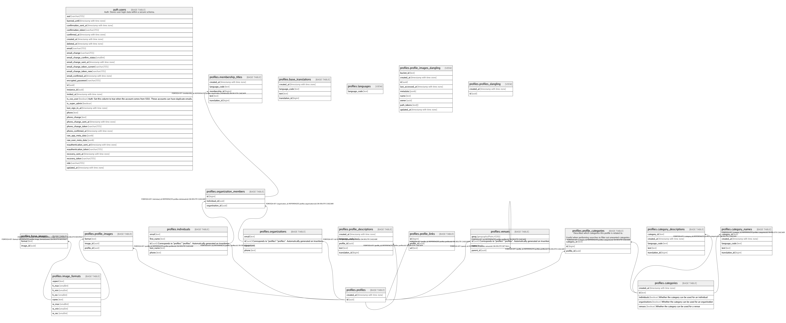

# Dansdata

## Tables

| Name | Columns | Comment | Type |
| ---- | ------- | ------- | ---- |
| [api_auth.log](api_auth.log.md) | 9 | Log for API token usage | BASE TABLE |
| [api_auth.token_ip_rules](api_auth.token_ip_rules.md) | 3 | Whitelist for IP addresses from which an API key may be used. No entries means allowed from all. | BASE TABLE |
| [api_auth.token_origin_rules](api_auth.token_origin_rules.md) | 3 | Whitelist for origins from which an API key may be used. No entries means allowed from all. | BASE TABLE |
| [api_auth.tokens](api_auth.tokens.md) | 5 | Listing of known API tokens | BASE TABLE |
| [api_auth.usage](api_auth.usage.md) | 6 |  | VIEW |
| [api_auth.user_config](api_auth.user_config.md) | 9 | API Key restrictions and other API related configuration | BASE TABLE |
| [auth.users](auth.users.md) | 32 | Auth: Stores user login data within a secure schema. | BASE TABLE |
| [internal.association_translations](internal.association_translations.md) | 5 | Localized texts to describe a given association in a human-readable way | BASE TABLE |
| [internal.associations](internal.associations.md) | 2 | Listing of the different ways a profile may be associated with an event_slot | BASE TABLE |
| [internal.countries](internal.countries.md) | 2 |  | BASE TABLE |
| [internal.country_translations](internal.country_translations.md) | 4 | Localized texts to describe a given country in a human-readable way | BASE TABLE |
| [internal.event_group_translations](internal.event_group_translations.md) | 6 | Translated texts relating to a given event group | BASE TABLE |
| [internal.event_groups](internal.event_groups.md) | 4 | A grouping of event_slots within an event.  "event" is a top-level abstraction, typically symbolizing the entirety of e.g. "Dansbandveckan i Malung".  An event can be split into groups, typically symbolizing e.g. the day, a group of people or something else. It is up to the event organizer to create appropriate groupings for their specific event.  Each group in the event can be further subdivided into individual "slots". The slot symbolizes an individual e.g. dance or course session. | BASE TABLE |
| [internal.event_organizers](internal.event_organizers.md) | 5 | Determines which profiles are considered organizers of a given event.  Any user that is considered an owner of an organizing profile may edit the event in question.  Example:  "John" creates an event and adds the "Phantastico" band profile as an organizer. Since "Jane" is one of the `profile_owners` for the "Phantastico" band, she also receives edit access | BASE TABLE |
| [internal.event_slot_profile_associations](internal.event_slot_profile_associations.md) | 5 | Relates profiles to event slots. | BASE TABLE |
| [internal.event_slot_translations](internal.event_slot_translations.md) | 6 | Translated texts relating to a given event slot | BASE TABLE |
| [internal.event_slots](internal.event_slots.md) | 6 | An atomic unit within an event, e.g. a single course session or dance.  "event" is a top-level abstraction, typically symbolizing the entirety of e.g. "Dansbandveckan i Malung".  An event can be split into groups, typically symbolizing e.g. the day, a group of people or something else. It is up to the event organizer to create appropriate groupings for their specific event.  Each group in the event can be further subdivided into individual "slots". The slot symbolizes an individual e.g. dance or course session. | BASE TABLE |
| [internal.event_translations](internal.event_translations.md) | 6 | Translated texts relating to a given event | BASE TABLE |
| [internal.events](internal.events.md) | 5 | A collection of event_groups, in turn containing individual event_slots.  "event" is a top-level abstraction, typically symbolizing the entirety of e.g. "Dansbandveckan i Malung".  An event can be split into groups, typically symbolizing e.g. the day, a group of people or something else. It is up to the event organizer to create appropriate groupings for their specific event.  Each group in the event can be further subdivided into individual "slots". The slot symbolizes an individual e.g. dance or course session. | BASE TABLE |
| [internal.geo_locations](internal.geo_locations.md) | 7 |  | BASE TABLE |
| [internal.language_translations](internal.language_translations.md) | 4 | Language codes and their names in different languages | BASE TABLE |
| [internal.languages](internal.languages.md) | 1 | List of supported languages | BASE TABLE |
| [internal.profile_owners](internal.profile_owners.md) | 5 | Determines which users may edit and control what profiles | BASE TABLE |
| [internal.profile_translations](internal.profile_translations.md) | 6 | Translated texts relating to a given profile | BASE TABLE |
| [internal.profiles](internal.profiles.md) | 3 | The basic unit of "person, organization, or object" data.  Profiles are related to events, e.g. as organizers, venues, performers, etc. but are not events themselves.  A profile may be owned by multiple users but does not directly represent individual users. | BASE TABLE |

## Stored procedures and functions

| Name | ReturnType | Arguments | Type |
| ---- | ------- | ------- | ---- |
| pgsodium.sodium_base642bin | bytea | base64 text | FUNCTION |
| pgsodium.crypto_sign | bytea | message bytea, key bytea | FUNCTION |
| pgsodium.crypto_sign_open | bytea | signed_message bytea, key bytea | FUNCTION |
| pgsodium.crypto_sign_detached | bytea | message bytea, key bytea | FUNCTION |
| pgsodium.crypto_sign_verify_detached | bool | sig bytea, message bytea, key bytea | FUNCTION |
| pgsodium.crypto_pwhash_saltgen | bytea |  | FUNCTION |
| pgsodium.crypto_pwhash | bytea | password bytea, salt bytea | FUNCTION |
| pgsodium.crypto_pwhash_str | bytea | password bytea | FUNCTION |
| pgsodium.crypto_pwhash_str_verify | bool | hashed_password bytea, password bytea | FUNCTION |
| pgsodium.crypto_box_seal | bytea | message bytea, public_key bytea | FUNCTION |
| pgsodium.crypto_box_seal_open | bytea | ciphertext bytea, public_key bytea, secret_key bytea | FUNCTION |
| pgsodium.crypto_kx_client_session_keys | crypto_kx_session | client_pk bytea, client_sk bytea, server_pk bytea | FUNCTION |
| pgsodium.crypto_kx_server_session_keys | crypto_kx_session | server_pk bytea, server_sk bytea, client_pk bytea | FUNCTION |
| pgsodium.crypto_auth_hmacsha512_keygen | bytea |  | FUNCTION |
| pgsodium.crypto_sign_update_agg | bytea | message bytea | a |
| pgsodium.crypto_sign_update_agg | bytea | state bytea, message bytea | a |
| pgsodium.crypto_box_new_seed | bytea |  | FUNCTION |
| pgsodium.crypto_sign_new_seed | bytea |  | FUNCTION |
| pgsodium.crypto_sign_seed_new_keypair | crypto_sign_keypair | seed bytea | FUNCTION |
| pgsodium.crypto_hash_sha256 | bytea | message bytea | FUNCTION |
| pgsodium.crypto_hash_sha512 | bytea | message bytea | FUNCTION |
| pgsodium.derive_key | bytea | key_id bigint, key_len integer DEFAULT 32, context bytea DEFAULT '\x7067736f6469756d'::bytea | FUNCTION |
| pgsodium.pgsodium_derive | bytea | key_id bigint, key_len integer DEFAULT 32, context bytea DEFAULT decode('pgsodium'::text, 'escape'::text) | FUNCTION |
| pgsodium.randombytes_new_seed | bytea |  | FUNCTION |
| pgsodium.crypto_secretbox_keygen | bytea |  | FUNCTION |
| pgsodium.crypto_auth_keygen | bytea |  | FUNCTION |
| pgsodium.crypto_box_noncegen | bytea |  | FUNCTION |
| pgsodium.crypto_aead_ietf_keygen | bytea |  | FUNCTION |
| pgsodium.crypto_kdf_derive_from_key | bytea | subkey_size bigint, subkey_id bigint, context bytea, primary_key bytea | FUNCTION |
| pgsodium.crypto_shorthash_keygen | bytea |  | FUNCTION |
| pgsodium.crypto_generichash_keygen | bytea |  | FUNCTION |
| pgsodium.crypto_kdf_keygen | bytea |  | FUNCTION |
| pgsodium.crypto_kx_new_keypair | crypto_kx_keypair |  | FUNCTION |
| pgsodium.crypto_kx_new_seed | bytea |  | FUNCTION |
| pgsodium.crypto_kx_seed_new_keypair | crypto_kx_keypair | seed bytea | FUNCTION |
| pgsodium.crypto_auth_hmacsha256_keygen | bytea |  | FUNCTION |
| pgsodium.crypto_box_seed_new_keypair | crypto_box_keypair | seed bytea | FUNCTION |
| pgsodium.crypto_box_new_keypair | crypto_box_keypair |  | FUNCTION |
| pgsodium.crypto_sign_new_keypair | crypto_sign_keypair |  | FUNCTION |
| pgsodium.crypto_secretbox | bytea | message bytea, nonce bytea, key bytea | FUNCTION |
| pgsodium.crypto_secretbox_open | bytea | ciphertext bytea, nonce bytea, key bytea | FUNCTION |
| pgsodium.crypto_auth | bytea | message bytea, key bytea | FUNCTION |
| pgsodium.crypto_auth_verify | bool | mac bytea, message bytea, key bytea | FUNCTION |
| pgsodium.crypto_box | bytea | message bytea, nonce bytea, public bytea, secret bytea | FUNCTION |
| pgsodium.crypto_box_open | bytea | ciphertext bytea, nonce bytea, public bytea, secret bytea | FUNCTION |
| pgsodium.crypto_aead_ietf_encrypt | bytea | message bytea, additional bytea, nonce bytea, key bytea | FUNCTION |
| pgsodium.crypto_aead_ietf_decrypt | bytea | message bytea, additional bytea, nonce bytea, key bytea | FUNCTION |
| pgsodium.crypto_auth_hmacsha256 | bytea | message bytea, secret bytea | FUNCTION |
| pgsodium.crypto_auth_hmacsha256_verify | bool | hash bytea, message bytea, secret bytea | FUNCTION |
| pgsodium.crypto_auth_hmacsha512 | bytea | message bytea, secret bytea | FUNCTION |
| pgsodium.crypto_auth_hmacsha512_verify | bool | hash bytea, message bytea, secret bytea | FUNCTION |
| pgsodium.crypto_sign_init | bytea |  | FUNCTION |
| pgsodium.crypto_sign_update | bytea | state bytea, message bytea | FUNCTION |
| pgsodium.crypto_sign_final_create | bytea | state bytea, key bytea | FUNCTION |
| pgsodium.crypto_sign_final_verify | bool | state bytea, signature bytea, key bytea | FUNCTION |
| pgsodium.crypto_sign_update_agg1 | bytea | state bytea, message bytea | FUNCTION |
| pgsodium.crypto_sign_update_agg2 | bytea | cur_state bytea, initial_state bytea, message bytea | FUNCTION |
| pgsodium.randombytes_random | int4 |  | FUNCTION |
| pgsodium.randombytes_uniform | int4 | upper_bound integer | FUNCTION |
| pgsodium.randombytes_buf | bytea | size integer | FUNCTION |
| pgsodium.randombytes_buf_deterministic | bytea | size integer, seed bytea | FUNCTION |
| pgsodium.crypto_secretbox_noncegen | bytea |  | FUNCTION |
| pgsodium.crypto_aead_ietf_noncegen | bytea |  | FUNCTION |
| pgsodium.crypto_secretbox | bytea | message bytea, nonce bytea, key_id bigint, context bytea DEFAULT '\x7067736f6469756d'::bytea | FUNCTION |
| pgsodium.crypto_secretbox_open | bytea | message bytea, nonce bytea, key_id bigint, context bytea DEFAULT '\x7067736f6469756d'::bytea | FUNCTION |
| pgsodium.crypto_aead_ietf_encrypt | bytea | message bytea, additional bytea, nonce bytea, key_id bigint, context bytea DEFAULT '\x7067736f6469756d'::bytea | FUNCTION |
| pgsodium.crypto_aead_ietf_decrypt | bytea | message bytea, additional bytea, nonce bytea, key_id bigint, context bytea DEFAULT '\x7067736f6469756d'::bytea | FUNCTION |
| pgsodium.crypto_auth | bytea | message bytea, key_id bigint, context bytea DEFAULT '\x7067736f6469756d'::bytea | FUNCTION |
| pgsodium.crypto_auth_verify | bool | mac bytea, message bytea, key_id bigint, context bytea DEFAULT '\x7067736f6469756d'::bytea | FUNCTION |
| pgsodium.crypto_generichash | bytea | message bytea, key bytea DEFAULT NULL::bytea | FUNCTION |
| pgsodium.crypto_shorthash | bytea | message bytea, key bytea | FUNCTION |
| pgsodium.crypto_secretstream_keygen | bytea |  | FUNCTION |
| pgsodium.crypto_stream_xchacha20_keygen | bytea |  | FUNCTION |
| pgsodium.crypto_stream_xchacha20_noncegen | bytea |  | FUNCTION |
| pgsodium.crypto_stream_xchacha20 | bytea | bigint, bytea, bytea | FUNCTION |
| pgsodium.crypto_stream_xchacha20_xor | bytea | bytea, bytea, bytea | FUNCTION |
| pgsodium.crypto_stream_xchacha20_xor_ic | bytea | bytea, bytea, bigint, bytea | FUNCTION |
| pgsodium.crypto_stream_xchacha20 | bytea | bigint, bytea, bigint, context bytea DEFAULT '\x7067736f6469756d'::bytea | FUNCTION |
| pgsodium.sodium_bin2base64 | text | bin bytea | FUNCTION |
| pgsodium.crypto_stream_xchacha20_xor | bytea | bytea, bytea, bigint, context bytea DEFAULT '\x70676f736469756d'::bytea | FUNCTION |
| pgsodium.crypto_stream_xchacha20_xor_ic | bytea | bytea, bytea, bigint, bigint, context bytea DEFAULT '\x7067736f6469756d'::bytea | FUNCTION |
| pgsodium.crypto_cmp | bool | text, text | FUNCTION |
| pgsodium.crypto_generichash | bytea | message bytea, key bigint, context bytea DEFAULT '\x7067736f6469756d'::bytea | FUNCTION |
| pgsodium.crypto_shorthash | bytea | message bytea, key bigint, context bytea DEFAULT '\x7067736f6469756d'::bytea | FUNCTION |
| pgsodium.crypto_auth_hmacsha512 | bytea | message bytea, key_id bigint, context bytea DEFAULT '\x7067736f6469756d'::bytea | FUNCTION |
| pgsodium.crypto_auth_hmacsha512_verify | bool | hash bytea, message bytea, key_id bigint, context bytea DEFAULT '\x7067736f6469756d'::bytea | FUNCTION |
| pgsodium.crypto_auth_hmacsha256 | bytea | message bytea, key_id bigint, context bytea DEFAULT '\x7067736f6469756d'::bytea | FUNCTION |
| pgsodium.crypto_auth_hmacsha256_verify | bool | hash bytea, message bytea, key_id bigint, context bytea DEFAULT '\x7067736f6469756d'::bytea | FUNCTION |
| pgsodium.crypto_signcrypt_new_keypair | crypto_signcrypt_keypair |  | FUNCTION |
| pgsodium.crypto_aead_det_keygen | bytea |  | FUNCTION |
| pgsodium.crypto_signcrypt_sign_before | crypto_signcrypt_state_key | sender bytea, recipient bytea, sender_sk bytea, recipient_pk bytea, additional bytea | FUNCTION |
| pgsodium.crypto_signcrypt_sign_after | bytea | state bytea, sender_sk bytea, ciphertext bytea | FUNCTION |
| pgsodium.crypto_signcrypt_verify_before | crypto_signcrypt_state_key | signature bytea, sender bytea, recipient bytea, additional bytea, sender_pk bytea, recipient_sk bytea | FUNCTION |
| pgsodium.crypto_signcrypt_verify_after | bool | state bytea, signature bytea, sender_pk bytea, ciphertext bytea | FUNCTION |
| pgsodium.crypto_signcrypt_verify_public | bool | signature bytea, sender bytea, recipient bytea, additional bytea, sender_pk bytea, ciphertext bytea | FUNCTION |
| pgsodium.crypto_aead_det_encrypt | bytea | message bytea, additional bytea, key bytea, nonce bytea DEFAULT NULL::bytea | FUNCTION |
| pgsodium.crypto_aead_det_decrypt | bytea | ciphertext bytea, additional bytea, key bytea, nonce bytea DEFAULT NULL::bytea | FUNCTION |
| pgsodium.crypto_aead_det_encrypt | bytea | message bytea, additional bytea, key_id bigint, context bytea DEFAULT '\x7067736f6469756d'::bytea, nonce bytea DEFAULT NULL::bytea | FUNCTION |
| pgsodium.crypto_aead_det_decrypt | bytea | message bytea, additional bytea, key_id bigint, context bytea DEFAULT '\x7067736f6469756d'::bytea, nonce bytea DEFAULT NULL::bytea | FUNCTION |
| pgsodium.version | text |  | FUNCTION |
| pgsodium.create_key | key | comment text DEFAULT NULL::text, key_type pgsodium.key_type DEFAULT 'aead-det'::pgsodium.key_type, key_id bigint DEFAULT NULL::bigint, key_context bytea DEFAULT '\x7067736f6469756d'::bytea, expires timestamp without time zone DEFAULT NULL::timestamp without time zone, user_data jsonb DEFAULT NULL::jsonb | FUNCTION |
| pgsodium.crypto_aead_det_noncegen | bytea |  | FUNCTION |
| pgsodium.crypto_aead_det_encrypt | bytea | message bytea, additional bytea, key_uuid uuid | FUNCTION |
| pgsodium.crypto_aead_det_decrypt | bytea | message bytea, additional bytea, key_uuid uuid | FUNCTION |
| pgsodium.crypto_aead_ietf_encrypt | bytea | message bytea, additional bytea, nonce bytea, key_uuid uuid | FUNCTION |
| pgsodium.crypto_aead_ietf_decrypt | bytea | message bytea, additional bytea, nonce bytea, key_uuid uuid | FUNCTION |
| pgsodium.has_mask | bool | role regrole, source_name text | FUNCTION |
| pgsodium.mask_columns | record | source_relid oid | FUNCTION |
| extensions.armor | text | bytea | FUNCTION |
| pgsodium.create_mask_view | void | relid oid, debug boolean DEFAULT false | FUNCTION |
| pgsodium.trg_mask_update | event_trigger |  | FUNCTION |
| pgsodium.mask_role | void | masked_role regrole, source_name text, view_name text | FUNCTION |
| pgsodium.update_masks | void | debug boolean DEFAULT false | FUNCTION |
| pgsodium.crypto_aead_det_encrypt | bytea | message bytea, additional bytea, key_uuid uuid, nonce bytea | FUNCTION |
| pgsodium.crypto_aead_det_decrypt | bytea | message bytea, additional bytea, key_uuid uuid, nonce bytea | FUNCTION |
| pgsodium.encrypted_columns | text | relid oid | FUNCTION |
| pgsodium.decrypted_columns | text | relid oid | FUNCTION |
| extensions.gin_extract_value_date | internal | date, internal | FUNCTION |
| extensions.gin_compare_prefix_date | int4 | date, date, smallint, internal | FUNCTION |
| extensions.pgp_sym_encrypt | bytea | text, text | FUNCTION |
| extensions.grant_pg_graphql_access | event_trigger |  | FUNCTION |
| extensions.pgrst_ddl_watch | event_trigger |  | FUNCTION |
| extensions.pgrst_drop_watch | event_trigger |  | FUNCTION |
| extensions.pgp_pub_encrypt | bytea | text, bytea, text | FUNCTION |
| extensions.pgp_pub_encrypt_bytea | bytea | bytea, bytea | FUNCTION |
| extensions.set_graphql_placeholder | event_trigger |  | FUNCTION |
| extensions.pgp_pub_encrypt_bytea | bytea | bytea, bytea, text | FUNCTION |
| extensions.pgp_sym_decrypt | text | bytea, text | FUNCTION |
| storage.get_size_by_bucket | record |  | FUNCTION |
| extensions.pgp_sym_decrypt | text | bytea, text, text | FUNCTION |
| extensions.pgp_sym_decrypt_bytea | bytea | bytea, text | FUNCTION |
| extensions.pgp_sym_decrypt_bytea | bytea | bytea, text, text | FUNCTION |
| auth.email | text |  | FUNCTION |
| auth.jwt | jsonb |  | FUNCTION |
| auth.role | text |  | FUNCTION |
| auth.uid | uuid |  | FUNCTION |
| extensions.algorithm_sign | text | signables text, secret text, algorithm text | FUNCTION |
| extensions.armor | text | bytea, text[], text[] | FUNCTION |
| extensions.crypt | text | text, text | FUNCTION |
| extensions.dearmor | bytea | text | FUNCTION |
| extensions.decrypt | bytea | bytea, bytea, text | FUNCTION |
| extensions.decrypt_iv | bytea | bytea, bytea, bytea, text | FUNCTION |
| extensions.digest | bytea | bytea, text | FUNCTION |
| extensions.digest | bytea | text, text | FUNCTION |
| extensions.encrypt | bytea | bytea, bytea, text | FUNCTION |
| extensions.encrypt_iv | bytea | bytea, bytea, bytea, text | FUNCTION |
| extensions.gen_random_bytes | bytea | integer | FUNCTION |
| extensions.gen_random_uuid | uuid |  | FUNCTION |
| extensions.gen_salt | text | text | FUNCTION |
| extensions.gen_salt | text | text, integer | FUNCTION |
| storage.update_updated_at_column | trigger |  | FUNCTION |
| extensions.grant_pg_cron_access | event_trigger |  | FUNCTION |
| extensions.grant_pg_net_access | event_trigger |  | FUNCTION |
| extensions.hmac | bytea | bytea, bytea, text | FUNCTION |
| extensions.hmac | bytea | text, text, text | FUNCTION |
| extensions.pg_stat_statements | record | showtext boolean, OUT userid oid, OUT dbid oid, OUT toplevel boolean, OUT queryid bigint, OUT query text, OUT plans bigint, OUT total_plan_time double precision, OUT min_plan_time double precision, OUT max_plan_time double precision, OUT mean_plan_time double precision, OUT stddev_plan_time double precision, OUT calls bigint, OUT total_exec_time double precision, OUT min_exec_time double precision, OUT max_exec_time double precision, OUT mean_exec_time double precision, OUT stddev_exec_time double precision, OUT rows bigint, OUT shared_blks_hit bigint, OUT shared_blks_read bigint, OUT shared_blks_dirtied bigint, OUT shared_blks_written bigint, OUT local_blks_hit bigint, OUT local_blks_read bigint, OUT local_blks_dirtied bigint, OUT local_blks_written bigint, OUT temp_blks_read bigint, OUT temp_blks_written bigint, OUT blk_read_time double precision, OUT blk_write_time double precision, OUT wal_records bigint, OUT wal_fpi bigint, OUT wal_bytes numeric | FUNCTION |
| extensions.pg_stat_statements_info | record | OUT dealloc bigint, OUT stats_reset timestamp with time zone | FUNCTION |
| extensions.pg_stat_statements_reset | void | userid oid DEFAULT 0, dbid oid DEFAULT 0, queryid bigint DEFAULT 0 | FUNCTION |
| extensions.pgp_armor_headers | record | text, OUT key text, OUT value text | FUNCTION |
| extensions.pgp_key_id | text | bytea | FUNCTION |
| extensions.pgp_pub_decrypt | text | bytea, bytea | FUNCTION |
| extensions.pgp_pub_decrypt | text | bytea, bytea, text | FUNCTION |
| extensions.pgp_pub_decrypt | text | bytea, bytea, text, text | FUNCTION |
| extensions.pgp_pub_decrypt_bytea | bytea | bytea, bytea | FUNCTION |
| extensions.pgp_pub_decrypt_bytea | bytea | bytea, bytea, text | FUNCTION |
| extensions.pgp_pub_decrypt_bytea | bytea | bytea, bytea, text, text | FUNCTION |
| extensions.pgp_pub_encrypt | bytea | text, bytea | FUNCTION |
| extensions.pgp_sym_encrypt | bytea | text, text, text | FUNCTION |
| extensions.pgp_sym_encrypt_bytea | bytea | bytea, text | FUNCTION |
| extensions.pgp_sym_encrypt_bytea | bytea | bytea, text, text | FUNCTION |
| extensions.sign | text | payload json, secret text, algorithm text DEFAULT 'HS256'::text | FUNCTION |
| extensions.try_cast_double | float8 | inp text | FUNCTION |
| extensions.url_decode | bytea | data text | FUNCTION |
| extensions.url_encode | text | data bytea | FUNCTION |
| extensions.uuid_generate_v1 | uuid |  | FUNCTION |
| extensions.uuid_generate_v1mc | uuid |  | FUNCTION |
| extensions.uuid_generate_v3 | uuid | namespace uuid, name text | FUNCTION |
| extensions.uuid_generate_v4 | uuid |  | FUNCTION |
| extensions.uuid_generate_v5 | uuid | namespace uuid, name text | FUNCTION |
| extensions.uuid_nil | uuid |  | FUNCTION |
| extensions.uuid_ns_dns | uuid |  | FUNCTION |
| extensions.uuid_ns_oid | uuid |  | FUNCTION |
| extensions.uuid_ns_url | uuid |  | FUNCTION |
| extensions.uuid_ns_x500 | uuid |  | FUNCTION |
| extensions.verify | record | token text, secret text, algorithm text DEFAULT 'HS256'::text | FUNCTION |
| pgbouncer.get_auth | record | p_usename text | FUNCTION |
| realtime.apply_rls | wal_rls | wal jsonb, max_record_bytes integer DEFAULT (1024 * 1024) | FUNCTION |
| realtime.build_prepared_statement_sql | text | prepared_statement_name text, entity regclass, columns realtime.wal_column[] | FUNCTION |
| realtime.cast | jsonb | val text, type_ regtype | FUNCTION |
| realtime.check_equality_op | bool | op realtime.equality_op, type_ regtype, val_1 text, val_2 text | FUNCTION |
| realtime.is_visible_through_filters | bool | columns realtime.wal_column[], filters realtime.user_defined_filter[] | FUNCTION |
| realtime.quote_wal2json | text | entity regclass | FUNCTION |
| realtime.subscription_check_filters | trigger |  | FUNCTION |
| realtime.to_regrole | regrole | role_name text | FUNCTION |
| storage.extension | text | name text | FUNCTION |
| storage.filename | text | name text | FUNCTION |
| storage.foldername | _text | name text | FUNCTION |
| graphql.rebuild_types | void |  | FUNCTION |
| extensions.gin_extract_query_date | internal | date, internal, smallint, internal, internal | FUNCTION |
| extensions.gin_extract_value_interval | internal | interval, internal | FUNCTION |
| extensions.gin_compare_prefix_interval | int4 | interval, interval, smallint, internal | FUNCTION |
| extensions.gin_extract_query_interval | internal | interval, internal, smallint, internal, internal | FUNCTION |
| extensions.gin_extract_value_macaddr | internal | macaddr, internal | FUNCTION |
| extensions.gin_compare_prefix_macaddr | int4 | macaddr, macaddr, smallint, internal | FUNCTION |
| extensions.gin_extract_query_macaddr | internal | macaddr, internal, smallint, internal, internal | FUNCTION |
| extensions.gin_extract_value_inet | internal | inet, internal | FUNCTION |
| extensions.gin_compare_prefix_inet | int4 | inet, inet, smallint, internal | FUNCTION |
| extensions.gin_extract_query_inet | internal | inet, internal, smallint, internal, internal | FUNCTION |
| extensions.gin_extract_value_cidr | internal | cidr, internal | FUNCTION |
| extensions.gin_compare_prefix_cidr | int4 | cidr, cidr, smallint, internal | FUNCTION |
| extensions.gin_extract_query_cidr | internal | cidr, internal, smallint, internal, internal | FUNCTION |
| extensions.gin_extract_value_text | internal | text, internal | FUNCTION |
| extensions.gin_compare_prefix_text | int4 | text, text, smallint, internal | FUNCTION |
| extensions.gin_extract_query_text | internal | text, internal, smallint, internal, internal | FUNCTION |
| extensions.gin_extract_value_char | internal | "char", internal | FUNCTION |
| extensions.gin_compare_prefix_char | int4 | "char", "char", smallint, internal | FUNCTION |
| extensions.gin_extract_query_char | internal | "char", internal, smallint, internal, internal | FUNCTION |
| extensions.gin_extract_value_bytea | internal | bytea, internal | FUNCTION |
| extensions.gin_compare_prefix_bytea | int4 | bytea, bytea, smallint, internal | FUNCTION |
| extensions.gin_extract_query_bytea | internal | bytea, internal, smallint, internal, internal | FUNCTION |
| extensions.gin_extract_value_bit | internal | bit, internal | FUNCTION |
| extensions.gin_compare_prefix_bit | int4 | bit, bit, smallint, internal | FUNCTION |
| extensions.gin_extract_query_bit | internal | bit, internal, smallint, internal, internal | FUNCTION |
| extensions.gin_extract_value_varbit | internal | bit varying, internal | FUNCTION |
| extensions.gin_compare_prefix_varbit | int4 | bit varying, bit varying, smallint, internal | FUNCTION |
| extensions.gin_extract_query_varbit | internal | bit varying, internal, smallint, internal, internal | FUNCTION |
| extensions.gin_extract_value_numeric | internal | numeric, internal | FUNCTION |
| extensions.gin_compare_prefix_numeric | int4 | numeric, numeric, smallint, internal | FUNCTION |
| extensions.gin_extract_query_numeric | internal | numeric, internal, smallint, internal, internal | FUNCTION |
| extensions.gin_numeric_cmp | int4 | numeric, numeric | FUNCTION |
| extensions.gin_extract_value_macaddr8 | internal | macaddr8, internal | FUNCTION |
| graphql.is_variable | bool | field jsonb | FUNCTION |
| graphql.name_literal | text | ast jsonb | FUNCTION |
| graphql_public.graphql | jsonb | "operationName" text DEFAULT NULL::text, query text DEFAULT NULL::text, variables jsonb DEFAULT NULL::jsonb, extensions jsonb DEFAULT NULL::jsonb | FUNCTION |
| graphql.comment | text | regclass | FUNCTION |
| graphql.comment | text | regtype | FUNCTION |
| graphql.comment | text | regproc | FUNCTION |
| graphql.comment | text | regnamespace | FUNCTION |
| graphql.jsonb_coalesce | jsonb | val jsonb, default_ jsonb | FUNCTION |
| graphql.arg_coerce_list | jsonb | arg jsonb | FUNCTION |
| graphql.comment | text | regclass, column_name text | FUNCTION |
| graphql.comment_directive_inflect_names | bool | regnamespace | FUNCTION |
| graphql.jsonb_unnest_recursive_with_jsonpath | record | obj jsonb | FUNCTION |
| graphql.slug | text |  | FUNCTION |
| graphql._first_agg | anyelement | anyelement, anyelement | FUNCTION |
| graphql.first | anyelement | anyelement | a |
| graphql.is_array | bool | regtype | FUNCTION |
| graphql.is_composite | bool | regtype | FUNCTION |
| graphql.is_literal | bool | field jsonb | FUNCTION |
| graphql.primary_key_columns | _text | entity regclass | FUNCTION |
| graphql.primary_key_types | _regtype | entity regclass | FUNCTION |
| graphql.column_set_is_unique | bool | regclass, columns text[] | FUNCTION |
| graphql.to_type_name | text | regtype | FUNCTION |
| graphql.to_function_name | text | regproc | FUNCTION |
| graphql.to_regclass | regclass | schema_ text, name_ text | FUNCTION |
| graphql.to_table_name | text | regclass | FUNCTION |
| graphql.to_camel_case | text | text | FUNCTION |
| graphql.alias_or_name_literal | text | field jsonb | FUNCTION |
| graphql.arg_to_jsonb | jsonb | arg jsonb, variables jsonb DEFAULT '{}'::jsonb | FUNCTION |
| graphql.comment_directive | jsonb | comment_ text | FUNCTION |
| graphql.ast_pass_fragments | jsonb | ast jsonb, fragment_defs jsonb DEFAULT '{}'::jsonb | FUNCTION |
| graphql.ast_pass_strip_loc | jsonb | body jsonb | FUNCTION |
| graphql.parse | parse_result | text | FUNCTION |
| graphql.value_literal | text | ast jsonb | FUNCTION |
| graphql.value_literal_is_null | bool | ast jsonb | FUNCTION |
| graphql.exception | text | message text | FUNCTION |
| graphql.exception_required_argument | text | arg_name text | FUNCTION |
| graphql.exception_unknown_field | text | field_name text, type_name text | FUNCTION |
| graphql.exception_unknown_field | text | field_name text | FUNCTION |
| graphql.reverse | _column_order_w_type | column_orders graphql.column_order_w_type[] | FUNCTION |
| graphql.to_cursor_clause | text | alias_name text, column_orders graphql.column_order_w_type[] | FUNCTION |
| graphql.encode | text | jsonb | FUNCTION |
| graphql.decode | jsonb | text | FUNCTION |
| graphql.cursor_where_clause | text | block_name text, column_orders graphql.column_order_w_type[], cursor_ text, cursor_var_ix integer, depth_ integer DEFAULT 1 | FUNCTION |
| graphql.comment_directive_name | text | regclass | FUNCTION |
| graphql.comment_directive_totalcount_enabled | bool | regclass | FUNCTION |
| graphql.comment_directive_name | text | regclass, column_name text | FUNCTION |
| graphql.comment_directive_name | text | regtype | FUNCTION |
| graphql.comment_directive_name | text | regproc | FUNCTION |
| graphql.inflect_type_default | text | text | FUNCTION |
| graphql.type_name | text | rec graphql._type | FUNCTION |
| graphql.type_name | text | type_id integer | FUNCTION |
| graphql.type_name | text | regclass, graphql.meta_kind | FUNCTION |
| graphql.set_type_name | trigger |  | FUNCTION |
| graphql.sql_type_to_graphql_type | text | regtype | FUNCTION |
| graphql.type_id | int4 | regtype | FUNCTION |
| graphql.field_name_for_column | text | entity regclass, column_name text | FUNCTION |
| graphql.lowercase_first_letter | text | text | FUNCTION |
| graphql.field_name_for_to_many | text | foreign_entity regclass, foreign_name_override text | FUNCTION |
| graphql.field_name_for_query_collection | text | entity regclass | FUNCTION |
| graphql.prepared_statement_exists | bool | statement_name text | FUNCTION |
| graphql.build_insert | text | ast jsonb, variable_definitions jsonb DEFAULT '[]'::jsonb, variables jsonb DEFAULT '{}'::jsonb | FUNCTION |
| graphql.field_name_for_to_one | text | foreign_entity regclass, foreign_name_override text, foreign_columns text[] | FUNCTION |
| graphql.field_name_for_function | text | func regproc | FUNCTION |
| graphql.field_name | text | rec graphql._field | FUNCTION |
| graphql.set_field_name | trigger |  | FUNCTION |
| graphql.type_id | int4 | type_name text | FUNCTION |
| graphql.type_id | int4 | graphql.meta_kind | FUNCTION |
| graphql.rebuild_fields | void |  | FUNCTION |
| graphql.arg_index | int4 | arg_name text, variable_definitions jsonb | FUNCTION |
| graphql.get_arg_by_name | jsonb | name text, arguments jsonb | FUNCTION |
| graphql.arg_clause | text | name text, arguments jsonb, variable_definitions jsonb, entity regclass, default_value text DEFAULT NULL::text | FUNCTION |
| api_auth.handle_deleted_user | trigger |  | FUNCTION |
| graphql.join_clause | text | local_columns text[], local_alias_name text, parent_columns text[], parent_alias_name text | FUNCTION |
| graphql.primary_key_clause | text | entity regclass, alias_name text | FUNCTION |
| graphql.order_by_clause | text | alias_name text, column_orders graphql.column_order_w_type[] | FUNCTION |
| graphql.order_by_enum_to_clause | text | order_by_enum_val text | FUNCTION |
| graphql.to_column_orders | _column_order_w_type | order_by_arg jsonb, entity regclass, variables jsonb DEFAULT '{}'::jsonb | FUNCTION |
| graphql.text_to_comparison_op | comparison_op | text | FUNCTION |
| graphql.where_clause | text | filter_arg jsonb, entity regclass, alias_name text, variables jsonb DEFAULT '{}'::jsonb, variable_definitions jsonb DEFAULT '{}'::jsonb | FUNCTION |
| graphql.build_connection_query | text | ast jsonb, variable_definitions jsonb DEFAULT '[]'::jsonb, variables jsonb DEFAULT '{}'::jsonb, parent_type text DEFAULT NULL::text, parent_block_name text DEFAULT NULL::text | FUNCTION |
| graphql.build_delete | text | ast jsonb, variable_definitions jsonb DEFAULT '[]'::jsonb, variables jsonb DEFAULT '{}'::jsonb | FUNCTION |
| graphql.build_heartbeat_query | text | ast jsonb | FUNCTION |
| extensions.gtrgm_same | internal | gtrgm, gtrgm, internal | FUNCTION |
| graphql.argument_value_by_name | text | name text, ast jsonb | FUNCTION |
| graphql.build_node_query | text | ast jsonb, variable_definitions jsonb DEFAULT '[]'::jsonb, variables jsonb DEFAULT '{}'::jsonb, parent_type text DEFAULT NULL::text, parent_block_name text DEFAULT NULL::text | FUNCTION |
| graphql.build_update | text | ast jsonb, variable_definitions jsonb DEFAULT '[]'::jsonb, variables jsonb DEFAULT '{}'::jsonb | FUNCTION |
| graphql.build_enum_values_query | text | ast jsonb, type_block_name text | FUNCTION |
| graphql.build_field_on_type_query | text | ast jsonb, type_block_name text, variable_definitions jsonb DEFAULT '[]'::jsonb, variables jsonb DEFAULT '{}'::jsonb, is_input_fields boolean DEFAULT false | FUNCTION |
| graphql.build_args_on_field_query | text | ast jsonb, field_block_name text, variable_definitions jsonb DEFAULT '[]'::jsonb, variables jsonb DEFAULT '{}'::jsonb | FUNCTION |
| extensions.gin_extract_value_trgm | internal | text, internal | FUNCTION |
| extensions.gin_extract_query_trgm | internal | text, internal, smallint, internal, internal, internal, internal | FUNCTION |
| graphql.resolve | jsonb | query text DEFAULT NULL::text, variables jsonb DEFAULT '{}'::jsonb, "operationName" text DEFAULT NULL::text, extensions jsonb DEFAULT NULL::jsonb | FUNCTION |
| graphql.build_schema_query | text | ast jsonb, variable_definitions jsonb DEFAULT '[]'::jsonb, variables jsonb DEFAULT '{}'::jsonb | FUNCTION |
| graphql.build_type_query_core_selects | text | ast jsonb, block_name text | FUNCTION |
| graphql.build_type_query_wrapper_selects | text | ast jsonb, kind text, of_type_selects text | FUNCTION |
| graphql.build_type_query_in_field_context | text | ast jsonb, field_block_name text | FUNCTION |
| graphql.cache_key | text | role regrole, schemas text[], schema_version integer, ast jsonb, variables jsonb, variable_definitions jsonb | FUNCTION |
| graphql.cache_key_variable_component | text | variables jsonb DEFAULT '{}'::jsonb, variable_definitions jsonb DEFAULT '[]'::jsonb | FUNCTION |
| extensions.gin_trgm_consistent | bool | internal, smallint, text, integer, internal, internal, internal, internal | FUNCTION |
| extensions.gin_trgm_triconsistent | char | internal, smallint, text, integer, internal, internal, internal | FUNCTION |
| graphql.prepared_statement_create_clause | text | statement_name text, variable_definitions jsonb, query_ text | FUNCTION |
| graphql.prepared_statement_execute_clause | text | statement_name text, variable_definitions jsonb, variables jsonb | FUNCTION |
| graphql.variable_definitions_sort | jsonb | variable_definitions jsonb | FUNCTION |
| graphql.get_built_schema_version | int4 |  | FUNCTION |
| graphql.rebuild_schema | void |  | FUNCTION |
| graphql.rebuild_on_ddl | event_trigger |  | FUNCTION |
| graphql.rebuild_on_drop | event_trigger |  | FUNCTION |
| storage.search | record | prefix text, bucketname text, limits integer DEFAULT 100, levels integer DEFAULT 1, offsets integer DEFAULT 0, search text DEFAULT ''::text, sortcolumn text DEFAULT 'name'::text, sortorder text DEFAULT 'asc'::text | FUNCTION |
| extensions.strict_word_similarity | float4 | text, text | FUNCTION |
| extensions.strict_word_similarity_op | bool | text, text | FUNCTION |
| api_auth.new_api_token | text | user_id uuid, title text | FUNCTION |
| api_auth.tid | uuid |  | FUNCTION |
| api_auth.check_token_revocation | void |  | FUNCTION |
| api_auth.clean_log | void |  | FUNCTION |
| extensions.http_set_curlopt | bool | curlopt character varying, value character varying | FUNCTION |
| extensions.http_reset_curlopt | bool |  | FUNCTION |
| extensions.http_header | http_header | field character varying, value character varying | FUNCTION |
| extensions.http | http_response | request http_request | FUNCTION |
| extensions.http_get | http_response | uri character varying | FUNCTION |
| extensions.http_post | http_response | uri character varying, content character varying, content_type character varying | FUNCTION |
| extensions.http_put | http_response | uri character varying, content character varying, content_type character varying | FUNCTION |
| extensions.http_patch | http_response | uri character varying, content character varying, content_type character varying | FUNCTION |
| extensions.http_delete | http_response | uri character varying | FUNCTION |
| extensions.http_head | http_response | uri character varying | FUNCTION |
| extensions.urlencode | text | string character varying | FUNCTION |
| extensions.strict_word_similarity_commutator_op | bool | text, text | FUNCTION |
| extensions.strict_word_similarity_dist_op | float4 | text, text | FUNCTION |
| public.api_auth_log_request | void | method text, path text, user_agent text, origin text, ip text | FUNCTION |
| extensions.strict_word_similarity_dist_commutator_op | float4 | text, text | FUNCTION |
| extensions.gtrgm_options | void | internal | FUNCTION |
| extensions.gin_btree_consistent | bool | internal, smallint, anyelement, integer, internal, internal | FUNCTION |
| extensions.gin_extract_value_int2 | internal | smallint, internal | FUNCTION |
| extensions.gin_compare_prefix_int2 | int4 | smallint, smallint, smallint, internal | FUNCTION |
| extensions.gin_extract_query_int2 | internal | smallint, internal, smallint, internal, internal | FUNCTION |
| extensions.gin_extract_value_int4 | internal | integer, internal | FUNCTION |
| extensions.gin_compare_prefix_int4 | int4 | integer, integer, smallint, internal | FUNCTION |
| extensions.gin_extract_query_int4 | internal | integer, internal, smallint, internal, internal | FUNCTION |
| extensions.gin_extract_value_int8 | internal | bigint, internal | FUNCTION |
| extensions.gin_compare_prefix_int8 | int4 | bigint, bigint, smallint, internal | FUNCTION |
| extensions.gin_extract_query_int8 | internal | bigint, internal, smallint, internal, internal | FUNCTION |
| extensions.gin_extract_value_float4 | internal | real, internal | FUNCTION |
| extensions.gin_compare_prefix_float4 | int4 | real, real, smallint, internal | FUNCTION |
| extensions.gin_extract_query_float4 | internal | real, internal, smallint, internal, internal | FUNCTION |
| extensions.gin_extract_value_float8 | internal | double precision, internal | FUNCTION |
| api_auth.send_log_api_request | void |  | FUNCTION |
| api_auth.handle_new_user | trigger |  | FUNCTION |
| extensions.moddatetime | trigger |  | FUNCTION |
| api_auth.check_usage_limit_rules | void |  | FUNCTION |
| extensions.gin_compare_prefix_float8 | int4 | double precision, double precision, smallint, internal | FUNCTION |
| extensions.gin_extract_query_float8 | internal | double precision, internal, smallint, internal, internal | FUNCTION |
| extensions.gin_extract_value_money | internal | money, internal | FUNCTION |
| extensions.gin_compare_prefix_money | int4 | money, money, smallint, internal | FUNCTION |
| extensions.gin_extract_query_money | internal | money, internal, smallint, internal, internal | FUNCTION |
| extensions.gin_extract_value_oid | internal | oid, internal | FUNCTION |
| extensions.gin_compare_prefix_oid | int4 | oid, oid, smallint, internal | FUNCTION |
| extensions.gin_extract_query_oid | internal | oid, internal, smallint, internal, internal | FUNCTION |
| extensions.gin_extract_value_timestamp | internal | timestamp without time zone, internal | FUNCTION |
| extensions.gin_compare_prefix_timestamp | int4 | timestamp without time zone, timestamp without time zone, smallint, internal | FUNCTION |
| extensions.gin_extract_query_timestamp | internal | timestamp without time zone, internal, smallint, internal, internal | FUNCTION |
| extensions.gin_extract_value_timestamptz | internal | timestamp with time zone, internal | FUNCTION |
| extensions.gin_compare_prefix_timestamptz | int4 | timestamp with time zone, timestamp with time zone, smallint, internal | FUNCTION |
| extensions.gin_extract_query_timestamptz | internal | timestamp with time zone, internal, smallint, internal, internal | FUNCTION |
| extensions.gin_extract_value_time | internal | time without time zone, internal | FUNCTION |
| extensions.gin_compare_prefix_time | int4 | time without time zone, time without time zone, smallint, internal | FUNCTION |
| extensions.gin_extract_query_time | internal | time without time zone, internal, smallint, internal, internal | FUNCTION |
| extensions.gin_extract_value_timetz | internal | time with time zone, internal | FUNCTION |
| extensions.gin_compare_prefix_timetz | int4 | time with time zone, time with time zone, smallint, internal | FUNCTION |
| extensions.gin_extract_query_timetz | internal | time with time zone, internal, smallint, internal, internal | FUNCTION |
| api_auth.check_ip_rules | void |  | FUNCTION |
| api_auth.check_origin_rules | void |  | FUNCTION |
| api_auth.validate_token | void |  | FUNCTION |
| extensions.set_limit | float4 | real | FUNCTION |
| extensions.show_limit | float4 |  | FUNCTION |
| extensions.show_trgm | _text | text | FUNCTION |
| extensions.similarity | float4 | text, text | FUNCTION |
| extensions.similarity_op | bool | text, text | FUNCTION |
| extensions.word_similarity | float4 | text, text | FUNCTION |
| extensions.word_similarity_op | bool | text, text | FUNCTION |
| extensions.word_similarity_commutator_op | bool | text, text | FUNCTION |
| extensions.similarity_dist | float4 | text, text | FUNCTION |
| extensions.word_similarity_dist_op | float4 | text, text | FUNCTION |
| extensions.word_similarity_dist_commutator_op | float4 | text, text | FUNCTION |
| extensions.gtrgm_in | gtrgm | cstring | FUNCTION |
| extensions.gtrgm_out | cstring | gtrgm | FUNCTION |
| extensions.gtrgm_consistent | bool | internal, text, smallint, oid, internal | FUNCTION |
| extensions.gtrgm_distance | float8 | internal, text, smallint, oid, internal | FUNCTION |
| extensions.gtrgm_compress | internal | internal | FUNCTION |
| extensions.gtrgm_decompress | internal | internal | FUNCTION |
| extensions.gtrgm_penalty | internal | internal, internal, internal | FUNCTION |
| extensions.gtrgm_picksplit | internal | internal, internal | FUNCTION |
| extensions.gtrgm_union | gtrgm | internal, internal | FUNCTION |
| extensions.gin_compare_prefix_macaddr8 | int4 | macaddr8, macaddr8, smallint, internal | FUNCTION |
| extensions.gin_extract_query_macaddr8 | internal | macaddr8, internal, smallint, internal, internal | FUNCTION |
| extensions.gin_extract_value_anyenum | internal | anyenum, internal | FUNCTION |
| extensions.gin_compare_prefix_anyenum | int4 | anyenum, anyenum, smallint, internal | FUNCTION |
| extensions.gin_extract_query_anyenum | internal | anyenum, internal, smallint, internal, internal | FUNCTION |
| extensions.gin_enum_cmp | int4 | anyenum, anyenum | FUNCTION |
| extensions.gin_extract_value_uuid | internal | uuid, internal | FUNCTION |
| extensions.gin_compare_prefix_uuid | int4 | uuid, uuid, smallint, internal | FUNCTION |
| extensions.gin_extract_query_uuid | internal | uuid, internal, smallint, internal, internal | FUNCTION |
| extensions.gin_extract_value_name | internal | name, internal | FUNCTION |
| extensions.gin_compare_prefix_name | int4 | name, name, smallint, internal | FUNCTION |
| extensions.gin_extract_query_name | internal | name, internal, smallint, internal, internal | FUNCTION |
| extensions.gin_extract_value_bool | internal | boolean, internal | FUNCTION |
| extensions.gin_compare_prefix_bool | int4 | boolean, boolean, smallint, internal | FUNCTION |
| extensions.gin_extract_query_bool | internal | boolean, internal, smallint, internal, internal | FUNCTION |
| extensions.gin_extract_value_bpchar | internal | character, internal | FUNCTION |
| extensions.gin_compare_prefix_bpchar | int4 | character, character, smallint, internal | FUNCTION |
| extensions.gin_extract_query_bpchar | internal | character, internal, smallint, internal, internal | FUNCTION |
| extensions.geometry_cmp | int4 | geom1 geometry, geom2 geometry | FUNCTION |
| extensions.geometry_sortsupport | void | internal | FUNCTION |
| extensions.geometry_hash | int4 | geometry | FUNCTION |
| extensions._postgis_deprecate | void | oldname text, newname text, version text | FUNCTION |
| extensions.spheroid_in | spheroid | cstring | FUNCTION |
| extensions.spheroid_out | cstring | spheroid | FUNCTION |
| extensions.geometry_in | geometry | cstring | FUNCTION |
| extensions.geometry_out | cstring | geometry | FUNCTION |
| extensions.geometry_typmod_in | int4 | cstring[] | FUNCTION |
| extensions.geometry_typmod_out | cstring | integer | FUNCTION |
| extensions.geometry_analyze | bool | internal | FUNCTION |
| extensions.geometry_recv | geometry | internal | FUNCTION |
| extensions.geometry_send | bytea | geometry | FUNCTION |
| extensions.geometry | geometry | geometry, integer, boolean | FUNCTION |
| extensions.geometry | geometry | point | FUNCTION |
| extensions.point | point | geometry | FUNCTION |
| extensions.geometry | geometry | path | FUNCTION |
| extensions.path | path | geometry | FUNCTION |
| extensions.geometry | geometry | polygon | FUNCTION |
| extensions.polygon | polygon | geometry | FUNCTION |
| extensions.st_x | float8 | geometry | FUNCTION |
| extensions.st_y | float8 | geometry | FUNCTION |
| extensions.st_z | float8 | geometry | FUNCTION |
| extensions.st_m | float8 | geometry | FUNCTION |
| extensions.box3d_in | box3d | cstring | FUNCTION |
| extensions.box3d_out | cstring | box3d | FUNCTION |
| extensions.box2d_in | box2d | cstring | FUNCTION |
| extensions.box2d_out | cstring | box2d | FUNCTION |
| extensions.box2df_in | box2df | cstring | FUNCTION |
| extensions.box2df_out | cstring | box2df | FUNCTION |
| extensions.gidx_in | gidx | cstring | FUNCTION |
| extensions.gidx_out | cstring | gidx | FUNCTION |
| extensions.geometry_lt | bool | geom1 geometry, geom2 geometry | FUNCTION |
| extensions.geometry_le | bool | geom1 geometry, geom2 geometry | FUNCTION |
| extensions.geometry_gt | bool | geom1 geometry, geom2 geometry | FUNCTION |
| extensions.geometry_ge | bool | geom1 geometry, geom2 geometry | FUNCTION |
| extensions.geometry_eq | bool | geom1 geometry, geom2 geometry | FUNCTION |
| extensions.geometry_gist_distance_2d | float8 | internal, geometry, integer | FUNCTION |
| extensions.geometry_gist_consistent_2d | bool | internal, geometry, integer | FUNCTION |
| extensions.geometry_gist_compress_2d | internal | internal | FUNCTION |
| extensions.geometry_gist_penalty_2d | internal | internal, internal, internal | FUNCTION |
| extensions.geometry_gist_picksplit_2d | internal | internal, internal | FUNCTION |
| extensions.geometry_gist_union_2d | internal | bytea, internal | FUNCTION |
| extensions.geometry_gist_same_2d | internal | geom1 geometry, geom2 geometry, internal | FUNCTION |
| extensions.geometry_gist_decompress_2d | internal | internal | FUNCTION |
| extensions._postgis_selectivity | float8 | tbl regclass, att_name text, geom geometry, mode text DEFAULT '2'::text | FUNCTION |
| extensions._postgis_join_selectivity | float8 | regclass, text, regclass, text, text DEFAULT '2'::text | FUNCTION |
| extensions._postgis_stats | text | tbl regclass, att_name text, text DEFAULT '2'::text | FUNCTION |
| extensions._postgis_index_extent | box2d | tbl regclass, col text | FUNCTION |
| extensions.gserialized_gist_sel_2d | float8 | internal, oid, internal, integer | FUNCTION |
| extensions.gserialized_gist_sel_nd | float8 | internal, oid, internal, integer | FUNCTION |
| extensions.gserialized_gist_joinsel_2d | float8 | internal, oid, internal, smallint | FUNCTION |
| extensions.gserialized_gist_joinsel_nd | float8 | internal, oid, internal, smallint | FUNCTION |
| extensions.geometry_overlaps | bool | geom1 geometry, geom2 geometry | FUNCTION |
| extensions.geometry_same | bool | geom1 geometry, geom2 geometry | FUNCTION |
| extensions.geometry_distance_centroid | float8 | geom1 geometry, geom2 geometry | FUNCTION |
| extensions.geometry_distance_box | float8 | geom1 geometry, geom2 geometry | FUNCTION |
| extensions.geometry_contains | bool | geom1 geometry, geom2 geometry | FUNCTION |
| extensions.geometry_within | bool | geom1 geometry, geom2 geometry | FUNCTION |
| extensions.geometry_left | bool | geom1 geometry, geom2 geometry | FUNCTION |
| extensions.geometry_overleft | bool | geom1 geometry, geom2 geometry | FUNCTION |
| extensions.geometry_below | bool | geom1 geometry, geom2 geometry | FUNCTION |
| extensions.geometry_overbelow | bool | geom1 geometry, geom2 geometry | FUNCTION |
| extensions.geometry_overright | bool | geom1 geometry, geom2 geometry | FUNCTION |
| extensions.geometry_right | bool | geom1 geometry, geom2 geometry | FUNCTION |
| extensions.geometry_overabove | bool | geom1 geometry, geom2 geometry | FUNCTION |
| extensions.geometry_above | bool | geom1 geometry, geom2 geometry | FUNCTION |
| extensions.geometry_gist_consistent_nd | bool | internal, geometry, integer | FUNCTION |
| extensions.geometry_gist_compress_nd | internal | internal | FUNCTION |
| extensions.geometry_gist_penalty_nd | internal | internal, internal, internal | FUNCTION |
| extensions.geometry_gist_picksplit_nd | internal | internal, internal | FUNCTION |
| extensions.geometry_gist_union_nd | internal | bytea, internal | FUNCTION |
| extensions.geometry_gist_same_nd | internal | geometry, geometry, internal | FUNCTION |
| extensions.geometry_gist_decompress_nd | internal | internal | FUNCTION |
| extensions.geometry_overlaps_nd | bool | geometry, geometry | FUNCTION |
| extensions.geometry_contains_nd | bool | geometry, geometry | FUNCTION |
| extensions.geometry_within_nd | bool | geometry, geometry | FUNCTION |
| extensions.geometry_same_nd | bool | geometry, geometry | FUNCTION |
| extensions.geometry_distance_centroid_nd | float8 | geometry, geometry | FUNCTION |
| extensions.geometry_distance_cpa | float8 | geometry, geometry | FUNCTION |
| extensions.geometry_gist_distance_nd | float8 | internal, geometry, integer | FUNCTION |
| extensions.st_shiftlongitude | geometry | geometry | FUNCTION |
| extensions.st_wrapx | geometry | geom geometry, wrap double precision, move double precision | FUNCTION |
| extensions.st_xmin | float8 | box3d | FUNCTION |
| extensions.st_ymin | float8 | box3d | FUNCTION |
| extensions.st_zmin | float8 | box3d | FUNCTION |
| extensions.st_xmax | float8 | box3d | FUNCTION |
| extensions.st_ymax | float8 | box3d | FUNCTION |
| extensions.st_zmax | float8 | box3d | FUNCTION |
| extensions.st_expand | box2d | box2d, double precision | FUNCTION |
| extensions.st_expand | box2d | box box2d, dx double precision, dy double precision | FUNCTION |
| extensions.postgis_getbbox | box2d | geometry | FUNCTION |
| extensions.st_makebox2d | box2d | geom1 geometry, geom2 geometry | FUNCTION |
| extensions.st_estimatedextent | box2d | text, text, text, boolean | FUNCTION |
| extensions.st_estimatedextent | box2d | text, text, text | FUNCTION |
| extensions.st_estimatedextent | box2d | text, text | FUNCTION |
| extensions.st_findextent | box2d | text, text, text | FUNCTION |
| extensions.st_findextent | box2d | text, text | FUNCTION |
| extensions.postgis_addbbox | geometry | geometry | FUNCTION |
| extensions.postgis_dropbbox | geometry | geometry | FUNCTION |
| extensions.postgis_hasbbox | bool | geometry | FUNCTION |
| extensions.st_quantizecoordinates | geometry | g geometry, prec_x integer, prec_y integer DEFAULT NULL::integer, prec_z integer DEFAULT NULL::integer, prec_m integer DEFAULT NULL::integer | FUNCTION |
| extensions.st_memsize | int4 | geometry | FUNCTION |
| extensions.st_summary | text | geometry | FUNCTION |
| extensions.st_npoints | int4 | geometry | FUNCTION |
| extensions.st_nrings | int4 | geometry | FUNCTION |
| extensions.st_3dlength | float8 | geometry | FUNCTION |
| extensions.st_length2d | float8 | geometry | FUNCTION |
| extensions.st_length | float8 | geometry | FUNCTION |
| extensions.st_lengthspheroid | float8 | geometry, spheroid | FUNCTION |
| extensions.st_length2dspheroid | float8 | geometry, spheroid | FUNCTION |
| extensions.st_3dperimeter | float8 | geometry | FUNCTION |
| extensions.st_perimeter2d | float8 | geometry | FUNCTION |
| extensions.st_perimeter | float8 | geometry | FUNCTION |
| extensions.st_area2d | float8 | geometry | FUNCTION |
| extensions.st_area | float8 | geometry | FUNCTION |
| extensions.st_ispolygoncw | bool | geometry | FUNCTION |
| extensions.st_ispolygonccw | bool | geometry | FUNCTION |
| extensions.st_distancespheroid | float8 | geom1 geometry, geom2 geometry, spheroid | FUNCTION |
| extensions.st_distance | float8 | geom1 geometry, geom2 geometry | FUNCTION |
| extensions.st_pointinsidecircle | bool | geometry, double precision, double precision, double precision | FUNCTION |
| extensions.st_azimuth | float8 | geom1 geometry, geom2 geometry | FUNCTION |
| extensions.st_angle | float8 | pt1 geometry, pt2 geometry, pt3 geometry, pt4 geometry DEFAULT '0101000000000000000000F87F000000000000F87F'::geometry | FUNCTION |
| extensions.st_force2d | geometry | geometry | FUNCTION |
| extensions.st_force3dz | geometry | geom geometry, zvalue double precision DEFAULT 0.0 | FUNCTION |
| extensions.st_force3d | geometry | geom geometry, zvalue double precision DEFAULT 0.0 | FUNCTION |
| extensions.st_force3dm | geometry | geom geometry, mvalue double precision DEFAULT 0.0 | FUNCTION |
| extensions.postgis_lib_build_date | text |  | FUNCTION |
| extensions._postgis_scripts_pgsql_version | text |  | FUNCTION |
| extensions.st_force4d | geometry | geom geometry, zvalue double precision DEFAULT 0.0, mvalue double precision DEFAULT 0.0 | FUNCTION |
| extensions.st_forcecollection | geometry | geometry | FUNCTION |
| extensions.st_collectionextract | geometry | geometry, integer | FUNCTION |
| extensions.st_collectionextract | geometry | geometry | FUNCTION |
| extensions.st_collectionhomogenize | geometry | geometry | FUNCTION |
| extensions.st_multi | geometry | geometry | FUNCTION |
| extensions.st_forcecurve | geometry | geometry | FUNCTION |
| extensions.st_forcesfs | geometry | geometry | FUNCTION |
| extensions.st_forcesfs | geometry | geometry, version text | FUNCTION |
| extensions.st_expand | box3d | box3d, double precision | FUNCTION |
| extensions.st_expand | box3d | box box3d, dx double precision, dy double precision, dz double precision DEFAULT 0 | FUNCTION |
| extensions.st_expand | geometry | geometry, double precision | FUNCTION |
| extensions.st_expand | geometry | geom geometry, dx double precision, dy double precision, dz double precision DEFAULT 0, dm double precision DEFAULT 0 | FUNCTION |
| extensions.st_envelope | geometry | geometry | FUNCTION |
| extensions.st_boundingdiagonal | geometry | geom geometry, fits boolean DEFAULT false | FUNCTION |
| extensions.st_reverse | geometry | geometry | FUNCTION |
| extensions.st_forcepolygoncw | geometry | geometry | FUNCTION |
| extensions.st_forcepolygonccw | geometry | geometry | FUNCTION |
| extensions.st_forcerhr | geometry | geometry | FUNCTION |
| extensions.postgis_noop | geometry | geometry | FUNCTION |
| extensions.postgis_geos_noop | geometry | geometry | FUNCTION |
| extensions.st_normalize | geometry | geom geometry | FUNCTION |
| extensions.st_zmflag | int2 | geometry | FUNCTION |
| extensions.st_ndims | int2 | geometry | FUNCTION |
| extensions.st_asewkt | text | geometry | FUNCTION |
| extensions.st_asewkt | text | geometry, integer | FUNCTION |
| extensions._postgis_pgsql_version | text |  | FUNCTION |
| extensions.st_astwkb | bytea | geom geometry, prec integer DEFAULT NULL::integer, prec_z integer DEFAULT NULL::integer, prec_m integer DEFAULT NULL::integer, with_sizes boolean DEFAULT NULL::boolean, with_boxes boolean DEFAULT NULL::boolean | FUNCTION |
| extensions.st_astwkb | bytea | geom geometry[], ids bigint[], prec integer DEFAULT NULL::integer, prec_z integer DEFAULT NULL::integer, prec_m integer DEFAULT NULL::integer, with_sizes boolean DEFAULT NULL::boolean, with_boxes boolean DEFAULT NULL::boolean | FUNCTION |
| extensions.st_asewkb | bytea | geometry | FUNCTION |
| extensions.st_ashexewkb | text | geometry | FUNCTION |
| extensions.st_ashexewkb | text | geometry, text | FUNCTION |
| extensions.st_asewkb | bytea | geometry, text | FUNCTION |
| extensions.st_aslatlontext | text | geom geometry, tmpl text DEFAULT ''::text | FUNCTION |
| extensions.geomfromewkb | geometry | bytea | FUNCTION |
| extensions.st_geomfromewkb | geometry | bytea | FUNCTION |
| extensions.st_geomfromtwkb | geometry | bytea | FUNCTION |
| extensions.geomfromewkt | geometry | text | FUNCTION |
| extensions.st_geomfromewkt | geometry | text | FUNCTION |
| extensions.postgis_cache_bbox | trigger |  | FUNCTION |
| extensions.st_makepoint | geometry | double precision, double precision | FUNCTION |
| extensions.st_makepoint | geometry | double precision, double precision, double precision | FUNCTION |
| extensions.st_makepoint | geometry | double precision, double precision, double precision, double precision | FUNCTION |
| extensions.st_makepointm | geometry | double precision, double precision, double precision | FUNCTION |
| extensions.st_3dmakebox | box3d | geom1 geometry, geom2 geometry | FUNCTION |
| extensions.st_makeline | geometry | geometry[] | FUNCTION |
| extensions.st_linefrommultipoint | geometry | geometry | FUNCTION |
| extensions.st_makeline | geometry | geom1 geometry, geom2 geometry | FUNCTION |
| extensions.st_addpoint | geometry | geom1 geometry, geom2 geometry | FUNCTION |
| extensions.st_addpoint | geometry | geom1 geometry, geom2 geometry, integer | FUNCTION |
| extensions.st_removepoint | geometry | geometry, integer | FUNCTION |
| extensions.st_setpoint | geometry | geometry, integer, geometry | FUNCTION |
| extensions.st_makeenvelope | geometry | double precision, double precision, double precision, double precision, integer DEFAULT 0 | FUNCTION |
| extensions.st_snaptogrid | geometry | geom1 geometry, geom2 geometry, double precision, double precision, double precision, double precision | FUNCTION |
| extensions.st_tileenvelope | geometry | zoom integer, x integer, y integer, bounds geometry DEFAULT '0102000020110F00000200000093107C45F81B73C193107C45F81B73C193107C45F81B734193107C45F81B7341'::geometry, margin double precision DEFAULT 0.0 | FUNCTION |
| extensions.st_makepolygon | geometry | geometry, geometry[] | FUNCTION |
| extensions.st_makepolygon | geometry | geometry | FUNCTION |
| extensions.st_buildarea | geometry | geometry | FUNCTION |
| extensions.st_polygonize | geometry | geometry[] | FUNCTION |
| extensions.st_clusterintersecting | _geometry | geometry[] | FUNCTION |
| extensions.st_clusterwithin | _geometry | geometry[], double precision | FUNCTION |
| extensions.st_clusterdbscan | int4 | geometry, eps double precision, minpoints integer | w |
| extensions.st_linemerge | geometry | geometry | FUNCTION |
| extensions.st_affine | geometry | geometry, double precision, double precision, double precision, double precision, double precision, double precision, double precision, double precision, double precision, double precision, double precision, double precision | FUNCTION |
| extensions.st_affine | geometry | geometry, double precision, double precision, double precision, double precision, double precision, double precision | FUNCTION |
| extensions.st_rotate | geometry | geometry, double precision | FUNCTION |
| extensions.st_rotate | geometry | geometry, double precision, double precision, double precision | FUNCTION |
| extensions.st_rotate | geometry | geometry, double precision, geometry | FUNCTION |
| extensions.st_rotatez | geometry | geometry, double precision | FUNCTION |
| extensions.st_rotatex | geometry | geometry, double precision | FUNCTION |
| extensions.st_rotatey | geometry | geometry, double precision | FUNCTION |
| extensions.st_translate | geometry | geometry, double precision, double precision, double precision | FUNCTION |
| extensions.st_translate | geometry | geometry, double precision, double precision | FUNCTION |
| extensions.st_scale | geometry | geometry, geometry | FUNCTION |
| extensions.st_scale | geometry | geometry, geometry, origin geometry | FUNCTION |
| extensions.st_scale | geometry | geometry, double precision, double precision, double precision | FUNCTION |
| extensions.st_scale | geometry | geometry, double precision, double precision | FUNCTION |
| extensions.st_transscale | geometry | geometry, double precision, double precision, double precision, double precision | FUNCTION |
| extensions.st_dump | geometry_dump | geometry | FUNCTION |
| extensions.st_dumprings | geometry_dump | geometry | FUNCTION |
| extensions.st_dumppoints | geometry_dump | geometry | FUNCTION |
| extensions.st_chaikinsmoothing | geometry | geometry, integer DEFAULT 1, boolean DEFAULT false | FUNCTION |
| extensions.populate_geometry_columns | text | use_typmod boolean DEFAULT true | FUNCTION |
| extensions.populate_geometry_columns | int4 | tbl_oid oid, use_typmod boolean DEFAULT true | FUNCTION |
| extensions.addgeometrycolumn | text | catalog_name character varying, schema_name character varying, table_name character varying, column_name character varying, new_srid_in integer, new_type character varying, new_dim integer, use_typmod boolean DEFAULT true | FUNCTION |
| extensions.addgeometrycolumn | text | schema_name character varying, table_name character varying, column_name character varying, new_srid integer, new_type character varying, new_dim integer, use_typmod boolean DEFAULT true | FUNCTION |
| extensions.addgeometrycolumn | text | table_name character varying, column_name character varying, new_srid integer, new_type character varying, new_dim integer, use_typmod boolean DEFAULT true | FUNCTION |
| extensions.dropgeometrycolumn | text | catalog_name character varying, schema_name character varying, table_name character varying, column_name character varying | FUNCTION |
| extensions.dropgeometrycolumn | text | schema_name character varying, table_name character varying, column_name character varying | FUNCTION |
| extensions.dropgeometrycolumn | text | table_name character varying, column_name character varying | FUNCTION |
| extensions.dropgeometrytable | text | catalog_name character varying, schema_name character varying, table_name character varying | FUNCTION |
| extensions.dropgeometrytable | text | schema_name character varying, table_name character varying | FUNCTION |
| extensions.dropgeometrytable | text | table_name character varying | FUNCTION |
| extensions.st_snaptogrid | geometry | geometry, double precision, double precision, double precision, double precision | FUNCTION |
| extensions.st_snaptogrid | geometry | geometry, double precision, double precision | FUNCTION |
| extensions.st_snaptogrid | geometry | geometry, double precision | FUNCTION |
| extensions.updategeometrysrid | text | catalogn_name character varying, schema_name character varying, table_name character varying, column_name character varying, new_srid_in integer | FUNCTION |
| extensions.updategeometrysrid | text | character varying, character varying, character varying, integer | FUNCTION |
| extensions.updategeometrysrid | text | character varying, character varying, integer | FUNCTION |
| extensions.find_srid | int4 | character varying, character varying, character varying | FUNCTION |
| extensions.get_proj4_from_srid | text | integer | FUNCTION |
| extensions.st_setsrid | geometry | geom geometry, srid integer | FUNCTION |
| extensions.st_srid | int4 | geom geometry | FUNCTION |
| extensions.postgis_transform_geometry | geometry | geom geometry, text, text, integer | FUNCTION |
| extensions.st_transform | geometry | geometry, integer | FUNCTION |
| extensions.st_transform | geometry | geom geometry, to_proj text | FUNCTION |
| extensions.st_transform | geometry | geom geometry, from_proj text, to_proj text | FUNCTION |
| extensions.st_transform | geometry | geom geometry, from_proj text, to_srid integer | FUNCTION |
| extensions.postgis_version | text |  | FUNCTION |
| extensions.postgis_liblwgeom_version | text |  | FUNCTION |
| extensions.postgis_proj_version | text |  | FUNCTION |
| extensions.postgis_wagyu_version | text |  | FUNCTION |
| extensions.postgis_scripts_installed | text |  | FUNCTION |
| extensions.postgis_lib_version | text |  | FUNCTION |
| extensions.postgis_scripts_released | text |  | FUNCTION |
| extensions.postgis_geos_version | text |  | FUNCTION |
| extensions.postgis_lib_revision | text |  | FUNCTION |
| extensions.postgis_svn_version | text |  | FUNCTION |
| extensions.postgis_libxml_version | text |  | FUNCTION |
| extensions.postgis_scripts_build_date | text |  | FUNCTION |
| extensions.postgis_extensions_upgrade | text |  | FUNCTION |
| extensions.postgis_full_version | text |  | FUNCTION |
| extensions.box2d | box2d | geometry | FUNCTION |
| extensions.box3d | box3d | geometry | FUNCTION |
| extensions.box | box | geometry | FUNCTION |
| extensions.box2d | box2d | box3d | FUNCTION |
| extensions.box3d | box3d | box2d | FUNCTION |
| extensions.box | box | box3d | FUNCTION |
| extensions.text | text | geometry | FUNCTION |
| extensions.box3dtobox | box | box3d | FUNCTION |
| extensions.geometry | geometry | box2d | FUNCTION |
| extensions.geometry | geometry | box3d | FUNCTION |
| extensions.geometry | geometry | text | FUNCTION |
| extensions.geometry | geometry | bytea | FUNCTION |
| extensions.bytea | bytea | geometry | FUNCTION |
| extensions.st_simplify | geometry | geometry, double precision | FUNCTION |
| extensions.st_simplify | geometry | geometry, double precision, boolean | FUNCTION |
| extensions.st_simplifyvw | geometry | geometry, double precision | FUNCTION |
| extensions.st_seteffectivearea | geometry | geometry, double precision DEFAULT '-1'::integer, integer DEFAULT 1 | FUNCTION |
| extensions.st_filterbym | geometry | geometry, double precision, double precision DEFAULT NULL::double precision, boolean DEFAULT false | FUNCTION |
| extensions.st_segmentize | geometry | geometry, double precision | FUNCTION |
| extensions.st_lineinterpolatepoint | geometry | geometry, double precision | FUNCTION |
| extensions.st_lineinterpolatepoints | geometry | geometry, double precision, repeat boolean DEFAULT true | FUNCTION |
| extensions.st_linesubstring | geometry | geometry, double precision, double precision | FUNCTION |
| extensions.st_linelocatepoint | float8 | geom1 geometry, geom2 geometry | FUNCTION |
| extensions.st_addmeasure | geometry | geometry, double precision, double precision | FUNCTION |
| extensions.st_closestpointofapproach | float8 | geometry, geometry | FUNCTION |
| extensions.st_distancecpa | float8 | geometry, geometry | FUNCTION |
| extensions.st_cpawithin | bool | geometry, geometry, double precision | FUNCTION |
| extensions.st_isvalidtrajectory | bool | geometry | FUNCTION |
| extensions.st_intersection | geometry | geom1 geometry, geom2 geometry, gridsize double precision DEFAULT '-1'::integer | FUNCTION |
| extensions.st_buffer | geometry | geom geometry, radius double precision, options text DEFAULT ''::text | FUNCTION |
| extensions.st_buffer | geometry | geom geometry, radius double precision, quadsegs integer | FUNCTION |
| extensions.st_minimumboundingradius | record | geometry, OUT center geometry, OUT radius double precision | FUNCTION |
| extensions.st_minimumboundingcircle | geometry | inputgeom geometry, segs_per_quarter integer DEFAULT 48 | FUNCTION |
| extensions.st_orientedenvelope | geometry | geometry | FUNCTION |
| extensions.st_offsetcurve | geometry | line geometry, distance double precision, params text DEFAULT ''::text | FUNCTION |
| extensions.st_generatepoints | geometry | area geometry, npoints integer | FUNCTION |
| extensions.st_generatepoints | geometry | area geometry, npoints integer, seed integer | FUNCTION |
| extensions.st_convexhull | geometry | geometry | FUNCTION |
| extensions.st_simplifypreservetopology | geometry | geometry, double precision | FUNCTION |
| extensions.st_isvalidreason | text | geometry | FUNCTION |
| extensions.st_isvaliddetail | valid_detail | geom geometry, flags integer DEFAULT 0 | FUNCTION |
| extensions.st_isvalidreason | text | geometry, integer | FUNCTION |
| extensions.st_isvalid | bool | geometry, integer | FUNCTION |
| extensions.st_hausdorffdistance | float8 | geom1 geometry, geom2 geometry | FUNCTION |
| extensions.st_hausdorffdistance | float8 | geom1 geometry, geom2 geometry, double precision | FUNCTION |
| extensions.st_frechetdistance | float8 | geom1 geometry, geom2 geometry, double precision DEFAULT '-1'::integer | FUNCTION |
| extensions.st_maximuminscribedcircle | record | geometry, OUT center geometry, OUT nearest geometry, OUT radius double precision | FUNCTION |
| extensions.st_difference | geometry | geom1 geometry, geom2 geometry, gridsize double precision DEFAULT '-1.0'::numeric | FUNCTION |
| extensions.st_boundary | geometry | geometry | FUNCTION |
| extensions.st_points | geometry | geometry | FUNCTION |
| extensions.st_symdifference | geometry | geom1 geometry, geom2 geometry, gridsize double precision DEFAULT '-1.0'::numeric | FUNCTION |
| extensions.st_symmetricdifference | geometry | geom1 geometry, geom2 geometry | FUNCTION |
| extensions.st_union | geometry | geom1 geometry, geom2 geometry | FUNCTION |
| extensions.st_union | geometry | geom1 geometry, geom2 geometry, gridsize double precision | FUNCTION |
| extensions.st_unaryunion | geometry | geometry, gridsize double precision DEFAULT '-1.0'::numeric | FUNCTION |
| extensions.st_removerepeatedpoints | geometry | geom geometry, tolerance double precision DEFAULT 0.0 | FUNCTION |
| extensions.st_clipbybox2d | geometry | geom geometry, box box2d | FUNCTION |
| extensions.st_subdivide | geometry | geom geometry, maxvertices integer DEFAULT 256, gridsize double precision DEFAULT '-1.0'::numeric | FUNCTION |
| extensions.st_reduceprecision | geometry | geom geometry, gridsize double precision | FUNCTION |
| extensions.st_makevalid | geometry | geometry | FUNCTION |
| extensions.st_cleangeometry | geometry | geometry | FUNCTION |
| extensions.st_split | geometry | geom1 geometry, geom2 geometry | FUNCTION |
| extensions.st_sharedpaths | geometry | geom1 geometry, geom2 geometry | FUNCTION |
| extensions.st_snap | geometry | geom1 geometry, geom2 geometry, double precision | FUNCTION |
| extensions.st_relatematch | bool | text, text | FUNCTION |
| extensions.st_node | geometry | g geometry | FUNCTION |
| extensions.st_delaunaytriangles | geometry | g1 geometry, tolerance double precision DEFAULT 0.0, flags integer DEFAULT 0 | FUNCTION |
| extensions._st_voronoi | geometry | g1 geometry, clip geometry DEFAULT NULL::geometry, tolerance double precision DEFAULT 0.0, return_polygons boolean DEFAULT true | FUNCTION |
| extensions.st_voronoipolygons | geometry | g1 geometry, tolerance double precision DEFAULT 0.0, extend_to geometry DEFAULT NULL::geometry | FUNCTION |
| extensions.st_voronoilines | geometry | g1 geometry, tolerance double precision DEFAULT 0.0, extend_to geometry DEFAULT NULL::geometry | FUNCTION |
| extensions.st_combinebbox | box3d | box3d, geometry | FUNCTION |
| extensions.st_combinebbox | box3d | box3d, box3d | FUNCTION |
| extensions.st_combinebbox | box2d | box2d, geometry | FUNCTION |
| extensions.st_extent | box2d | geometry | a |
| extensions.st_3dextent | box3d | geometry | a |
| extensions.st_collect | geometry | geom1 geometry, geom2 geometry | FUNCTION |
| extensions.st_memcollect | geometry | geometry | a |
| extensions.st_collect | geometry | geometry[] | FUNCTION |
| extensions.st_memunion | geometry | geometry | a |
| extensions.pgis_geometry_accum_transfn | internal | internal, geometry | FUNCTION |
| extensions.pgis_geometry_accum_transfn | internal | internal, geometry, double precision | FUNCTION |
| extensions.pgis_geometry_accum_transfn | internal | internal, geometry, double precision, integer | FUNCTION |
| extensions.pgis_geometry_union_finalfn | geometry | internal | FUNCTION |
| extensions.pgis_geometry_collect_finalfn | geometry | internal | FUNCTION |
| extensions.pgis_geometry_polygonize_finalfn | geometry | internal | FUNCTION |
| extensions.pgis_geometry_clusterintersecting_finalfn | _geometry | internal | FUNCTION |
| extensions.pgis_geometry_clusterwithin_finalfn | _geometry | internal | FUNCTION |
| extensions.pgis_geometry_makeline_finalfn | geometry | internal | FUNCTION |
| extensions.st_union | geometry | geometry[] | FUNCTION |
| extensions.st_union | geometry | geometry | a |
| extensions.st_union | geometry | geometry, gridsize double precision | a |
| extensions.st_collect | geometry | geometry | a |
| extensions.st_clusterintersecting | _geometry | geometry | a |
| extensions.st_clusterwithin | _geometry | geometry, double precision | a |
| extensions.st_polygonize | geometry | geometry | a |
| extensions.st_makeline | geometry | geometry | a |
| extensions.st_clusterkmeans | int4 | geom geometry, k integer | w |
| extensions.st_relate | text | geom1 geometry, geom2 geometry | FUNCTION |
| extensions.st_relate | text | geom1 geometry, geom2 geometry, integer | FUNCTION |
| extensions.st_relate | bool | geom1 geometry, geom2 geometry, text | FUNCTION |
| extensions.st_disjoint | bool | geom1 geometry, geom2 geometry | FUNCTION |
| extensions._st_linecrossingdirection | int4 | line1 geometry, line2 geometry | FUNCTION |
| extensions._st_dwithin | bool | geom1 geometry, geom2 geometry, double precision | FUNCTION |
| extensions._st_touches | bool | geom1 geometry, geom2 geometry | FUNCTION |
| extensions._st_intersects | bool | geom1 geometry, geom2 geometry | FUNCTION |
| extensions._st_crosses | bool | geom1 geometry, geom2 geometry | FUNCTION |
| extensions._st_contains | bool | geom1 geometry, geom2 geometry | FUNCTION |
| extensions._st_containsproperly | bool | geom1 geometry, geom2 geometry | FUNCTION |
| extensions._st_covers | bool | geom1 geometry, geom2 geometry | FUNCTION |
| extensions._st_coveredby | bool | geom1 geometry, geom2 geometry | FUNCTION |
| extensions._st_within | bool | geom1 geometry, geom2 geometry | FUNCTION |
| extensions._st_overlaps | bool | geom1 geometry, geom2 geometry | FUNCTION |
| extensions._st_dfullywithin | bool | geom1 geometry, geom2 geometry, double precision | FUNCTION |
| extensions._st_3ddwithin | bool | geom1 geometry, geom2 geometry, double precision | FUNCTION |
| extensions._st_3ddfullywithin | bool | geom1 geometry, geom2 geometry, double precision | FUNCTION |
| extensions._st_3dintersects | bool | geom1 geometry, geom2 geometry | FUNCTION |
| extensions._st_orderingequals | bool | geom1 geometry, geom2 geometry | FUNCTION |
| extensions._st_equals | bool | geom1 geometry, geom2 geometry | FUNCTION |
| extensions.postgis_index_supportfn | internal | internal | FUNCTION |
| extensions.st_linecrossingdirection | int4 | line1 geometry, line2 geometry | FUNCTION |
| extensions.st_dwithin | bool | geom1 geometry, geom2 geometry, double precision | FUNCTION |
| extensions.st_touches | bool | geom1 geometry, geom2 geometry | FUNCTION |
| extensions.st_intersects | bool | geom1 geometry, geom2 geometry | FUNCTION |
| extensions.st_crosses | bool | geom1 geometry, geom2 geometry | FUNCTION |
| extensions.st_contains | bool | geom1 geometry, geom2 geometry | FUNCTION |
| extensions.st_containsproperly | bool | geom1 geometry, geom2 geometry | FUNCTION |
| extensions.st_within | bool | geom1 geometry, geom2 geometry | FUNCTION |
| extensions.st_covers | bool | geom1 geometry, geom2 geometry | FUNCTION |
| extensions.st_coveredby | bool | geom1 geometry, geom2 geometry | FUNCTION |
| extensions.st_overlaps | bool | geom1 geometry, geom2 geometry | FUNCTION |
| extensions.st_dfullywithin | bool | geom1 geometry, geom2 geometry, double precision | FUNCTION |
| extensions.st_3ddwithin | bool | geom1 geometry, geom2 geometry, double precision | FUNCTION |
| extensions.st_3ddfullywithin | bool | geom1 geometry, geom2 geometry, double precision | FUNCTION |
| extensions.st_3dintersects | bool | geom1 geometry, geom2 geometry | FUNCTION |
| extensions.st_orderingequals | bool | geom1 geometry, geom2 geometry | FUNCTION |
| extensions.st_equals | bool | geom1 geometry, geom2 geometry | FUNCTION |
| extensions.st_isvalid | bool | geometry | FUNCTION |
| extensions.st_minimumclearance | float8 | geometry | FUNCTION |
| extensions.st_minimumclearanceline | geometry | geometry | FUNCTION |
| extensions.st_centroid | geometry | geometry | FUNCTION |
| extensions.st_geometricmedian | geometry | g geometry, tolerance double precision DEFAULT NULL::double precision, max_iter integer DEFAULT 10000, fail_if_not_converged boolean DEFAULT false | FUNCTION |
| extensions.st_isring | bool | geometry | FUNCTION |
| extensions.st_pointonsurface | geometry | geometry | FUNCTION |
| extensions.st_issimple | bool | geometry | FUNCTION |
| extensions.st_iscollection | bool | geometry | FUNCTION |
| extensions.equals | bool | geom1 geometry, geom2 geometry | FUNCTION |
| extensions._st_geomfromgml | geometry | text, integer | FUNCTION |
| extensions.st_geomfromgml | geometry | text, integer | FUNCTION |
| extensions.st_geomfromgml | geometry | text | FUNCTION |
| extensions.st_gmltosql | geometry | text | FUNCTION |
| extensions.st_gmltosql | geometry | text, integer | FUNCTION |
| extensions.st_geomfromkml | geometry | text | FUNCTION |
| extensions.st_geomfromgeojson | geometry | text | FUNCTION |
| extensions.st_geomfromgeojson | geometry | json | FUNCTION |
| extensions.st_geomfromgeojson | geometry | jsonb | FUNCTION |
| extensions.postgis_libjson_version | text |  | FUNCTION |
| extensions.st_linefromencodedpolyline | geometry | txtin text, nprecision integer DEFAULT 5 | FUNCTION |
| extensions.st_asencodedpolyline | text | geom geometry, nprecision integer DEFAULT 5 | FUNCTION |
| extensions.st_assvg | text | geom geometry, rel integer DEFAULT 0, maxdecimaldigits integer DEFAULT 15 | FUNCTION |
| extensions._st_asgml | text | integer, geometry, integer, integer, text, text | FUNCTION |
| extensions.st_asgml | text | geom geometry, maxdecimaldigits integer DEFAULT 15, options integer DEFAULT 0 | FUNCTION |
| extensions.st_asgml | text | version integer, geom geometry, maxdecimaldigits integer DEFAULT 15, options integer DEFAULT 0, nprefix text DEFAULT NULL::text, id text DEFAULT NULL::text | FUNCTION |
| extensions.st_askml | text | geom geometry, maxdecimaldigits integer DEFAULT 15, nprefix text DEFAULT ''::text | FUNCTION |
| extensions.st_asgeojson | text | geom geometry, maxdecimaldigits integer DEFAULT 9, options integer DEFAULT 8 | FUNCTION |
| extensions.st_asgeojson | text | r record, geom_column text DEFAULT ''::text, maxdecimaldigits integer DEFAULT 9, pretty_bool boolean DEFAULT false | FUNCTION |
| extensions.json | json | geometry | FUNCTION |
| extensions.jsonb | jsonb | geometry | FUNCTION |
| extensions.pgis_asmvt_transfn | internal | internal, anyelement | FUNCTION |
| extensions.pgis_asmvt_transfn | internal | internal, anyelement, text | FUNCTION |
| extensions.pgis_asmvt_transfn | internal | internal, anyelement, text, integer | FUNCTION |
| extensions.pgis_asmvt_transfn | internal | internal, anyelement, text, integer, text | FUNCTION |
| extensions.pgis_asmvt_transfn | internal | internal, anyelement, text, integer, text, text | FUNCTION |
| extensions.pgis_asmvt_finalfn | bytea | internal | FUNCTION |
| extensions.pgis_asmvt_combinefn | internal | internal, internal | FUNCTION |
| extensions.pgis_asmvt_serialfn | bytea | internal | FUNCTION |
| extensions.pgis_asmvt_deserialfn | internal | bytea, internal | FUNCTION |
| extensions.st_asmvt | bytea | anyelement | a |
| extensions.st_asmvt | bytea | anyelement, text | a |
| extensions.st_asmvt | bytea | anyelement, text, integer | a |
| extensions.st_asmvt | bytea | anyelement, text, integer, text | a |
| extensions.st_asmvt | bytea | anyelement, text, integer, text, text | a |
| extensions.st_asbinary | bytea | geometry | FUNCTION |
| extensions.st_astext | text | geometry | FUNCTION |
| extensions.st_asmvtgeom | geometry | geom geometry, bounds box2d, extent integer DEFAULT 4096, buffer integer DEFAULT 256, clip_geom boolean DEFAULT true | FUNCTION |
| extensions.postgis_libprotobuf_version | text |  | FUNCTION |
| extensions.pgis_asgeobuf_transfn | internal | internal, anyelement | FUNCTION |
| extensions.pgis_asgeobuf_transfn | internal | internal, anyelement, text | FUNCTION |
| extensions.pgis_asgeobuf_finalfn | bytea | internal | FUNCTION |
| extensions.st_asgeobuf | bytea | anyelement | a |
| extensions.st_asgeobuf | bytea | anyelement, text | a |
| extensions.st_geohash | text | geom geometry, maxchars integer DEFAULT 0 | FUNCTION |
| extensions._st_sortablehash | int8 | geom geometry | FUNCTION |
| extensions.st_box2dfromgeohash | box2d | text, integer DEFAULT NULL::integer | FUNCTION |
| extensions.st_pointfromgeohash | geometry | text, integer DEFAULT NULL::integer | FUNCTION |
| extensions.st_geomfromgeohash | geometry | text, integer DEFAULT NULL::integer | FUNCTION |
| extensions.st_numpoints | int4 | geometry | FUNCTION |
| extensions.st_numgeometries | int4 | geometry | FUNCTION |
| extensions.st_geometryn | geometry | geometry, integer | FUNCTION |
| extensions.st_dimension | int4 | geometry | FUNCTION |
| extensions.st_exteriorring | geometry | geometry | FUNCTION |
| extensions.st_numinteriorrings | int4 | geometry | FUNCTION |
| extensions.st_numinteriorring | int4 | geometry | FUNCTION |
| extensions.st_interiorringn | geometry | geometry, integer | FUNCTION |
| extensions.geometrytype | text | geometry | FUNCTION |
| extensions.st_geometrytype | text | geometry | FUNCTION |
| extensions.st_pointn | geometry | geometry, integer | FUNCTION |
| extensions.st_numpatches | int4 | geometry | FUNCTION |
| extensions.st_patchn | geometry | geometry, integer | FUNCTION |
| extensions.st_startpoint | geometry | geometry | FUNCTION |
| extensions.st_endpoint | geometry | geometry | FUNCTION |
| extensions.st_isclosed | bool | geometry | FUNCTION |
| extensions.st_isempty | bool | geometry | FUNCTION |
| extensions.st_asbinary | bytea | geometry, text | FUNCTION |
| extensions.st_astext | text | geometry, integer | FUNCTION |
| extensions.st_geometryfromtext | geometry | text | FUNCTION |
| extensions.st_geometryfromtext | geometry | text, integer | FUNCTION |
| extensions.st_geomfromtext | geometry | text | FUNCTION |
| extensions.st_geomfromtext | geometry | text, integer | FUNCTION |
| extensions.st_wkttosql | geometry | text | FUNCTION |
| extensions.st_pointfromtext | geometry | text | FUNCTION |
| extensions.st_pointfromtext | geometry | text, integer | FUNCTION |
| extensions.st_linefromtext | geometry | text | FUNCTION |
| extensions.st_linefromtext | geometry | text, integer | FUNCTION |
| extensions.st_polyfromtext | geometry | text | FUNCTION |
| extensions.st_polyfromtext | geometry | text, integer | FUNCTION |
| extensions.st_polygonfromtext | geometry | text, integer | FUNCTION |
| extensions.st_polygonfromtext | geometry | text | FUNCTION |
| extensions.st_mlinefromtext | geometry | text, integer | FUNCTION |
| extensions.st_mlinefromtext | geometry | text | FUNCTION |
| extensions.st_multilinestringfromtext | geometry | text | FUNCTION |
| extensions.st_multilinestringfromtext | geometry | text, integer | FUNCTION |
| extensions.st_mpointfromtext | geometry | text, integer | FUNCTION |
| extensions.st_mpointfromtext | geometry | text | FUNCTION |
| extensions.st_multipointfromtext | geometry | text | FUNCTION |
| extensions.st_mpolyfromtext | geometry | text, integer | FUNCTION |
| extensions.st_mpolyfromtext | geometry | text | FUNCTION |
| extensions.st_multipolygonfromtext | geometry | text, integer | FUNCTION |
| extensions.st_multipolygonfromtext | geometry | text | FUNCTION |
| extensions.st_geomcollfromtext | geometry | text, integer | FUNCTION |
| extensions.st_geomcollfromtext | geometry | text | FUNCTION |
| extensions.st_geomfromwkb | geometry | bytea | FUNCTION |
| extensions.st_geomfromwkb | geometry | bytea, integer | FUNCTION |
| extensions.st_pointfromwkb | geometry | bytea, integer | FUNCTION |
| extensions.st_pointfromwkb | geometry | bytea | FUNCTION |
| extensions.st_linefromwkb | geometry | bytea, integer | FUNCTION |
| extensions.st_linefromwkb | geometry | bytea | FUNCTION |
| extensions.st_linestringfromwkb | geometry | bytea, integer | FUNCTION |
| extensions.st_linestringfromwkb | geometry | bytea | FUNCTION |
| extensions.st_polyfromwkb | geometry | bytea, integer | FUNCTION |
| extensions.st_polyfromwkb | geometry | bytea | FUNCTION |
| extensions.st_polygonfromwkb | geometry | bytea, integer | FUNCTION |
| extensions.st_polygonfromwkb | geometry | bytea | FUNCTION |
| extensions.st_mpointfromwkb | geometry | bytea, integer | FUNCTION |
| extensions.st_mpointfromwkb | geometry | bytea | FUNCTION |
| extensions.st_multipointfromwkb | geometry | bytea, integer | FUNCTION |
| extensions.st_multipointfromwkb | geometry | bytea | FUNCTION |
| extensions.st_multilinefromwkb | geometry | bytea | FUNCTION |
| extensions.st_mlinefromwkb | geometry | bytea, integer | FUNCTION |
| extensions.st_mlinefromwkb | geometry | bytea | FUNCTION |
| extensions.st_mpolyfromwkb | geometry | bytea, integer | FUNCTION |
| extensions.st_mpolyfromwkb | geometry | bytea | FUNCTION |
| extensions.st_multipolyfromwkb | geometry | bytea, integer | FUNCTION |
| extensions.st_multipolyfromwkb | geometry | bytea | FUNCTION |
| extensions.st_geomcollfromwkb | geometry | bytea, integer | FUNCTION |
| extensions.st_geomcollfromwkb | geometry | bytea | FUNCTION |
| extensions._st_maxdistance | float8 | geom1 geometry, geom2 geometry | FUNCTION |
| extensions.geography_gist_union | internal | bytea, internal | FUNCTION |
| extensions.st_maxdistance | float8 | geom1 geometry, geom2 geometry | FUNCTION |
| extensions.st_closestpoint | geometry | geom1 geometry, geom2 geometry | FUNCTION |
| extensions.st_shortestline | geometry | geom1 geometry, geom2 geometry | FUNCTION |
| extensions._st_longestline | geometry | geom1 geometry, geom2 geometry | FUNCTION |
| extensions.st_longestline | geometry | geom1 geometry, geom2 geometry | FUNCTION |
| extensions.st_swapordinates | geometry | geom geometry, ords cstring | FUNCTION |
| extensions.st_flipcoordinates | geometry | geometry | FUNCTION |
| extensions.st_bdpolyfromtext | geometry | text, integer | FUNCTION |
| extensions.st_bdmpolyfromtext | geometry | text, integer | FUNCTION |
| extensions.unlockrows | int4 | text | FUNCTION |
| extensions.lockrow | int4 | text, text, text, text, timestamp without time zone | FUNCTION |
| extensions.lockrow | int4 | text, text, text, text | FUNCTION |
| extensions.lockrow | int4 | text, text, text | FUNCTION |
| extensions.lockrow | int4 | text, text, text, timestamp without time zone | FUNCTION |
| extensions.addauth | bool | text | FUNCTION |
| extensions.checkauth | int4 | text, text, text | FUNCTION |
| extensions.checkauth | int4 | text, text | FUNCTION |
| extensions.checkauthtrigger | trigger |  | FUNCTION |
| extensions.gettransactionid | xid |  | FUNCTION |
| extensions.geography_gist_same | internal | box2d, box2d, internal | FUNCTION |
| extensions.enablelongtransactions | text |  | FUNCTION |
| extensions.longtransactionsenabled | bool |  | FUNCTION |
| extensions.disablelongtransactions | text |  | FUNCTION |
| extensions.geography_typmod_in | int4 | cstring[] | FUNCTION |
| extensions.geography_typmod_out | cstring | integer | FUNCTION |
| extensions.geography_in | geography | cstring, oid, integer | FUNCTION |
| extensions.geography_out | cstring | geography | FUNCTION |
| extensions.geography_recv | geography | internal, oid, integer | FUNCTION |
| extensions.geography_send | bytea | geography | FUNCTION |
| extensions.geography_analyze | bool | internal | FUNCTION |
| extensions.geography | geography | geography, integer, boolean | FUNCTION |
| extensions.geography | geography | bytea | FUNCTION |
| extensions.bytea | bytea | geography | FUNCTION |
| extensions.st_astext | text | geography | FUNCTION |
| extensions.st_astext | text | geography, integer | FUNCTION |
| extensions.st_astext | text | text | FUNCTION |
| extensions.st_geographyfromtext | geography | text | FUNCTION |
| extensions.st_geogfromtext | geography | text | FUNCTION |
| extensions.st_geogfromwkb | geography | bytea | FUNCTION |
| extensions.postgis_typmod_dims | int4 | integer | FUNCTION |
| extensions.postgis_typmod_srid | int4 | integer | FUNCTION |
| extensions.postgis_typmod_type | text | integer | FUNCTION |
| extensions.geography | geography | geometry | FUNCTION |
| extensions.geometry | geometry | geography | FUNCTION |
| extensions.geography_gist_consistent | bool | internal, geography, integer | FUNCTION |
| extensions.geography_gist_compress | internal | internal | FUNCTION |
| extensions.geography_gist_penalty | internal | internal, internal, internal | FUNCTION |
| extensions.geography_gist_picksplit | internal | internal, internal | FUNCTION |
| extensions.geography_gist_decompress | internal | internal | FUNCTION |
| extensions.geography_overlaps | bool | geography, geography | FUNCTION |
| extensions.geography_distance_knn | float8 | geography, geography | FUNCTION |
| extensions.geography_gist_distance | float8 | internal, geography, integer | FUNCTION |
| extensions.overlaps_geog | bool | gidx, geography | FUNCTION |
| extensions.overlaps_geog | bool | gidx, gidx | FUNCTION |
| extensions.overlaps_geog | bool | geography, gidx | FUNCTION |
| extensions.geog_brin_inclusion_add_value | bool | internal, internal, internal, internal | FUNCTION |
| extensions.geography_lt | bool | geography, geography | FUNCTION |
| extensions.geography_le | bool | geography, geography | FUNCTION |
| extensions.geography_gt | bool | geography, geography | FUNCTION |
| extensions.geography_ge | bool | geography, geography | FUNCTION |
| extensions.geography_eq | bool | geography, geography | FUNCTION |
| extensions.geography_cmp | int4 | geography, geography | FUNCTION |
| extensions.st_assvg | text | geog geography, rel integer DEFAULT 0, maxdecimaldigits integer DEFAULT 15 | FUNCTION |
| extensions.st_assvg | text | text | FUNCTION |
| extensions.st_asgml | text | version integer, geog geography, maxdecimaldigits integer DEFAULT 15, options integer DEFAULT 0, nprefix text DEFAULT 'gml'::text, id text DEFAULT ''::text | FUNCTION |
| extensions.st_asgml | text | geog geography, maxdecimaldigits integer DEFAULT 15, options integer DEFAULT 0, nprefix text DEFAULT 'gml'::text, id text DEFAULT ''::text | FUNCTION |
| extensions.st_asgml | text | text | FUNCTION |
| extensions.st_askml | text | geog geography, maxdecimaldigits integer DEFAULT 15, nprefix text DEFAULT ''::text | FUNCTION |
| extensions.st_askml | text | text | FUNCTION |
| extensions.st_asgeojson | text | geog geography, maxdecimaldigits integer DEFAULT 9, options integer DEFAULT 0 | FUNCTION |
| extensions.st_asgeojson | text | text | FUNCTION |
| extensions.st_interpolatepoint | float8 | line geometry, point geometry | FUNCTION |
| extensions.st_distance | float8 | geog1 geography, geog2 geography, use_spheroid boolean DEFAULT true | FUNCTION |
| extensions.st_distance | float8 | text, text | FUNCTION |
| extensions._st_expand | geography | geography, double precision | FUNCTION |
| extensions._st_distanceuncached | float8 | geography, geography, double precision, boolean | FUNCTION |
| extensions._st_distanceuncached | float8 | geography, geography, boolean | FUNCTION |
| extensions._st_distanceuncached | float8 | geography, geography | FUNCTION |
| extensions._st_distancetree | float8 | geography, geography, double precision, boolean | FUNCTION |
| extensions._st_distancetree | float8 | geography, geography | FUNCTION |
| extensions._st_dwithinuncached | bool | geography, geography, double precision, boolean | FUNCTION |
| extensions._st_dwithinuncached | bool | geography, geography, double precision | FUNCTION |
| extensions.st_area | float8 | geog geography, use_spheroid boolean DEFAULT true | FUNCTION |
| extensions.st_area | float8 | text | FUNCTION |
| extensions.st_length | float8 | geog geography, use_spheroid boolean DEFAULT true | FUNCTION |
| extensions.st_length | float8 | text | FUNCTION |
| extensions.st_project | geography | geog geography, distance double precision, azimuth double precision | FUNCTION |
| extensions.st_azimuth | float8 | geog1 geography, geog2 geography | FUNCTION |
| extensions.st_perimeter | float8 | geog geography, use_spheroid boolean DEFAULT true | FUNCTION |
| extensions._st_pointoutside | geography | geography | FUNCTION |
| extensions.st_segmentize | geography | geog geography, max_segment_length double precision | FUNCTION |
| extensions._st_bestsrid | int4 | geography, geography | FUNCTION |
| extensions._st_bestsrid | int4 | geography | FUNCTION |
| extensions.st_buffer | geography | geography, double precision | FUNCTION |
| extensions.st_buffer | geography | geography, double precision, integer | FUNCTION |
| extensions.st_buffer | geography | geography, double precision, text | FUNCTION |
| extensions.st_buffer | geometry | text, double precision | FUNCTION |
| extensions.st_buffer | geometry | text, double precision, integer | FUNCTION |
| extensions.st_buffer | geometry | text, double precision, text | FUNCTION |
| extensions.st_angle | float8 | line1 geometry, line2 geometry | FUNCTION |
| extensions.st_intersection | geography | geography, geography | FUNCTION |
| extensions.st_intersection | geometry | text, text | FUNCTION |
| extensions.st_asbinary | bytea | geography | FUNCTION |
| extensions.st_asbinary | bytea | geography, text | FUNCTION |
| extensions.st_asewkt | text | geography | FUNCTION |
| extensions.st_asewkt | text | geography, integer | FUNCTION |
| extensions.st_asewkt | text | text | FUNCTION |
| extensions.geometrytype | text | geography | FUNCTION |
| extensions.st_summary | text | geography | FUNCTION |
| extensions.st_geohash | text | geog geography, maxchars integer DEFAULT 0 | FUNCTION |
| extensions.st_srid | int4 | geog geography | FUNCTION |
| extensions.st_setsrid | geography | geog geography, srid integer | FUNCTION |
| extensions.st_centroid | geography | geography, use_spheroid boolean DEFAULT true | FUNCTION |
| extensions.st_centroid | geometry | text | FUNCTION |
| extensions._st_covers | bool | geog1 geography, geog2 geography | FUNCTION |
| extensions._st_dwithin | bool | geog1 geography, geog2 geography, tolerance double precision, use_spheroid boolean DEFAULT true | FUNCTION |
| extensions._st_coveredby | bool | geog1 geography, geog2 geography | FUNCTION |
| extensions.st_covers | bool | geog1 geography, geog2 geography | FUNCTION |
| extensions.st_dwithin | bool | geog1 geography, geog2 geography, tolerance double precision, use_spheroid boolean DEFAULT true | FUNCTION |
| extensions.st_coveredby | bool | geog1 geography, geog2 geography | FUNCTION |
| extensions.st_intersects | bool | geog1 geography, geog2 geography | FUNCTION |
| extensions.st_covers | bool | text, text | FUNCTION |
| extensions.st_coveredby | bool | text, text | FUNCTION |
| extensions.st_dwithin | bool | text, text, double precision | FUNCTION |
| extensions.st_intersects | bool | text, text | FUNCTION |
| extensions.st_distancesphere | float8 | geom1 geometry, geom2 geometry | FUNCTION |
| extensions.st_locatealong | geometry | geometry geometry, measure double precision, leftrightoffset double precision DEFAULT 0.0 | FUNCTION |
| extensions.postgis_type_name | varchar | geomname character varying, coord_dimension integer, use_new_name boolean DEFAULT true | FUNCTION |
| extensions.postgis_constraint_srid | int4 | geomschema text, geomtable text, geomcolumn text | FUNCTION |
| extensions.postgis_constraint_dims | int4 | geomschema text, geomtable text, geomcolumn text | FUNCTION |
| extensions.postgis_constraint_type | varchar | geomschema text, geomtable text, geomcolumn text | FUNCTION |
| extensions.st_3ddistance | float8 | geom1 geometry, geom2 geometry | FUNCTION |
| extensions.st_3dmaxdistance | float8 | geom1 geometry, geom2 geometry | FUNCTION |
| extensions.st_3dclosestpoint | geometry | geom1 geometry, geom2 geometry | FUNCTION |
| extensions.st_3dshortestline | geometry | geom1 geometry, geom2 geometry | FUNCTION |
| extensions.st_3dlongestline | geometry | geom1 geometry, geom2 geometry | FUNCTION |
| extensions.st_coorddim | int2 | geometry geometry | FUNCTION |
| extensions.st_curvetoline | geometry | geom geometry, tol double precision DEFAULT 32, toltype integer DEFAULT 0, flags integer DEFAULT 0 | FUNCTION |
| extensions.st_hasarc | bool | geometry geometry | FUNCTION |
| extensions.st_linetocurve | geometry | geometry geometry | FUNCTION |
| extensions.st_point | geometry | double precision, double precision | FUNCTION |
| extensions.st_polygon | geometry | geometry, integer | FUNCTION |
| extensions.st_wkbtosql | geometry | wkb bytea | FUNCTION |
| extensions.st_locatebetween | geometry | geometry geometry, frommeasure double precision, tomeasure double precision, leftrightoffset double precision DEFAULT 0.0 | FUNCTION |
| extensions.st_locatebetweenelevations | geometry | geometry geometry, fromelevation double precision, toelevation double precision | FUNCTION |
| extensions.st_hexagon | geometry | size double precision, cell_i integer, cell_j integer, origin geometry DEFAULT '010100000000000000000000000000000000000000'::geometry | FUNCTION |
| extensions.st_square | geometry | size double precision, cell_i integer, cell_j integer, origin geometry DEFAULT '010100000000000000000000000000000000000000'::geometry | FUNCTION |
| extensions.st_hexagongrid | record | size double precision, bounds geometry, OUT geom geometry, OUT i integer, OUT j integer | FUNCTION |
| extensions.st_squaregrid | record | size double precision, bounds geometry, OUT geom geometry, OUT i integer, OUT j integer | FUNCTION |
| extensions.contains_2d | bool | box2df, geometry | FUNCTION |
| extensions.is_contained_2d | bool | box2df, geometry | FUNCTION |
| extensions.overlaps_2d | bool | box2df, geometry | FUNCTION |
| extensions.overlaps_2d | bool | box2df, box2df | FUNCTION |
| extensions.contains_2d | bool | box2df, box2df | FUNCTION |
| extensions.is_contained_2d | bool | box2df, box2df | FUNCTION |
| extensions.contains_2d | bool | geometry, box2df | FUNCTION |
| extensions.is_contained_2d | bool | geometry, box2df | FUNCTION |
| extensions.overlaps_2d | bool | geometry, box2df | FUNCTION |
| extensions.overlaps_nd | bool | gidx, geometry | FUNCTION |
| extensions.overlaps_nd | bool | gidx, gidx | FUNCTION |
| extensions.overlaps_nd | bool | geometry, gidx | FUNCTION |
| extensions.geom2d_brin_inclusion_add_value | bool | internal, internal, internal, internal | FUNCTION |
| extensions.geom3d_brin_inclusion_add_value | bool | internal, internal, internal, internal | FUNCTION |
| extensions.geom4d_brin_inclusion_add_value | bool | internal, internal, internal, internal | FUNCTION |
| extensions._st_concavehull | geometry | param_inputgeom geometry | FUNCTION |
| extensions.st_concavehull | geometry | param_geom geometry, param_pctconvex double precision, param_allow_holes boolean DEFAULT false | FUNCTION |
| extensions._st_asx3d | text | integer, geometry, integer, integer, text | FUNCTION |
| extensions.st_asx3d | text | geom geometry, maxdecimaldigits integer DEFAULT 15, options integer DEFAULT 0 | FUNCTION |
| extensions.st_3dlineinterpolatepoint | geometry | geometry, double precision | FUNCTION |
| extensions.geometry_spgist_config_2d | void | internal, internal | FUNCTION |
| extensions.geometry_spgist_choose_2d | void | internal, internal | FUNCTION |
| extensions.geometry_spgist_picksplit_2d | void | internal, internal | FUNCTION |
| extensions.geometry_spgist_inner_consistent_2d | void | internal, internal | FUNCTION |
| extensions.geometry_spgist_leaf_consistent_2d | bool | internal, internal | FUNCTION |
| extensions.geometry_spgist_compress_2d | internal | internal | FUNCTION |
| extensions.geometry_overlaps_3d | bool | geom1 geometry, geom2 geometry | FUNCTION |
| extensions.geometry_contains_3d | bool | geom1 geometry, geom2 geometry | FUNCTION |
| extensions.geometry_contained_3d | bool | geom1 geometry, geom2 geometry | FUNCTION |
| extensions.geometry_same_3d | bool | geom1 geometry, geom2 geometry | FUNCTION |
| extensions.geometry_spgist_config_3d | void | internal, internal | FUNCTION |
| extensions.geometry_spgist_choose_3d | void | internal, internal | FUNCTION |
| extensions.geometry_spgist_picksplit_3d | void | internal, internal | FUNCTION |
| extensions.geometry_spgist_inner_consistent_3d | void | internal, internal | FUNCTION |
| extensions.geometry_spgist_leaf_consistent_3d | bool | internal, internal | FUNCTION |
| extensions.geometry_spgist_compress_3d | internal | internal | FUNCTION |
| extensions.geometry_spgist_config_nd | void | internal, internal | FUNCTION |
| extensions.geometry_spgist_choose_nd | void | internal, internal | FUNCTION |
| extensions.geometry_spgist_picksplit_nd | void | internal, internal | FUNCTION |
| extensions.geometry_spgist_inner_consistent_nd | void | internal, internal | FUNCTION |
| extensions.geometry_spgist_leaf_consistent_nd | bool | internal, internal | FUNCTION |
| extensions.geometry_spgist_compress_nd | internal | internal | FUNCTION |
| extensions.geography_spgist_config_nd | void | internal, internal | FUNCTION |
| extensions.geography_spgist_choose_nd | void | internal, internal | FUNCTION |
| extensions.geography_spgist_picksplit_nd | void | internal, internal | FUNCTION |
| extensions.geography_spgist_inner_consistent_nd | void | internal, internal | FUNCTION |
| extensions.geography_spgist_leaf_consistent_nd | bool | internal, internal | FUNCTION |
| extensions.geography_spgist_compress_nd | internal | internal | FUNCTION |

## Relations

---

> Generated by [tbls](https://github.com/k1LoW/tbls)
