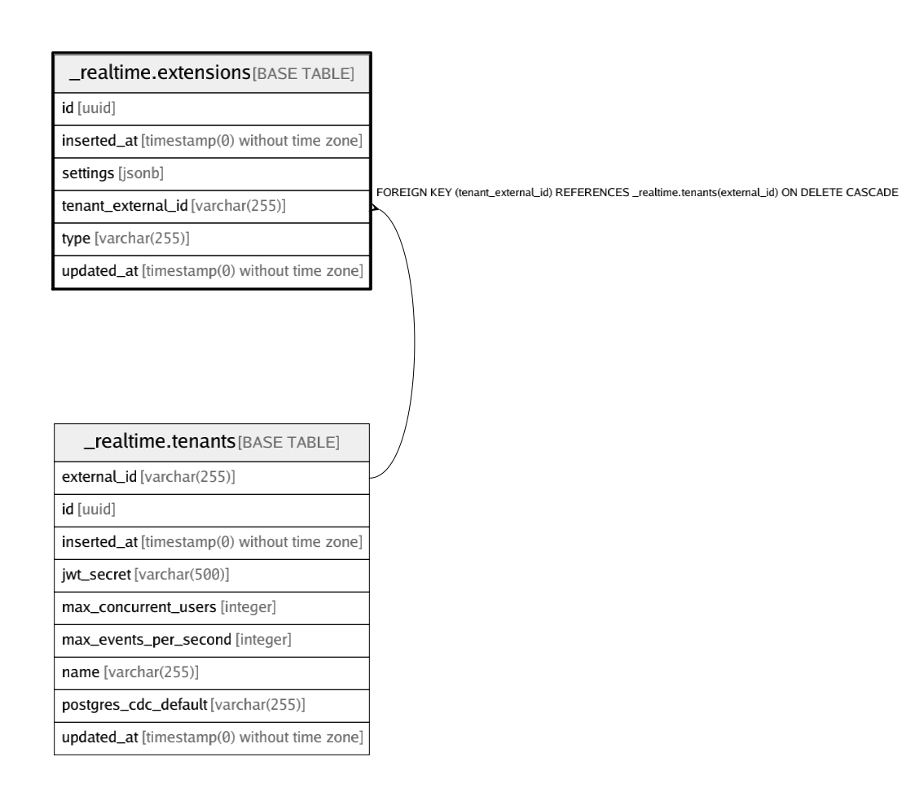

# _realtime.extensions

## Description

## Columns

| Name | Type | Default | Nullable | Children | Parents | Comment |
| ---- | ---- | ------- | -------- | -------- | ------- | ------- |
| id | uuid |  | false |  |  |  |
| inserted_at | timestamp(0) without time zone |  | false |  |  |  |
| settings | jsonb |  | true |  |  |  |
| tenant_external_id | varchar(255) |  | true |  | [_realtime.tenants](_realtime.tenants.md) |  |
| type | varchar(255) |  | true |  |  |  |
| updated_at | timestamp(0) without time zone |  | false |  |  |  |

## Constraints

| Name | Type | Definition |
| ---- | ---- | ---------- |
| extensions_pkey | PRIMARY KEY | PRIMARY KEY (id) |
| extensions_tenant_external_id_fkey | FOREIGN KEY | FOREIGN KEY (tenant_external_id) REFERENCES _realtime.tenants(external_id) ON DELETE CASCADE |

## Indexes

| Name | Definition |
| ---- | ---------- |
| extensions_pkey | CREATE UNIQUE INDEX extensions_pkey ON _realtime.extensions USING btree (id) |

## Relations

---

> Generated by [tbls](https://github.com/k1LoW/tbls)
