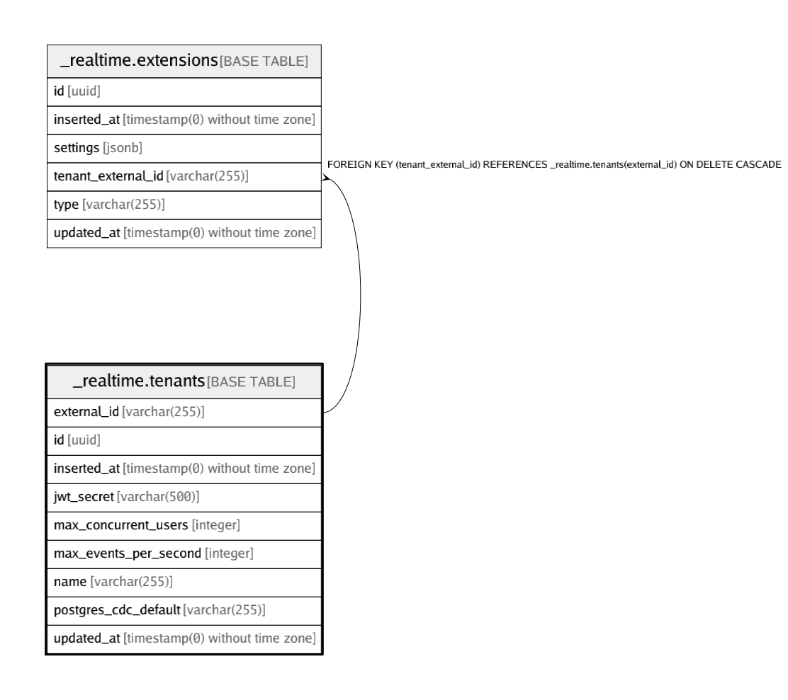

# _realtime.tenants

## Description

## Columns

| Name | Type | Default | Nullable | Children | Parents | Comment |
| ---- | ---- | ------- | -------- | -------- | ------- | ------- |
| external_id | varchar(255) |  | true | [_realtime.extensions](_realtime.extensions.md) |  |  |
| id | uuid |  | false |  |  |  |
| inserted_at | timestamp(0) without time zone |  | false |  |  |  |
| jwt_secret | varchar(500) |  | true |  |  |  |
| max_concurrent_users | integer | 200 | false |  |  |  |
| max_events_per_second | integer | 100 | false |  |  |  |
| name | varchar(255) |  | true |  |  |  |
| postgres_cdc_default | varchar(255) | 'postgres_cdc_rls'::character varying | true |  |  |  |
| updated_at | timestamp(0) without time zone |  | false |  |  |  |

## Constraints

| Name | Type | Definition |
| ---- | ---- | ---------- |
| tenants_external_id_key | UNIQUE | UNIQUE (external_id) |
| tenants_pkey | PRIMARY KEY | PRIMARY KEY (id) |

## Indexes

| Name | Definition |
| ---- | ---------- |
| tenants_external_id_key | CREATE UNIQUE INDEX tenants_external_id_key ON _realtime.tenants USING btree (external_id) |
| tenants_pkey | CREATE UNIQUE INDEX tenants_pkey ON _realtime.tenants USING btree (id) |

## Relations

---

> Generated by [tbls](https://github.com/k1LoW/tbls)
