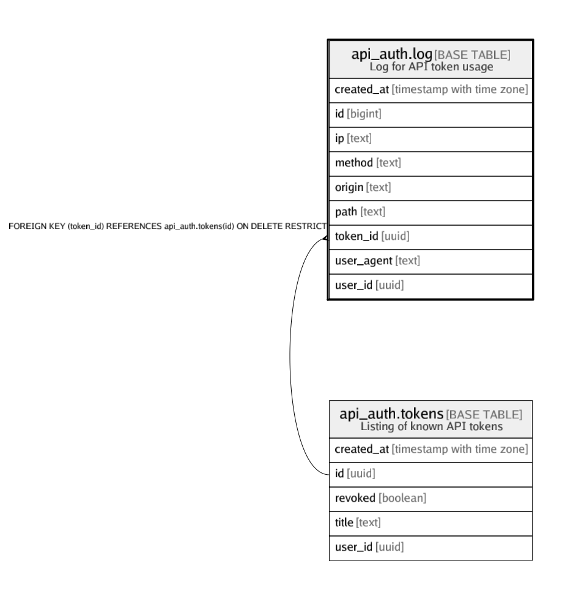

# api_auth.log

## Description

Log for API token usage

## Columns

| Name | Type | Default | Nullable | Children | Parents | Comment |
| ---- | ---- | ------- | -------- | -------- | ------- | ------- |
| created_at | timestamp with time zone | (now() AT TIME ZONE 'utc'::text) | false |  |  |  |
| id | bigint |  | false |  |  |  |
| ip | text | ((current_setting('request.headers'::text, true))::json ->> 'x_real_ip'::text) | true |  |  |  |
| method | text | current_setting('request.method'::text, true) | true |  |  |  |
| origin | text | ((current_setting('request.headers'::text, true))::json ->> 'origin'::text) | true |  |  |  |
| path | text | current_setting('request.path'::text, true) | true |  |  |  |
| token_id | uuid | api_auth.tid() | false |  | [api_auth.tokens](api_auth.tokens.md) |  |
| user_agent | text | ((current_setting('request.headers'::text, true))::json ->> 'user-agent'::text) | true |  |  |  |
| user_id | uuid | auth.uid() | false |  |  |  |

## Constraints

| Name | Type | Definition |
| ---- | ---- | ---------- |
| log_pkey | PRIMARY KEY | PRIMARY KEY (id) |
| log_token_id_fkey | FOREIGN KEY | FOREIGN KEY (token_id) REFERENCES api_auth.tokens(id) ON DELETE RESTRICT |

## Indexes

| Name | Definition |
| ---- | ---------- |
| log_pkey | CREATE UNIQUE INDEX log_pkey ON api_auth.log USING btree (id) |

## Relations

---

> Generated by [tbls](https://github.com/k1LoW/tbls)
