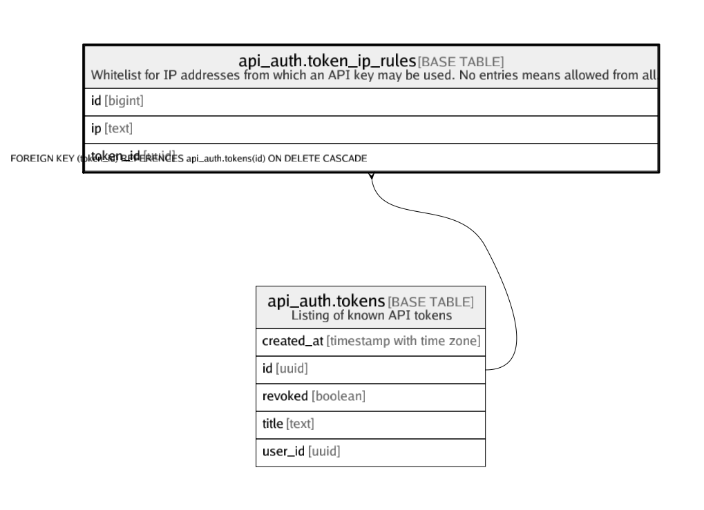

# api_auth.token_ip_rules

## Description

Whitelist for IP addresses from which an API key may be used. No entries means allowed from all.

## Columns

| Name | Type | Default | Nullable | Children | Parents | Comment |
| ---- | ---- | ------- | -------- | -------- | ------- | ------- |
| id | bigint |  | false |  |  |  |
| ip | text |  | false |  |  |  |
| token_id | uuid |  | false |  | [api_auth.tokens](api_auth.tokens.md) |  |

## Constraints

| Name | Type | Definition |
| ---- | ---- | ---------- |
| token_ip_rules_pkey | PRIMARY KEY | PRIMARY KEY (id) |
| token_ip_rules_token_id_fkey | FOREIGN KEY | FOREIGN KEY (token_id) REFERENCES api_auth.tokens(id) ON DELETE CASCADE |
| token_ip_rules_token_id_origin_uniq | UNIQUE | UNIQUE (token_id, ip) |

## Indexes

| Name | Definition |
| ---- | ---------- |
| token_ip_rules_pkey | CREATE UNIQUE INDEX token_ip_rules_pkey ON api_auth.token_ip_rules USING btree (id) |
| token_ip_rules_token_id_origin_uniq | CREATE UNIQUE INDEX token_ip_rules_token_id_origin_uniq ON api_auth.token_ip_rules USING btree (token_id, ip) |

## Relations

---

> Generated by [tbls](https://github.com/k1LoW/tbls)
