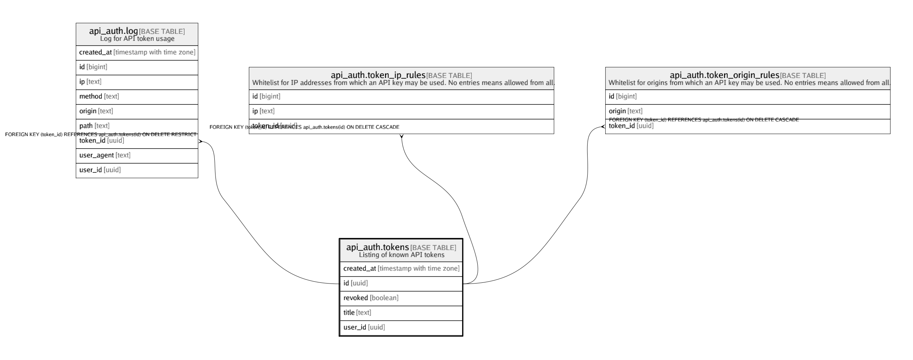

# api_auth.tokens

## Description

Listing of known API tokens

## Columns

| Name | Type | Default | Nullable | Children | Parents | Comment |
| ---- | ---- | ------- | -------- | -------- | ------- | ------- |
| created_at | timestamp with time zone | (now() AT TIME ZONE 'utc'::text) | false |  |  |  |
| id | uuid | gen_random_uuid() | false | [api_auth.log](api_auth.log.md) [api_auth.token_ip_rules](api_auth.token_ip_rules.md) [api_auth.token_origin_rules](api_auth.token_origin_rules.md) |  |  |
| revoked | boolean | false | false |  |  |  |
| title | text |  | false |  |  |  |
| user_id | uuid |  | false |  |  |  |

## Constraints

| Name | Type | Definition |
| ---- | ---- | ---------- |
| tokens_pkey | PRIMARY KEY | PRIMARY KEY (id) |

## Indexes

| Name | Definition |
| ---- | ---------- |
| tokens_pkey | CREATE UNIQUE INDEX tokens_pkey ON api_auth.tokens USING btree (id) |

## Relations

---

> Generated by [tbls](https://github.com/k1LoW/tbls)
