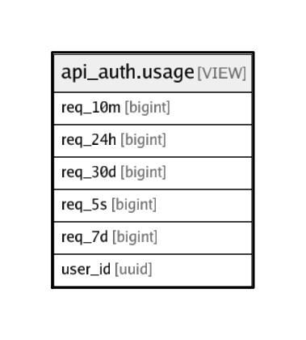

# api_auth.usage

## Description

<details>
<summary><strong>Table Definition</strong></summary>

```sql
CREATE VIEW usage AS (
 SELECT COALESCE(users.id, log.user_id) AS user_id,
    count(*) FILTER (WHERE (log.created_at >= (now() - '00:00:05'::interval))) AS req_5s,
    count(*) FILTER (WHERE (log.created_at >= (now() - '00:10:00'::interval))) AS req_10m,
    count(*) FILTER (WHERE (log.created_at >= (now() - '24:00:00'::interval))) AS req_24h,
    count(*) FILTER (WHERE (log.created_at >= (now() - '7 days'::interval))) AS req_7d,
    count(*) FILTER (WHERE (log.created_at >= (now() - '30 days'::interval))) AS req_30d
   FROM (auth.users
     FULL JOIN api_auth.log ON ((users.id = log.user_id)))
  GROUP BY users.id, log.user_id
)
```

</details>

## Referenced Tables

- [auth.users](auth.users.md)
- [api_auth.log](api_auth.log.md)

## Columns

| Name | Type | Default | Nullable | Children | Parents | Comment |
| ---- | ---- | ------- | -------- | -------- | ------- | ------- |
| req_10m | bigint |  | true |  |  |  |
| req_24h | bigint |  | true |  |  |  |
| req_30d | bigint |  | true |  |  |  |
| req_5s | bigint |  | true |  |  |  |
| req_7d | bigint |  | true |  |  |  |
| user_id | uuid |  | true |  |  |  |

## Relations



---

> Generated by [tbls](https://github.com/k1LoW/tbls)
