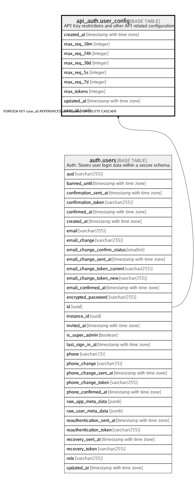

# api_auth.user_config

## Description

API Key restrictions and other API related configuration

## Columns

| Name | Type | Default | Nullable | Children | Parents | Comment |
| ---- | ---- | ------- | -------- | -------- | ------- | ------- |
| created_at | timestamp with time zone | (now() AT TIME ZONE 'utc'::text) | false |  |  |  |
| max_req_10m | integer | 900 | false |  |  |  |
| max_req_24h | integer | 43200 | false |  |  |  |
| max_req_30d | integer | 518400 | false |  |  |  |
| max_req_5s | integer | 20 | false |  |  |  |
| max_req_7d | integer | 151200 | false |  |  |  |
| max_tokens | integer | 10 | false |  |  |  |
| updated_at | timestamp with time zone | (now() AT TIME ZONE 'utc'::text) | false |  |  |  |
| user_id | uuid |  | false |  | [auth.users](auth.users.md) |  |

## Constraints

| Name | Type | Definition |
| ---- | ---- | ---------- |
| user_config_pkey | PRIMARY KEY | PRIMARY KEY (user_id) |
| user_config_user_id_fkey | FOREIGN KEY | FOREIGN KEY (user_id) REFERENCES auth.users(id) ON DELETE CASCADE |

## Indexes

| Name | Definition |
| ---- | ---------- |
| user_config_pkey | CREATE UNIQUE INDEX user_config_pkey ON api_auth.user_config USING btree (user_id) |

## Triggers

| Name | Definition |
| ---- | ---------- |
| api_auth_config_moddatetime | CREATE TRIGGER api_auth_config_moddatetime BEFORE UPDATE ON api_auth.user_config FOR EACH ROW EXECUTE FUNCTION moddatetime('updated_at') |

## Relations

---

> Generated by [tbls](https://github.com/k1LoW/tbls)
