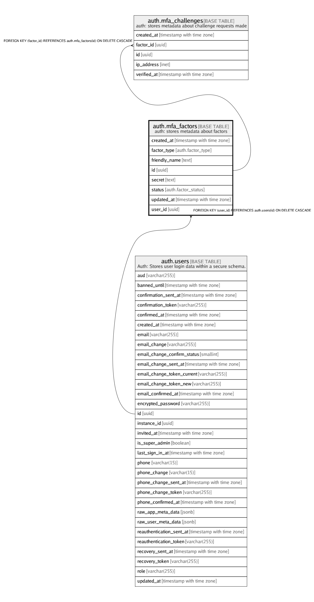

# auth.mfa_factors

## Description

auth: stores metadata about factors

## Columns

| Name | Type | Default | Nullable | Children | Parents | Comment |
| ---- | ---- | ------- | -------- | -------- | ------- | ------- |
| created_at | timestamp with time zone |  | false |  |  |  |
| factor_type | auth.factor_type |  | false |  |  |  |
| friendly_name | text |  | true |  |  |  |
| id | uuid |  | false | [auth.mfa_challenges](auth.mfa_challenges.md) |  |  |
| secret | text |  | true |  |  |  |
| status | auth.factor_status |  | false |  |  |  |
| updated_at | timestamp with time zone |  | false |  |  |  |
| user_id | uuid |  | false |  | [auth.users](auth.users.md) |  |

## Constraints

| Name | Type | Definition |
| ---- | ---- | ---------- |
| mfa_factors_pkey | PRIMARY KEY | PRIMARY KEY (id) |
| mfa_factors_user_id_fkey | FOREIGN KEY | FOREIGN KEY (user_id) REFERENCES auth.users(id) ON DELETE CASCADE |

## Indexes

| Name | Definition |
| ---- | ---------- |
| factor_id_created_at_idx | CREATE INDEX factor_id_created_at_idx ON auth.mfa_factors USING btree (user_id, created_at) |
| mfa_factors_pkey | CREATE UNIQUE INDEX mfa_factors_pkey ON auth.mfa_factors USING btree (id) |
| mfa_factors_user_friendly_name_unique | CREATE UNIQUE INDEX mfa_factors_user_friendly_name_unique ON auth.mfa_factors USING btree (friendly_name, user_id) WHERE (TRIM(BOTH FROM friendly_name) <> ''::text) |

## Relations

---

> Generated by [tbls](https://github.com/k1LoW/tbls)
