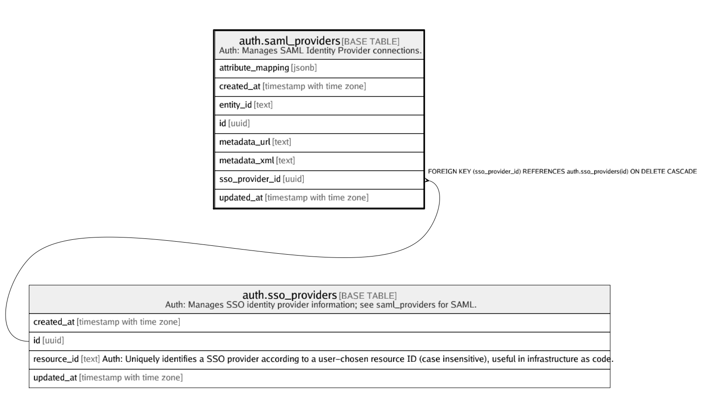

# auth.saml_providers

## Description

Auth: Manages SAML Identity Provider connections.

## Columns

| Name | Type | Default | Nullable | Children | Parents | Comment |
| ---- | ---- | ------- | -------- | -------- | ------- | ------- |
| attribute_mapping | jsonb |  | true |  |  |  |
| created_at | timestamp with time zone |  | true |  |  |  |
| entity_id | text |  | false |  |  |  |
| id | uuid |  | false |  |  |  |
| metadata_url | text |  | true |  |  |  |
| metadata_xml | text |  | false |  |  |  |
| sso_provider_id | uuid |  | false |  | [auth.sso_providers](auth.sso_providers.md) |  |
| updated_at | timestamp with time zone |  | true |  |  |  |

## Constraints

| Name | Type | Definition |
| ---- | ---- | ---------- |
| entity_id not empty | CHECK | CHECK ((char_length(entity_id) > 0)) |
| metadata_url not empty | CHECK | CHECK (((metadata_url = NULL::text) OR (char_length(metadata_url) > 0))) |
| metadata_xml not empty | CHECK | CHECK ((char_length(metadata_xml) > 0)) |
| saml_providers_entity_id_key | UNIQUE | UNIQUE (entity_id) |
| saml_providers_pkey | PRIMARY KEY | PRIMARY KEY (id) |
| saml_providers_sso_provider_id_fkey | FOREIGN KEY | FOREIGN KEY (sso_provider_id) REFERENCES auth.sso_providers(id) ON DELETE CASCADE |

## Indexes

| Name | Definition |
| ---- | ---------- |
| saml_providers_entity_id_key | CREATE UNIQUE INDEX saml_providers_entity_id_key ON auth.saml_providers USING btree (entity_id) |
| saml_providers_pkey | CREATE UNIQUE INDEX saml_providers_pkey ON auth.saml_providers USING btree (id) |
| saml_providers_sso_provider_id_idx | CREATE INDEX saml_providers_sso_provider_id_idx ON auth.saml_providers USING btree (sso_provider_id) |

## Relations

---

> Generated by [tbls](https://github.com/k1LoW/tbls)
