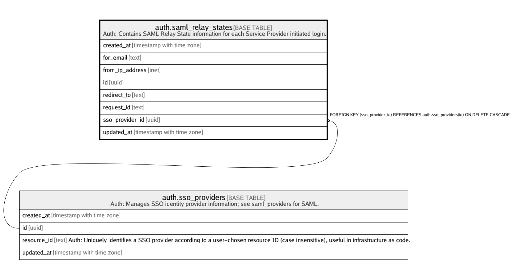

# auth.saml_relay_states

## Description

Auth: Contains SAML Relay State information for each Service Provider initiated login.

## Columns

| Name | Type | Default | Nullable | Children | Parents | Comment |
| ---- | ---- | ------- | -------- | -------- | ------- | ------- |
| created_at | timestamp with time zone |  | true |  |  |  |
| for_email | text |  | true |  |  |  |
| from_ip_address | inet |  | true |  |  |  |
| id | uuid |  | false |  |  |  |
| redirect_to | text |  | true |  |  |  |
| request_id | text |  | false |  |  |  |
| sso_provider_id | uuid |  | false |  | [auth.sso_providers](auth.sso_providers.md) |  |
| updated_at | timestamp with time zone |  | true |  |  |  |

## Constraints

| Name | Type | Definition |
| ---- | ---- | ---------- |
| request_id not empty | CHECK | CHECK ((char_length(request_id) > 0)) |
| saml_relay_states_pkey | PRIMARY KEY | PRIMARY KEY (id) |
| saml_relay_states_sso_provider_id_fkey | FOREIGN KEY | FOREIGN KEY (sso_provider_id) REFERENCES auth.sso_providers(id) ON DELETE CASCADE |

## Indexes

| Name | Definition |
| ---- | ---------- |
| saml_relay_states_for_email_idx | CREATE INDEX saml_relay_states_for_email_idx ON auth.saml_relay_states USING btree (for_email) |
| saml_relay_states_pkey | CREATE UNIQUE INDEX saml_relay_states_pkey ON auth.saml_relay_states USING btree (id) |
| saml_relay_states_sso_provider_id_idx | CREATE INDEX saml_relay_states_sso_provider_id_idx ON auth.saml_relay_states USING btree (sso_provider_id) |

## Relations

---

> Generated by [tbls](https://github.com/k1LoW/tbls)
