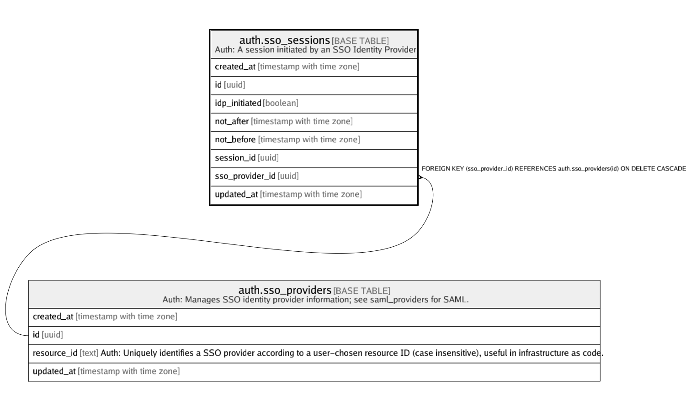

# auth.sso_sessions

## Description

Auth: A session initiated by an SSO Identity Provider

## Columns

| Name | Type | Default | Nullable | Children | Parents | Comment |
| ---- | ---- | ------- | -------- | -------- | ------- | ------- |
| created_at | timestamp with time zone |  | true |  |  |  |
| id | uuid |  | false |  |  |  |
| idp_initiated | boolean | false | true |  |  |  |
| not_after | timestamp with time zone |  | true |  |  |  |
| not_before | timestamp with time zone |  | true |  |  |  |
| session_id | uuid |  | false |  |  |  |
| sso_provider_id | uuid |  | true |  | [auth.sso_providers](auth.sso_providers.md) |  |
| updated_at | timestamp with time zone |  | true |  |  |  |

## Constraints

| Name | Type | Definition |
| ---- | ---- | ---------- |
| sso_sessions_pkey | PRIMARY KEY | PRIMARY KEY (id) |
| sso_sessions_session_id_fkey | FOREIGN KEY | FOREIGN KEY (session_id) REFERENCES auth.sessions(id) ON DELETE CASCADE |
| sso_sessions_sso_provider_id_fkey | FOREIGN KEY | FOREIGN KEY (sso_provider_id) REFERENCES auth.sso_providers(id) ON DELETE CASCADE |

## Indexes

| Name | Definition |
| ---- | ---------- |
| sso_sessions_pkey | CREATE UNIQUE INDEX sso_sessions_pkey ON auth.sso_sessions USING btree (id) |
| sso_sessions_session_id_idx | CREATE INDEX sso_sessions_session_id_idx ON auth.sso_sessions USING btree (session_id) |
| sso_sessions_sso_provider_id_idx | CREATE INDEX sso_sessions_sso_provider_id_idx ON auth.sso_sessions USING btree (sso_provider_id) |

## Relations

---

> Generated by [tbls](https://github.com/k1LoW/tbls)
