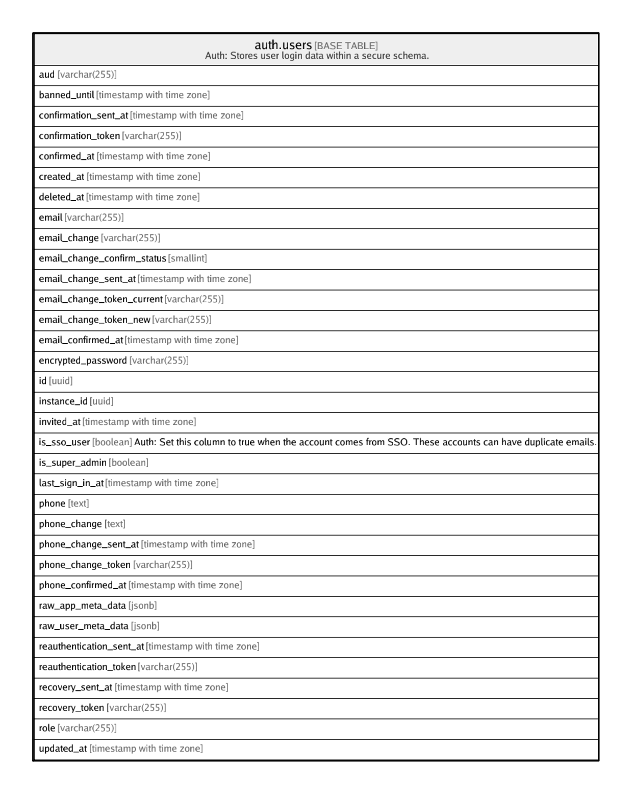

# auth.users

## Description

Auth: Stores user login data within a secure schema.

## Columns

| Name | Type | Default | Nullable | Extra Definition | Children | Parents | Comment |
| ---- | ---- | ------- | -------- | ---------------- | -------- | ------- | ------- |
| aud | varchar(255) |  | true |  |  |  |  |
| banned_until | timestamp with time zone |  | true |  |  |  |  |
| confirmation_sent_at | timestamp with time zone |  | true |  |  |  |  |
| confirmation_token | varchar(255) |  | true |  |  |  |  |
| confirmed_at | timestamp with time zone |  | true | GENERATED ALWAYS AS LEAST(email_confirmed_at, phone_confirmed_at) STORED |  |  |  |
| created_at | timestamp with time zone |  | true |  |  |  |  |
| deleted_at | timestamp with time zone |  | true |  |  |  |  |
| email | varchar(255) |  | true |  |  |  |  |
| email_change | varchar(255) |  | true |  |  |  |  |
| email_change_confirm_status | smallint | 0 | true |  |  |  |  |
| email_change_sent_at | timestamp with time zone |  | true |  |  |  |  |
| email_change_token_current | varchar(255) | ''::character varying | true |  |  |  |  |
| email_change_token_new | varchar(255) |  | true |  |  |  |  |
| email_confirmed_at | timestamp with time zone |  | true |  |  |  |  |
| encrypted_password | varchar(255) |  | true |  |  |  |  |
| id | uuid |  | false |  |  |  |  |
| instance_id | uuid |  | true |  |  |  |  |
| invited_at | timestamp with time zone |  | true |  |  |  |  |
| is_sso_user | boolean | false | false |  |  |  | Auth: Set this column to true when the account comes from SSO. These accounts can have duplicate emails. |
| is_super_admin | boolean |  | true |  |  |  |  |
| last_sign_in_at | timestamp with time zone |  | true |  |  |  |  |
| phone | text | NULL::character varying | true |  |  |  |  |
| phone_change | text | ''::character varying | true |  |  |  |  |
| phone_change_sent_at | timestamp with time zone |  | true |  |  |  |  |
| phone_change_token | varchar(255) | ''::character varying | true |  |  |  |  |
| phone_confirmed_at | timestamp with time zone |  | true |  |  |  |  |
| raw_app_meta_data | jsonb |  | true |  |  |  |  |
| raw_user_meta_data | jsonb |  | true |  |  |  |  |
| reauthentication_sent_at | timestamp with time zone |  | true |  |  |  |  |
| reauthentication_token | varchar(255) | ''::character varying | true |  |  |  |  |
| recovery_sent_at | timestamp with time zone |  | true |  |  |  |  |
| recovery_token | varchar(255) |  | true |  |  |  |  |
| role | varchar(255) |  | true |  |  |  |  |
| updated_at | timestamp with time zone |  | true |  |  |  |  |

## Constraints

| Name | Type | Definition |
| ---- | ---- | ---------- |
| users_email_change_confirm_status_check | CHECK | CHECK (((email_change_confirm_status >= 0) AND (email_change_confirm_status <= 2))) |
| users_phone_key | UNIQUE | UNIQUE (phone) |
| users_pkey | PRIMARY KEY | PRIMARY KEY (id) |

## Indexes

| Name | Definition | Comment |
| ---- | ---------- | ------- |
| confirmation_token_idx | CREATE UNIQUE INDEX confirmation_token_idx ON auth.users USING btree (confirmation_token) WHERE ((confirmation_token)::text !~ '^[0-9 ]*$'::text) |  |
| email_change_token_current_idx | CREATE UNIQUE INDEX email_change_token_current_idx ON auth.users USING btree (email_change_token_current) WHERE ((email_change_token_current)::text !~ '^[0-9 ]*$'::text) |  |
| email_change_token_new_idx | CREATE UNIQUE INDEX email_change_token_new_idx ON auth.users USING btree (email_change_token_new) WHERE ((email_change_token_new)::text !~ '^[0-9 ]*$'::text) |  |
| reauthentication_token_idx | CREATE UNIQUE INDEX reauthentication_token_idx ON auth.users USING btree (reauthentication_token) WHERE ((reauthentication_token)::text !~ '^[0-9 ]*$'::text) |  |
| recovery_token_idx | CREATE UNIQUE INDEX recovery_token_idx ON auth.users USING btree (recovery_token) WHERE ((recovery_token)::text !~ '^[0-9 ]*$'::text) |  |
| users_email_partial_key | CREATE UNIQUE INDEX users_email_partial_key ON auth.users USING btree (email) WHERE (is_sso_user = false) | Auth: A partial unique index that applies only when is_sso_user is false |
| users_instance_id_email_idx | CREATE INDEX users_instance_id_email_idx ON auth.users USING btree (instance_id, lower((email)::text)) |  |
| users_instance_id_idx | CREATE INDEX users_instance_id_idx ON auth.users USING btree (instance_id) |  |
| users_phone_key | CREATE UNIQUE INDEX users_phone_key ON auth.users USING btree (phone) |  |
| users_pkey | CREATE UNIQUE INDEX users_pkey ON auth.users USING btree (id) |  |

## Relations

---

> Generated by [tbls](https://github.com/k1LoW/tbls)
