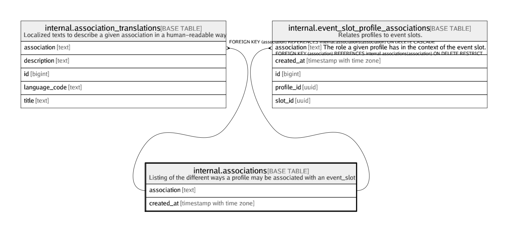

# internal.associations

## Description

Listing of the different ways a profile may be associated with an event_slot

## Columns

| Name | Type | Default | Nullable | Children | Parents | Comment |
| ---- | ---- | ------- | -------- | -------- | ------- | ------- |
| association | text |  | false | [internal.association_translations](internal.association_translations.md) [internal.event_slot_profile_associations](internal.event_slot_profile_associations.md) |  |  |
| created_at | timestamp with time zone | (now() AT TIME ZONE 'utc'::text) | false |  |  |  |

## Constraints

| Name | Type | Definition |
| ---- | ---- | ---------- |
| associations_association_check | CHECK | CHECK ((association = lower(association))) |
| associations_pkey | PRIMARY KEY | PRIMARY KEY (association) |

## Indexes

| Name | Definition |
| ---- | ---------- |
| associations_pkey | CREATE UNIQUE INDEX associations_pkey ON internal.associations USING btree (association) |

## Relations

---

> Generated by [tbls](https://github.com/k1LoW/tbls)
