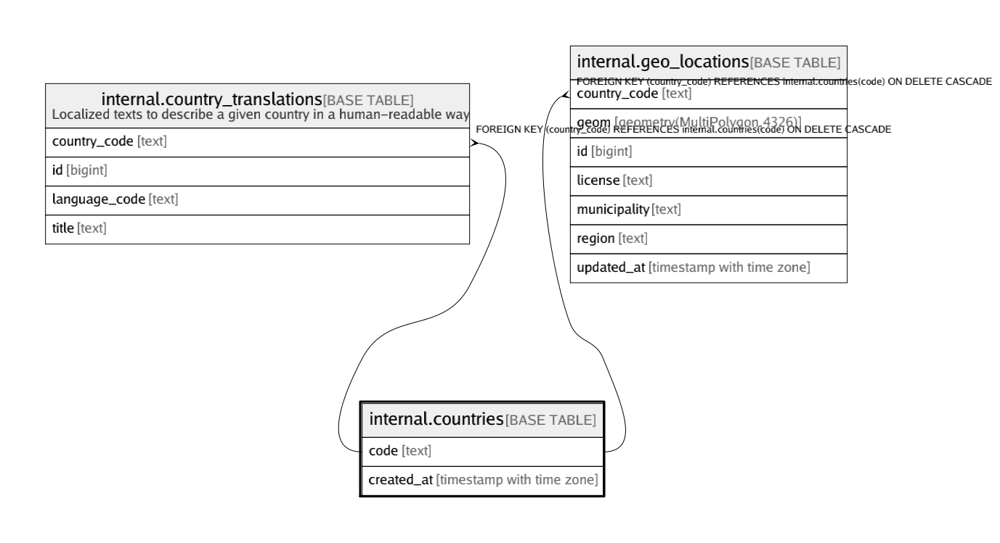

# internal.countries

## Description

## Columns

| Name | Type | Default | Nullable | Children | Parents | Comment |
| ---- | ---- | ------- | -------- | -------- | ------- | ------- |
| code | text |  | false | [internal.country_translations](internal.country_translations.md) [internal.geo_locations](internal.geo_locations.md) |  |  |
| created_at | timestamp with time zone | (now() AT TIME ZONE 'utc'::text) | false |  |  |  |

## Constraints

| Name | Type | Definition |
| ---- | ---- | ---------- |
| countries_code_check | CHECK | CHECK ((code = lower(code))) |
| countries_pkey | PRIMARY KEY | PRIMARY KEY (code) |

## Indexes

| Name | Definition |
| ---- | ---------- |
| countries_pkey | CREATE UNIQUE INDEX countries_pkey ON internal.countries USING btree (code) |

## Relations

---

> Generated by [tbls](https://github.com/k1LoW/tbls)
