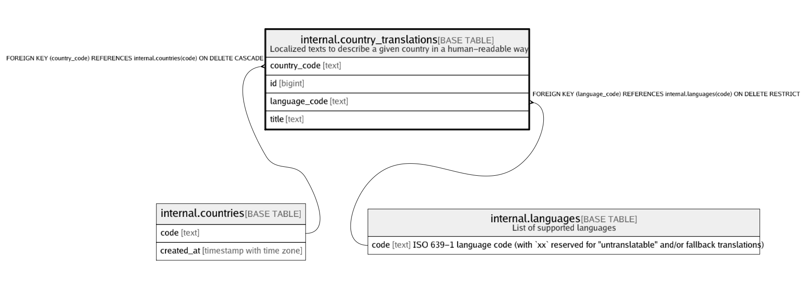

# internal.country_translations

## Description

Localized texts to describe a given country in a human-readable way

## Columns

| Name | Type | Default | Nullable | Children | Parents | Comment |
| ---- | ---- | ------- | -------- | -------- | ------- | ------- |
| country_code | text |  | false |  | [internal.countries](internal.countries.md) |  |
| id | bigint | nextval('internal.country_translations_id_seq'::regclass) | false |  |  |  |
| language_code | text |  | false |  | [internal.languages](internal.languages.md) |  |
| title | text |  | false |  |  |  |

## Constraints

| Name | Type | Definition |
| ---- | ---- | ---------- |
| country_translations_country_code_fkey | FOREIGN KEY | FOREIGN KEY (country_code) REFERENCES internal.countries(code) ON DELETE CASCADE |
| country_translations_country_code_language_code_key | UNIQUE | UNIQUE (country_code, language_code) |
| country_translations_language_code_fkey | FOREIGN KEY | FOREIGN KEY (language_code) REFERENCES internal.languages(code) ON DELETE RESTRICT |
| country_translations_pkey | PRIMARY KEY | PRIMARY KEY (id) |

## Indexes

| Name | Definition |
| ---- | ---------- |
| country_translations_country_code_language_code_key | CREATE UNIQUE INDEX country_translations_country_code_language_code_key ON internal.country_translations USING btree (country_code, language_code) |
| country_translations_pkey | CREATE UNIQUE INDEX country_translations_pkey ON internal.country_translations USING btree (id) |
| country_translations_title_gin_idx | CREATE INDEX country_translations_title_gin_idx ON internal.country_translations USING gin (title gin_trgm_ops) |

## Relations

---

> Generated by [tbls](https://github.com/k1LoW/tbls)
