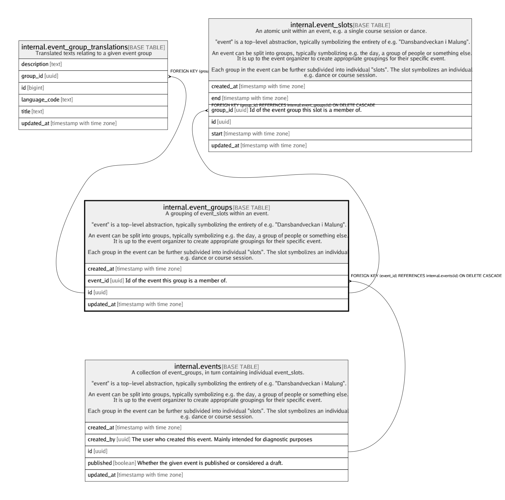

# internal.event_groups

## Description

A grouping of event_slots within an event.  
  
"event" is a top-level abstraction, typically symbolizing the entirety of e.g. "Dansbandveckan i Malung".  
  
An event can be split into groups, typically symbolizing e.g. the day, a group of people or something else.  
It is up to the event organizer to create appropriate groupings for their specific event.  
  
Each group in the event can be further subdivided into individual "slots". The slot symbolizes an individual  
e.g. dance or course session.

## Columns

| Name | Type | Default | Nullable | Children | Parents | Comment |
| ---- | ---- | ------- | -------- | -------- | ------- | ------- |
| created_at | timestamp with time zone | (now() AT TIME ZONE 'utc'::text) | false |  |  |  |
| event_id | uuid |  | false |  | [internal.events](internal.events.md) | Id of the event this group is a member of. |
| id | uuid | gen_random_uuid() | false | [internal.event_group_translations](internal.event_group_translations.md) [internal.event_slots](internal.event_slots.md) |  |  |
| updated_at | timestamp with time zone | (now() AT TIME ZONE 'utc'::text) | false |  |  |  |

## Constraints

| Name | Type | Definition |
| ---- | ---- | ---------- |
| event_groups_event_id_fkey | FOREIGN KEY | FOREIGN KEY (event_id) REFERENCES internal.events(id) ON DELETE CASCADE |
| event_groups_pkey | PRIMARY KEY | PRIMARY KEY (id) |

## Indexes

| Name | Definition |
| ---- | ---------- |
| event_groups_pkey | CREATE UNIQUE INDEX event_groups_pkey ON internal.event_groups USING btree (id) |

## Triggers

| Name | Definition |
| ---- | ---------- |
| internal_event_groups_moddatetime | CREATE TRIGGER internal_event_groups_moddatetime BEFORE UPDATE ON internal.event_groups FOR EACH ROW EXECUTE FUNCTION moddatetime('updated_at') |

## Relations

---

> Generated by [tbls](https://github.com/k1LoW/tbls)
