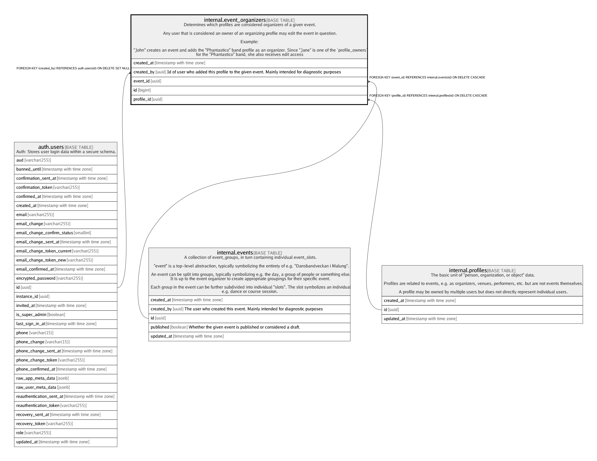

# internal.event_organizers

## Description

Determines which profiles are considered organizers of a given event.  
  
Any user that is considered an owner of an organizing profile may edit the event in question.  
  
Example:  
  
"John" creates an event and adds the "Phantastico" band profile as an organizer. Since "Jane" is one of the `profile_owners`  
for the "Phantastico" band, she also receives edit access

## Columns

| Name | Type | Default | Nullable | Children | Parents | Comment |
| ---- | ---- | ------- | -------- | -------- | ------- | ------- |
| created_at | timestamp with time zone | (now() AT TIME ZONE 'utc'::text) | false |  |  |  |
| created_by | uuid | auth.uid() | true |  | [auth.users](auth.users.md) | Id of user who added this profile to the given event. Mainly intended for diagnostic purposes |
| event_id | uuid |  | false |  | [internal.events](internal.events.md) |  |
| id | bigint | nextval('internal.event_organizers_id_seq'::regclass) | false |  |  |  |
| profile_id | uuid |  | false |  | [internal.profiles](internal.profiles.md) |  |

## Constraints

| Name | Type | Definition |
| ---- | ---- | ---------- |
| event_organizers_created_by_fkey | FOREIGN KEY | FOREIGN KEY (created_by) REFERENCES auth.users(id) ON DELETE SET NULL |
| event_organizers_event_id_fkey | FOREIGN KEY | FOREIGN KEY (event_id) REFERENCES internal.events(id) ON DELETE CASCADE |
| event_organizers_pkey | PRIMARY KEY | PRIMARY KEY (id) |
| event_organizers_profile_id_fkey | FOREIGN KEY | FOREIGN KEY (profile_id) REFERENCES internal.profiles(id) ON DELETE CASCADE |

## Indexes

| Name | Definition |
| ---- | ---------- |
| event_organizers_pkey | CREATE UNIQUE INDEX event_organizers_pkey ON internal.event_organizers USING btree (id) |

## Relations

---

> Generated by [tbls](https://github.com/k1LoW/tbls)
