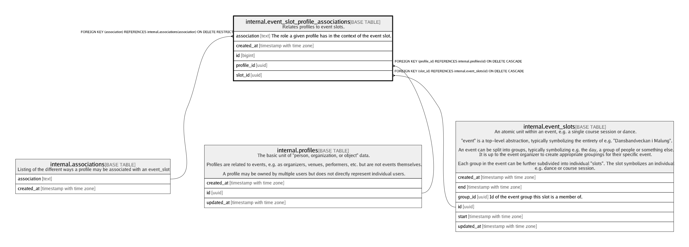

# internal.event_slot_profile_associations

## Description

Relates profiles to event slots.

## Columns

| Name | Type | Default | Nullable | Children | Parents | Comment |
| ---- | ---- | ------- | -------- | -------- | ------- | ------- |
| association | text |  | false |  | [internal.associations](internal.associations.md) | The role a given profile has in the context of the event slot. |
| created_at | timestamp with time zone | (now() AT TIME ZONE 'utc'::text) | false |  |  |  |
| id | bigint | nextval('internal.event_slot_profile_associations_id_seq'::regclass) | false |  |  |  |
| profile_id | uuid |  | false |  | [internal.profiles](internal.profiles.md) |  |
| slot_id | uuid |  | false |  | [internal.event_slots](internal.event_slots.md) |  |

## Constraints

| Name | Type | Definition |
| ---- | ---- | ---------- |
| event_slot_profile_associations_association_fkey | FOREIGN KEY | FOREIGN KEY (association) REFERENCES internal.associations(association) ON DELETE RESTRICT |
| event_slot_profile_associations_pkey | PRIMARY KEY | PRIMARY KEY (id) |
| event_slot_profile_associations_profile_id_fkey | FOREIGN KEY | FOREIGN KEY (profile_id) REFERENCES internal.profiles(id) ON DELETE CASCADE |
| event_slot_profile_associations_slot_id_fkey | FOREIGN KEY | FOREIGN KEY (slot_id) REFERENCES internal.event_slots(id) ON DELETE CASCADE |
| event_slot_profile_associations_slot_id_profile_id_association_ | UNIQUE | UNIQUE (slot_id, profile_id, association) |

## Indexes

| Name | Definition |
| ---- | ---------- |
| event_slot_profile_associations_pkey | CREATE UNIQUE INDEX event_slot_profile_associations_pkey ON internal.event_slot_profile_associations USING btree (id) |
| event_slot_profile_associations_slot_id_profile_id_association_ | CREATE UNIQUE INDEX event_slot_profile_associations_slot_id_profile_id_association_ ON internal.event_slot_profile_associations USING btree (slot_id, profile_id, association) |

## Relations

---

> Generated by [tbls](https://github.com/k1LoW/tbls)
