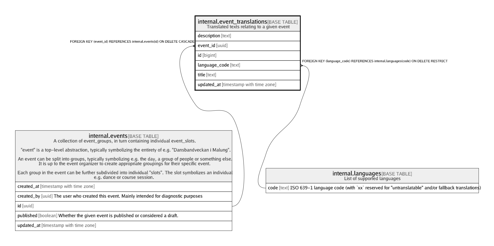

# internal.event_translations

## Description

Translated texts relating to a given event

## Columns

| Name | Type | Default | Nullable | Children | Parents | Comment |
| ---- | ---- | ------- | -------- | -------- | ------- | ------- |
| description | text | ''::text | false |  |  |  |
| event_id | uuid |  | false |  | [internal.events](internal.events.md) |  |
| id | bigint | nextval('internal.event_translations_id_seq'::regclass) | false |  |  |  |
| language_code | text |  | false |  | [internal.languages](internal.languages.md) |  |
| title | text |  | false |  |  |  |
| updated_at | timestamp with time zone | (now() AT TIME ZONE 'utc'::text) | false |  |  |  |

## Constraints

| Name | Type | Definition |
| ---- | ---- | ---------- |
| event_translations_event_id_fkey | FOREIGN KEY | FOREIGN KEY (event_id) REFERENCES internal.events(id) ON DELETE CASCADE |
| event_translations_event_id_language_code_key | UNIQUE | UNIQUE (event_id, language_code) |
| event_translations_language_code_fkey | FOREIGN KEY | FOREIGN KEY (language_code) REFERENCES internal.languages(code) ON DELETE RESTRICT |
| event_translations_pkey | PRIMARY KEY | PRIMARY KEY (id) |

## Indexes

| Name | Definition |
| ---- | ---------- |
| event_translations_event_id_language_code_key | CREATE UNIQUE INDEX event_translations_event_id_language_code_key ON internal.event_translations USING btree (event_id, language_code) |
| event_translations_pkey | CREATE UNIQUE INDEX event_translations_pkey ON internal.event_translations USING btree (id) |
| event_translations_title_gin_idx | CREATE INDEX event_translations_title_gin_idx ON internal.event_translations USING gin (title gin_trgm_ops) |

## Triggers

| Name | Definition |
| ---- | ---------- |
| internal_event_translations_moddatetime | CREATE TRIGGER internal_event_translations_moddatetime BEFORE UPDATE ON internal.event_translations FOR EACH ROW EXECUTE FUNCTION moddatetime('updated_at') |

## Relations

---

> Generated by [tbls](https://github.com/k1LoW/tbls)
