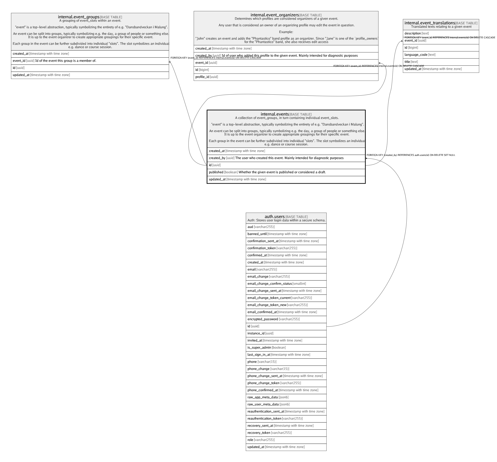

# internal.events

## Description

A collection of event_groups, in turn containing individual event_slots.  
  
"event" is a top-level abstraction, typically symbolizing the entirety of e.g. "Dansbandveckan i Malung".  
  
An event can be split into groups, typically symbolizing e.g. the day, a group of people or something else.  
It is up to the event organizer to create appropriate groupings for their specific event.  
  
Each group in the event can be further subdivided into individual "slots". The slot symbolizes an individual  
e.g. dance or course session.

## Columns

| Name | Type | Default | Nullable | Children | Parents | Comment |
| ---- | ---- | ------- | -------- | -------- | ------- | ------- |
| created_at | timestamp with time zone | (now() AT TIME ZONE 'utc'::text) | false |  |  |  |
| created_by | uuid | auth.uid() | true |  | [auth.users](auth.users.md) | The user who created this event. Mainly intended for diagnostic purposes |
| id | uuid | gen_random_uuid() | false | [internal.event_groups](internal.event_groups.md) [internal.event_organizers](internal.event_organizers.md) [internal.event_translations](internal.event_translations.md) |  |  |
| published | boolean | false | false |  |  | Whether the given event is published or considered a draft. |
| updated_at | timestamp with time zone | (now() AT TIME ZONE 'utc'::text) | false |  |  |  |

## Constraints

| Name | Type | Definition |
| ---- | ---- | ---------- |
| events_created_by_fkey | FOREIGN KEY | FOREIGN KEY (created_by) REFERENCES auth.users(id) ON DELETE SET NULL |
| events_pkey | PRIMARY KEY | PRIMARY KEY (id) |

## Indexes

| Name | Definition |
| ---- | ---------- |
| events_pkey | CREATE UNIQUE INDEX events_pkey ON internal.events USING btree (id) |

## Triggers

| Name | Definition |
| ---- | ---------- |
| internal_events_moddatetime | CREATE TRIGGER internal_events_moddatetime BEFORE UPDATE ON internal.events FOR EACH ROW EXECUTE FUNCTION moddatetime('updated_at') |

## Relations

---

> Generated by [tbls](https://github.com/k1LoW/tbls)
