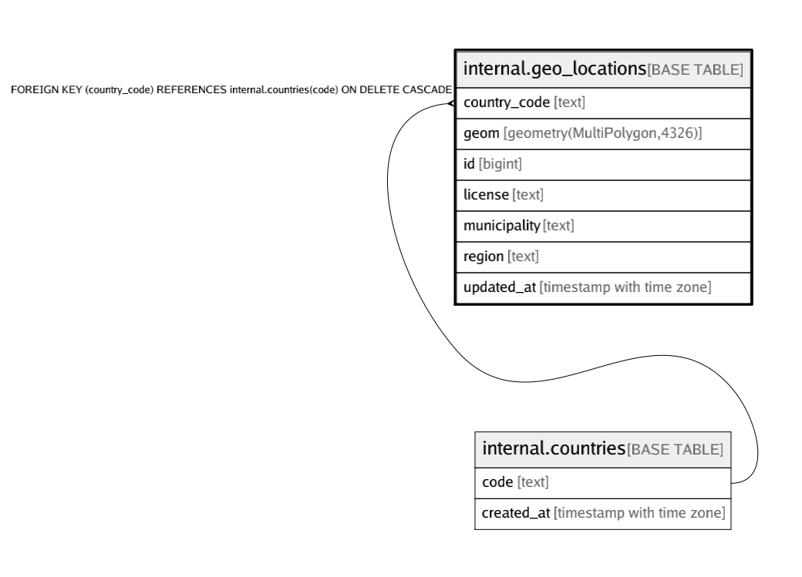

# internal.geo_locations

## Description

## Columns

| Name | Type | Default | Nullable | Children | Parents | Comment |
| ---- | ---- | ------- | -------- | -------- | ------- | ------- |
| country_code | text |  | false |  | [internal.countries](internal.countries.md) |  |
| geom | geometry(MultiPolygon,4326) |  | false |  |  |  |
| id | bigint | nextval('internal.geo_locations_id_seq'::regclass) | false |  |  |  |
| license | text |  | false |  |  |  |
| municipality | text |  | false |  |  |  |
| region | text |  | false |  |  |  |
| updated_at | timestamp with time zone | (now() AT TIME ZONE 'utc'::text) | false |  |  |  |

## Constraints

| Name | Type | Definition |
| ---- | ---- | ---------- |
| geo_locations_country_code_fkey | FOREIGN KEY | FOREIGN KEY (country_code) REFERENCES internal.countries(code) ON DELETE CASCADE |
| geo_locations_pkey | PRIMARY KEY | PRIMARY KEY (id) |

## Indexes

| Name | Definition |
| ---- | ---------- |
| geo_locations_geom_geom_idx | CREATE INDEX geo_locations_geom_geom_idx ON internal.geo_locations USING gist (geom) |
| geo_locations_pkey | CREATE UNIQUE INDEX geo_locations_pkey ON internal.geo_locations USING btree (id) |

## Triggers

| Name | Definition |
| ---- | ---------- |
| geo_locations_moddatetime | CREATE TRIGGER geo_locations_moddatetime BEFORE UPDATE ON internal.geo_locations FOR EACH ROW EXECUTE FUNCTION moddatetime('updated_at') |

## Relations

---

> Generated by [tbls](https://github.com/k1LoW/tbls)
