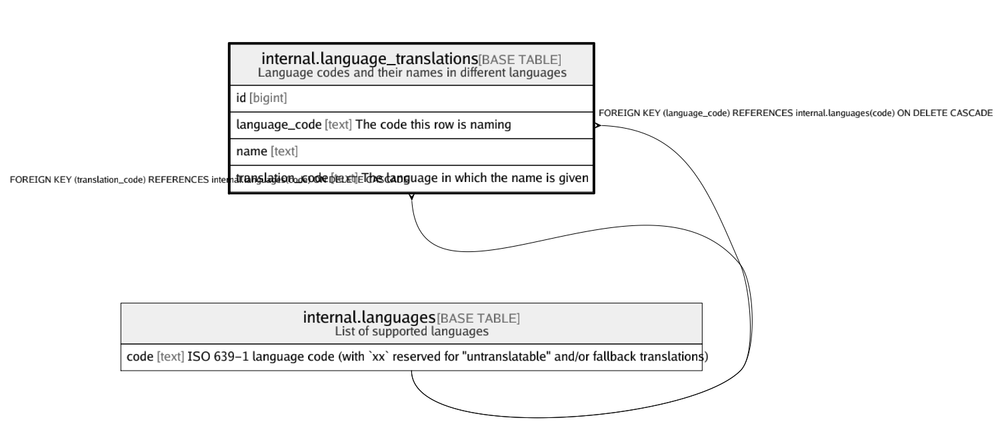

# internal.language_translations

## Description

Language codes and their names in different languages

## Columns

| Name | Type | Default | Nullable | Children | Parents | Comment |
| ---- | ---- | ------- | -------- | -------- | ------- | ------- |
| id | bigint | nextval('internal.language_translations_id_seq'::regclass) | false |  |  |  |
| language_code | text |  | false |  | [internal.languages](internal.languages.md) | The code this row is naming |
| name | text |  | false |  |  |  |
| translation_code | text |  | false |  | [internal.languages](internal.languages.md) | The language in which the name is given |

## Constraints

| Name | Type | Definition |
| ---- | ---- | ---------- |
| language_translations_language_code_fkey | FOREIGN KEY | FOREIGN KEY (language_code) REFERENCES internal.languages(code) ON DELETE CASCADE |
| language_translations_language_code_translation_code_key | UNIQUE | UNIQUE (language_code, translation_code) |
| language_translations_pkey | PRIMARY KEY | PRIMARY KEY (id) |
| language_translations_translation_code_fkey | FOREIGN KEY | FOREIGN KEY (translation_code) REFERENCES internal.languages(code) ON DELETE CASCADE |

## Indexes

| Name | Definition |
| ---- | ---------- |
| language_translations_language_code_translation_code_key | CREATE UNIQUE INDEX language_translations_language_code_translation_code_key ON internal.language_translations USING btree (language_code, translation_code) |
| language_translations_name_gin_idx | CREATE INDEX language_translations_name_gin_idx ON internal.language_translations USING gin (name gin_trgm_ops) |
| language_translations_pkey | CREATE UNIQUE INDEX language_translations_pkey ON internal.language_translations USING btree (id) |

## Relations

---

> Generated by [tbls](https://github.com/k1LoW/tbls)
