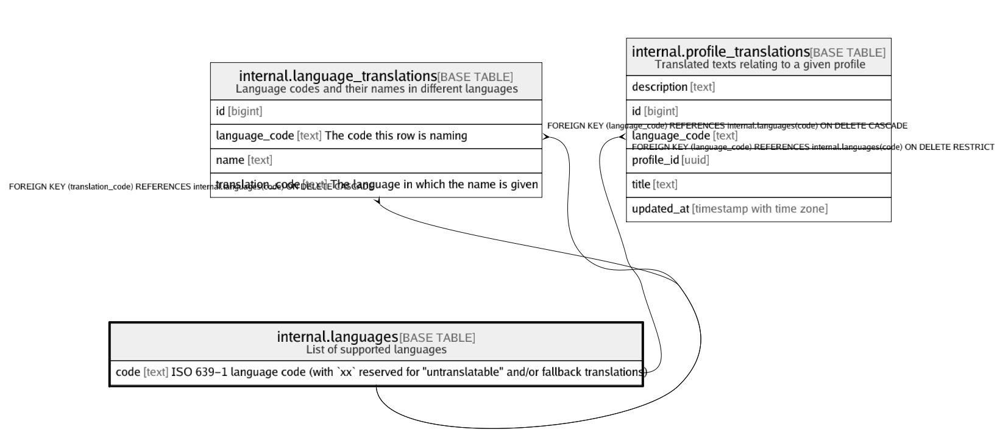

# internal.languages

## Description

List of supported languages

## Columns

| Name | Type | Default | Nullable | Children | Parents | Comment |
| ---- | ---- | ------- | -------- | -------- | ------- | ------- |
| code | text |  | false | [internal.language_translations](internal.language_translations.md) |  | ISO 639-1 language code (with `xx` reserved for "untranslatable" and/or fallback translations) |

## Constraints

| Name | Type | Definition |
| ---- | ---- | ---------- |
| languages_code_check | CHECK | CHECK ((code = lower(code))) |
| languages_pkey | PRIMARY KEY | PRIMARY KEY (code) |

## Indexes

| Name | Definition |
| ---- | ---------- |
| languages_pkey | CREATE UNIQUE INDEX languages_pkey ON internal.languages USING btree (code) |

## Relations

---

> Generated by [tbls](https://github.com/k1LoW/tbls)
