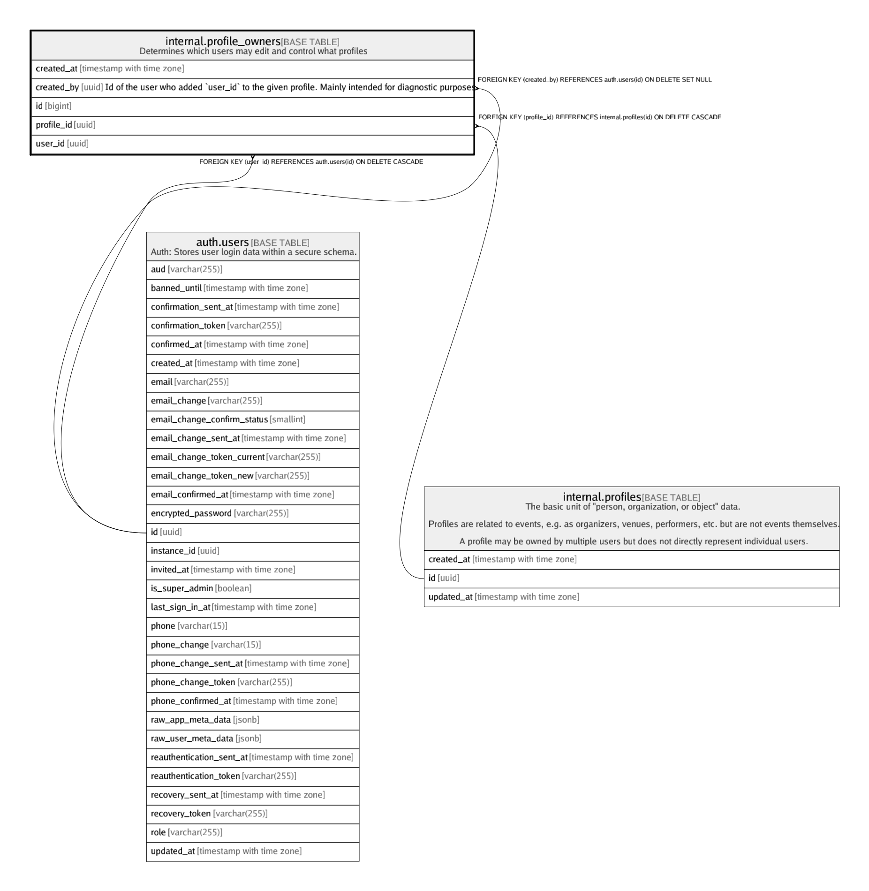

# internal.profile_owners

## Description

Determines which users may edit and control what profiles

## Columns

| Name | Type | Default | Nullable | Children | Parents | Comment |
| ---- | ---- | ------- | -------- | -------- | ------- | ------- |
| created_at | timestamp with time zone | (now() AT TIME ZONE 'utc'::text) | false |  |  |  |
| created_by | uuid | auth.uid() | true |  | [auth.users](auth.users.md) | Id of the user who added `user_id` to the given profile. Mainly intended for diagnostic purposes |
| id | bigint | nextval('internal.profile_owners_id_seq'::regclass) | false |  |  |  |
| profile_id | uuid |  | false |  | [internal.profiles](internal.profiles.md) |  |
| user_id | uuid |  | false |  | [auth.users](auth.users.md) |  |

## Constraints

| Name | Type | Definition |
| ---- | ---- | ---------- |
| profile_owners_check | CHECK | CHECK ((user_id <> created_by)) |
| profile_owners_created_by_fkey | FOREIGN KEY | FOREIGN KEY (created_by) REFERENCES auth.users(id) ON DELETE SET NULL |
| profile_owners_pkey | PRIMARY KEY | PRIMARY KEY (id) |
| profile_owners_profile_id_fkey | FOREIGN KEY | FOREIGN KEY (profile_id) REFERENCES internal.profiles(id) ON DELETE CASCADE |
| profile_owners_user_id_fkey | FOREIGN KEY | FOREIGN KEY (user_id) REFERENCES auth.users(id) ON DELETE CASCADE |
| profile_owners_user_id_profile_id_key | UNIQUE | UNIQUE (user_id, profile_id) |

## Indexes

| Name | Definition |
| ---- | ---------- |
| profile_owners_pkey | CREATE UNIQUE INDEX profile_owners_pkey ON internal.profile_owners USING btree (id) |
| profile_owners_user_id_profile_id_key | CREATE UNIQUE INDEX profile_owners_user_id_profile_id_key ON internal.profile_owners USING btree (user_id, profile_id) |

## Relations

---

> Generated by [tbls](https://github.com/k1LoW/tbls)
