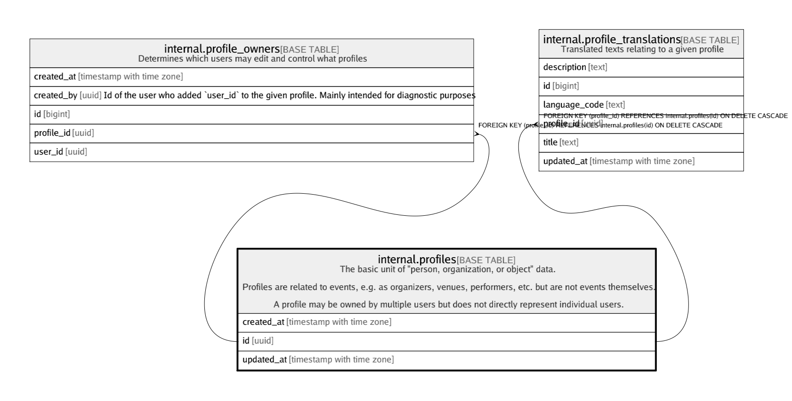

# internal.profiles

## Description

The basic unit of "person, organization, or object" data.  
  
Profiles are related to events, e.g. as organizers, venues, performers, etc. but are not events themselves.  
  
A profile may be owned by multiple users but does not directly represent individual users.

## Columns

| Name | Type | Default | Nullable | Children | Parents | Comment |
| ---- | ---- | ------- | -------- | -------- | ------- | ------- |
| created_at | timestamp with time zone | (now() AT TIME ZONE 'utc'::text) | false |  |  |  |
| id | uuid | gen_random_uuid() | false | [internal.event_organizers](internal.event_organizers.md) [internal.profile_owners](internal.profile_owners.md) [internal.profile_translations](internal.profile_translations.md) |  |  |
| updated_at | timestamp with time zone | (now() AT TIME ZONE 'utc'::text) | false |  |  |  |

## Constraints

| Name | Type | Definition |
| ---- | ---- | ---------- |
| profiles_pkey | PRIMARY KEY | PRIMARY KEY (id) |

## Indexes

| Name | Definition |
| ---- | ---------- |
| profiles_pkey | CREATE UNIQUE INDEX profiles_pkey ON internal.profiles USING btree (id) |

## Triggers

| Name | Definition |
| ---- | ---------- |
| internal_profiles_moddatetime | CREATE TRIGGER internal_profiles_moddatetime BEFORE UPDATE ON internal.profiles FOR EACH ROW EXECUTE FUNCTION moddatetime('updated_at') |

## Relations

---

> Generated by [tbls](https://github.com/k1LoW/tbls)
