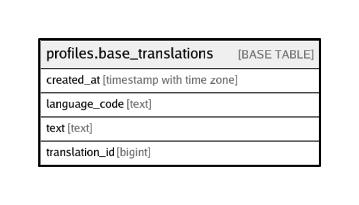

# profiles.base_translations

## Description

## Columns

| Name | Type | Default | Nullable | Children | Parents | Comment |
| ---- | ---- | ------- | -------- | -------- | ------- | ------- |
| created_at | timestamp with time zone | (now() AT TIME ZONE 'utc'::text) | false |  |  |  |
| language_code | text |  | false |  |  |  |
| text | text |  | false |  |  |  |
| translation_id | bigint | nextval('profiles.base_translations_translation_id_seq'::regclass) | false |  |  |  |

## Constraints

| Name | Type | Definition |
| ---- | ---- | ---------- |
| base_translations_language_code_check | CHECK | CHECK ((length(language_code) = 2)) |
| base_translations_pkey | PRIMARY KEY | PRIMARY KEY (translation_id) |
| base_translations_text_check | CHECK | CHECK (is_strlen(text, 1, 3000)) |

## Indexes

| Name | Definition |
| ---- | ---------- |
| base_translations_pkey | CREATE UNIQUE INDEX base_translations_pkey ON profiles.base_translations USING btree (translation_id) |

## Relations

---

> Generated by [tbls](https://github.com/k1LoW/tbls)
