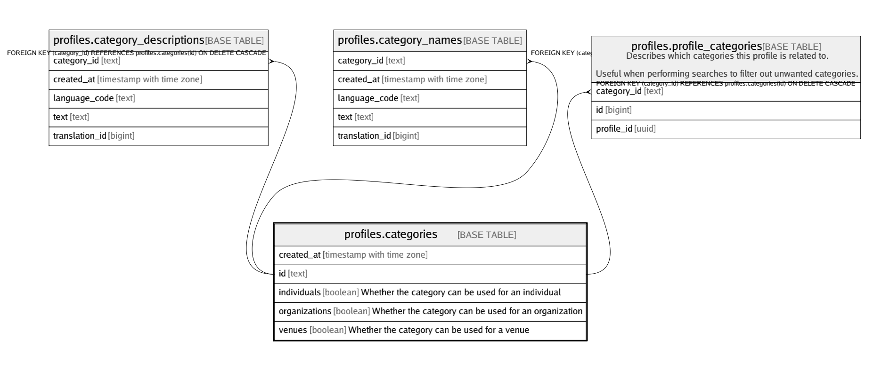

# profiles.categories

## Description

## Columns

| Name | Type | Default | Nullable | Children | Parents | Comment |
| ---- | ---- | ------- | -------- | -------- | ------- | ------- |
| created_at | timestamp with time zone | (now() AT TIME ZONE 'utc'::text) | false |  |  |  |
| id | text |  | false | [profiles.category_descriptions](profiles.category_descriptions.md) [profiles.category_names](profiles.category_names.md) [profiles.profile_categories](profiles.profile_categories.md) |  |  |
| individuals | boolean | false | false |  |  | Whether the category can be used for an individual |
| organizations | boolean | false | false |  |  | Whether the category can be used for an organization |
| venues | boolean | false | false |  |  | Whether the category can be used for a venue |

## Constraints

| Name | Type | Definition |
| ---- | ---- | ---------- |
| categories_id_check | CHECK | CHECK ((is_strlen(id, 1, 50) AND is_without_whitespace(id))) |
| categories_pkey | PRIMARY KEY | PRIMARY KEY (id) |

## Indexes

| Name | Definition |
| ---- | ---------- |
| categories_pkey | CREATE UNIQUE INDEX categories_pkey ON profiles.categories USING btree (id) |

## Relations

---

> Generated by [tbls](https://github.com/k1LoW/tbls)
