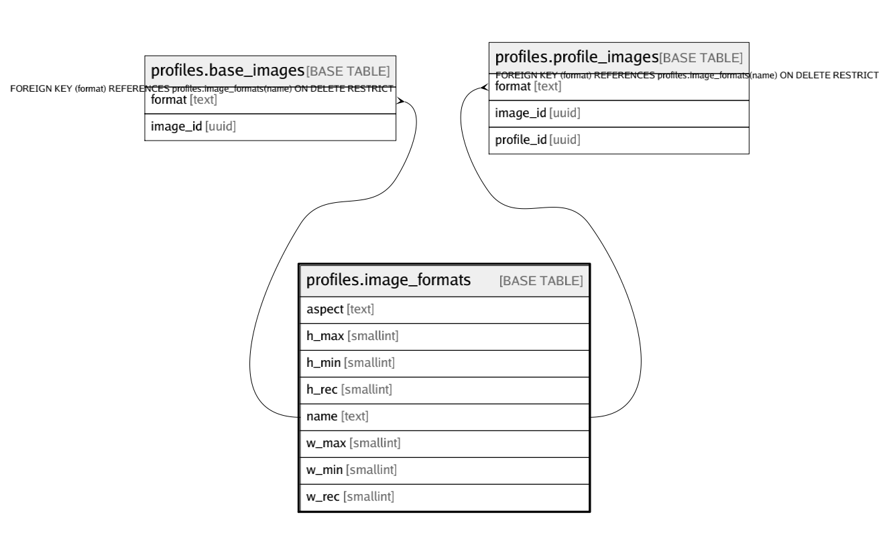

# profiles.image_formats

## Description

## Columns

| Name | Type | Default | Nullable | Children | Parents | Comment |
| ---- | ---- | ------- | -------- | -------- | ------- | ------- |
| aspect | text |  | false |  |  |  |
| h_max | smallint | '4096'::smallint | false |  |  |  |
| h_min | smallint | '150'::smallint | false |  |  |  |
| h_rec | smallint |  | false |  |  |  |
| name | text |  | false | [profiles.base_images](profiles.base_images.md) [profiles.profile_images](profiles.profile_images.md) |  |  |
| w_max | smallint | '4096'::smallint | false |  |  |  |
| w_min | smallint | '150'::smallint | false |  |  |  |
| w_rec | smallint |  | false |  |  |  |

## Constraints

| Name | Type | Definition |
| ---- | ---- | ---------- |
| image_formats_aspect_check | CHECK | CHECK ((aspect ~ '^\d+(?:\.\d+)?:\d+(?:\.\d+)?$'::text)) |
| image_formats_check | CHECK | CHECK (((w_rec < w_max) AND (w_rec >= w_min))) |
| image_formats_check1 | CHECK | CHECK (((h_rec < h_max) AND (h_rec >= h_min))) |
| image_formats_name_check | CHECK | CHECK ((is_strlen(name, 1, 50) AND is_without_whitespace(name))) |
| image_formats_pkey | PRIMARY KEY | PRIMARY KEY (name) |

## Indexes

| Name | Definition |
| ---- | ---------- |
| image_formats_pkey | CREATE UNIQUE INDEX image_formats_pkey ON profiles.image_formats USING btree (name) |

## Relations

---

> Generated by [tbls](https://github.com/k1LoW/tbls)
