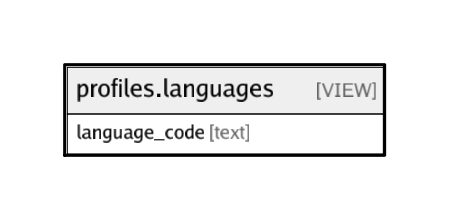

# profiles.languages

## Description

<details>
<summary><strong>Table Definition</strong></summary>

```sql
CREATE VIEW languages AS (
 SELECT DISTINCT base_translations.language_code
   FROM profiles.base_translations
)
```

</details>

## Referenced Tables

- [profiles.base_translations](profiles.base_translations.md)

## Columns

| Name | Type | Default | Nullable | Children | Parents | Comment |
| ---- | ---- | ------- | -------- | -------- | ------- | ------- |
| language_code | text |  | true |  |  |  |

## Relations



---

> Generated by [tbls](https://github.com/k1LoW/tbls)
