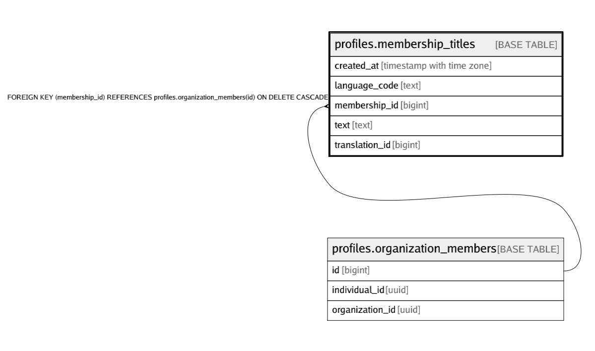

# profiles.membership_titles

## Description

## Columns

| Name | Type | Default | Nullable | Children | Parents | Comment |
| ---- | ---- | ------- | -------- | -------- | ------- | ------- |
| created_at | timestamp with time zone | (now() AT TIME ZONE 'utc'::text) | false |  |  |  |
| language_code | text |  | false |  |  |  |
| membership_id | bigint |  | false |  | [profiles.organization_members](profiles.organization_members.md) |  |
| text | text |  | false |  |  |  |
| translation_id | bigint | nextval('profiles.base_translations_translation_id_seq'::regclass) | false |  |  |  |

## Constraints

| Name | Type | Definition |
| ---- | ---- | ---------- |
| base_translations_language_code_check | CHECK | CHECK ((length(language_code) = 2)) |
| base_translations_text_check | CHECK | CHECK (is_strlen(text, 1, 3000)) |
| membership_titles_membership_id_fkey | FOREIGN KEY | FOREIGN KEY (membership_id) REFERENCES profiles.organization_members(id) ON DELETE CASCADE |
| membership_titles_membership_id_language_code_key | UNIQUE | UNIQUE (membership_id, language_code) |
| membership_titles_pkey | PRIMARY KEY | PRIMARY KEY (translation_id) |
| membership_titles_text_check | CHECK | CHECK ((is_strlen(text, 1, 50) AND is_singleline(text))) |

## Indexes

| Name | Definition |
| ---- | ---------- |
| membership_titles_membership_id_idx | CREATE INDEX membership_titles_membership_id_idx ON profiles.membership_titles USING btree (membership_id) |
| membership_titles_membership_id_language_code_key | CREATE UNIQUE INDEX membership_titles_membership_id_language_code_key ON profiles.membership_titles USING btree (membership_id, language_code) |
| membership_titles_pkey | CREATE UNIQUE INDEX membership_titles_pkey ON profiles.membership_titles USING btree (translation_id) |

## Relations

---

> Generated by [tbls](https://github.com/k1LoW/tbls)
