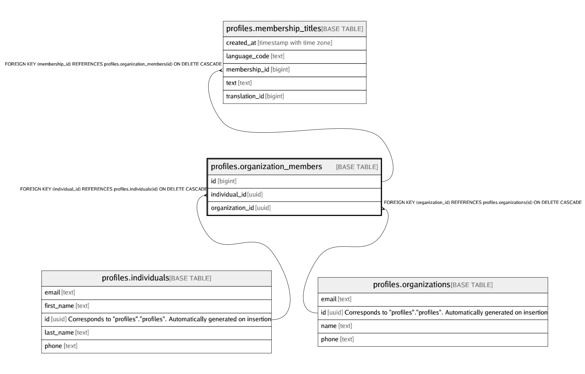

# profiles.organization_members

## Description

## Columns

| Name | Type | Default | Nullable | Children | Parents | Comment |
| ---- | ---- | ------- | -------- | -------- | ------- | ------- |
| id | bigint | nextval('profiles.organization_members_id_seq'::regclass) | false | [profiles.membership_titles](profiles.membership_titles.md) |  |  |
| individual_id | uuid |  | false |  | [profiles.individuals](profiles.individuals.md) |  |
| organization_id | uuid |  | false |  | [profiles.organizations](profiles.organizations.md) |  |

## Constraints

| Name | Type | Definition |
| ---- | ---- | ---------- |
| organization_members_individual_id_fkey | FOREIGN KEY | FOREIGN KEY (individual_id) REFERENCES profiles.individuals(id) ON DELETE CASCADE |
| organization_members_organization_id_fkey | FOREIGN KEY | FOREIGN KEY (organization_id) REFERENCES profiles.organizations(id) ON DELETE CASCADE |
| organization_members_organization_id_individual_id_key | UNIQUE | UNIQUE (organization_id, individual_id) |
| organization_members_pkey | PRIMARY KEY | PRIMARY KEY (id) |

## Indexes

| Name | Definition |
| ---- | ---------- |
| organization_members_individual_id_idx | CREATE INDEX organization_members_individual_id_idx ON profiles.organization_members USING btree (individual_id) |
| organization_members_organization_id_idx | CREATE INDEX organization_members_organization_id_idx ON profiles.organization_members USING btree (organization_id) |
| organization_members_organization_id_individual_id_key | CREATE UNIQUE INDEX organization_members_organization_id_individual_id_key ON profiles.organization_members USING btree (organization_id, individual_id) |
| organization_members_pkey | CREATE UNIQUE INDEX organization_members_pkey ON profiles.organization_members USING btree (id) |

## Relations

---

> Generated by [tbls](https://github.com/k1LoW/tbls)
