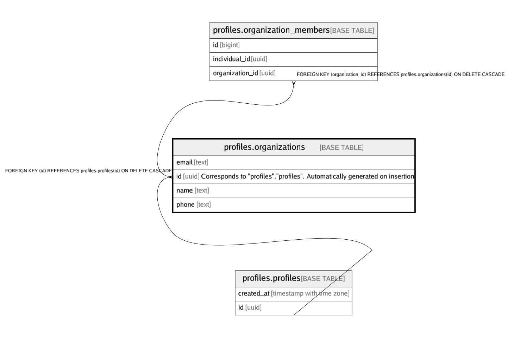

# profiles.organizations

## Description

## Columns

| Name | Type | Default | Nullable | Children | Parents | Comment |
| ---- | ---- | ------- | -------- | -------- | ------- | ------- |
| email | text |  | true |  |  |  |
| id | uuid |  | false | [profiles.organization_members](profiles.organization_members.md) | [profiles.profiles](profiles.profiles.md) | Corresponds to "profiles"."profiles". Automatically generated on insertion |
| name | text |  | false |  |  |  |
| phone | text |  | true |  |  |  |

## Constraints

| Name | Type | Definition |
| ---- | ---- | ---------- |
| organizations_email_check | CHECK | CHECK ((is_strlen(email, 3, 320) AND is_singleline(email))) |
| organizations_name_check | CHECK | CHECK ((is_strlen(name, 1, 50) AND is_singleline(name))) |
| organizations_phone_check | CHECK | CHECK ((is_strlen(phone, 5, 20) AND is_singleline(phone))) |
| organizations_pkey | PRIMARY KEY | PRIMARY KEY (id) |
| profile_organizations_id_fkey | FOREIGN KEY | FOREIGN KEY (id) REFERENCES profiles.profiles(id) ON DELETE CASCADE |

## Indexes

| Name | Definition |
| ---- | ---------- |
| organizations_pkey | CREATE UNIQUE INDEX organizations_pkey ON profiles.organizations USING btree (id) |

## Triggers

| Name | Definition |
| ---- | ---------- |
| profiles_organizations_create_associated_profile_trigger | CREATE TRIGGER profiles_organizations_create_associated_profile_trigger BEFORE INSERT ON profiles.organizations FOR EACH ROW EXECUTE FUNCTION profiles.create_associated_profile() |
| profiles_organizations_delete_associated_profile_trigger | CREATE TRIGGER profiles_organizations_delete_associated_profile_trigger AFTER DELETE ON profiles.organizations FOR EACH ROW EXECUTE FUNCTION profiles.delete_associated_profile() |

## Relations

---

> Generated by [tbls](https://github.com/k1LoW/tbls)
