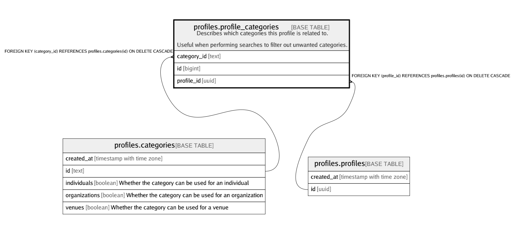

# profiles.profile_categories

## Description

Describes which categories this profile is related to.  
  
Useful when performing searches to filter out unwanted categories.

## Columns

| Name | Type | Default | Nullable | Children | Parents | Comment |
| ---- | ---- | ------- | -------- | -------- | ------- | ------- |
| category_id | text |  | false |  | [profiles.categories](profiles.categories.md) |  |
| id | bigint | nextval('profiles.profile_categories_id_seq'::regclass) | false |  |  |  |
| profile_id | uuid |  | false |  | [profiles.profiles](profiles.profiles.md) |  |

## Constraints

| Name | Type | Definition |
| ---- | ---- | ---------- |
| profile_categories_category_id_fkey | FOREIGN KEY | FOREIGN KEY (category_id) REFERENCES profiles.categories(id) ON DELETE CASCADE |
| profile_categories_pkey | PRIMARY KEY | PRIMARY KEY (id) |
| profile_categories_profile_id_category_id_key | UNIQUE | UNIQUE (profile_id, category_id) |
| profile_categories_profile_id_fkey | FOREIGN KEY | FOREIGN KEY (profile_id) REFERENCES profiles.profiles(id) ON DELETE CASCADE |

## Indexes

| Name | Definition |
| ---- | ---------- |
| profile_categories_category_id_idx | CREATE INDEX profile_categories_category_id_idx ON profiles.profile_categories USING btree (category_id) |
| profile_categories_pkey | CREATE UNIQUE INDEX profile_categories_pkey ON profiles.profile_categories USING btree (id) |
| profile_categories_profile_id_category_id_key | CREATE UNIQUE INDEX profile_categories_profile_id_category_id_key ON profiles.profile_categories USING btree (profile_id, category_id) |
| profile_categories_profile_id_idx | CREATE INDEX profile_categories_profile_id_idx ON profiles.profile_categories USING btree (profile_id) |

## Relations

---

> Generated by [tbls](https://github.com/k1LoW/tbls)
