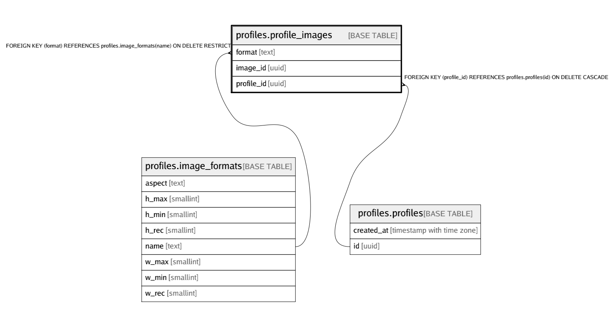

# profiles.profile_images

## Description

## Columns

| Name | Type | Default | Nullable | Children | Parents | Comment |
| ---- | ---- | ------- | -------- | -------- | ------- | ------- |
| format | text |  | false |  | [profiles.image_formats](profiles.image_formats.md) |  |
| image_id | uuid |  | false |  |  |  |
| profile_id | uuid |  | false |  | [profiles.profiles](profiles.profiles.md) |  |

## Constraints

| Name | Type | Definition |
| ---- | ---- | ---------- |
| profile_images_format_fkey | FOREIGN KEY | FOREIGN KEY (format) REFERENCES profiles.image_formats(name) ON DELETE RESTRICT |
| profile_images_id_fkey | FOREIGN KEY | FOREIGN KEY (image_id) REFERENCES storage.objects(id) ON DELETE CASCADE |
| profile_images_pkey | PRIMARY KEY | PRIMARY KEY (image_id) |
| profile_images_profile_id_fkey | FOREIGN KEY | FOREIGN KEY (profile_id) REFERENCES profiles.profiles(id) ON DELETE CASCADE |
| profile_images_profile_id_format_key | UNIQUE | UNIQUE (profile_id, format) |

## Indexes

| Name | Definition |
| ---- | ---------- |
| profile_images_pkey | CREATE UNIQUE INDEX profile_images_pkey ON profiles.profile_images USING btree (image_id) |
| profile_images_profile_id_format_key | CREATE UNIQUE INDEX profile_images_profile_id_format_key ON profiles.profile_images USING btree (profile_id, format) |
| profile_images_profile_id_idx | CREATE INDEX profile_images_profile_id_idx ON profiles.profile_images USING btree (profile_id) |

## Relations

---

> Generated by [tbls](https://github.com/k1LoW/tbls)
