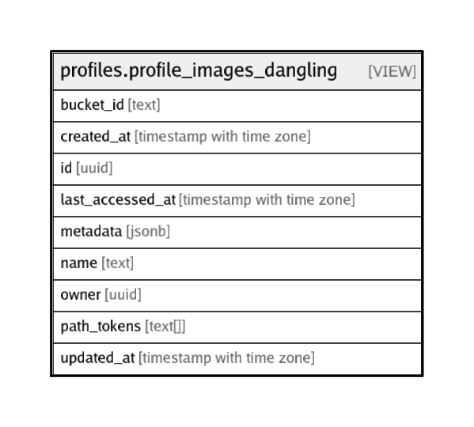

# profiles.profile_images_dangling

## Description

<details>
<summary><strong>Table Definition</strong></summary>

```sql
CREATE VIEW profile_images_dangling AS (
 SELECT objects.id,
    objects.bucket_id,
    objects.name,
    objects.owner,
    objects.created_at,
    objects.updated_at,
    objects.last_accessed_at,
    objects.metadata,
    objects.path_tokens
   FROM storage.objects
  WHERE ((objects.path_tokens[1] = 'profiles'::text) AND (NOT (EXISTS ( SELECT 1
           FROM profiles.profiles
          WHERE ((profiles.id)::text = objects.path_tokens[2])))))
)
```

</details>

## Referenced Tables

- [storage.objects](storage.objects.md)
- [profiles.profiles](profiles.profiles.md)

## Columns

| Name | Type | Default | Nullable | Children | Parents | Comment |
| ---- | ---- | ------- | -------- | -------- | ------- | ------- |
| bucket_id | text |  | true |  |  |  |
| created_at | timestamp with time zone |  | true |  |  |  |
| id | uuid |  | true |  |  |  |
| last_accessed_at | timestamp with time zone |  | true |  |  |  |
| metadata | jsonb |  | true |  |  |  |
| name | text |  | true |  |  |  |
| owner | uuid |  | true |  |  |  |
| path_tokens | text[] |  | true |  |  |  |
| updated_at | timestamp with time zone |  | true |  |  |  |

## Relations



---

> Generated by [tbls](https://github.com/k1LoW/tbls)
