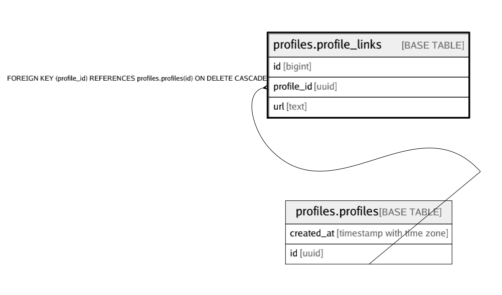

# profiles.profile_links

## Description

## Columns

| Name | Type | Default | Nullable | Children | Parents | Comment |
| ---- | ---- | ------- | -------- | -------- | ------- | ------- |
| id | bigint | nextval('profiles.profile_links_id_seq'::regclass) | false |  |  |  |
| profile_id | uuid |  | false |  | [profiles.profiles](profiles.profiles.md) |  |
| url | text |  | false |  |  |  |

## Constraints

| Name | Type | Definition |
| ---- | ---- | ---------- |
| profile_links_pkey | PRIMARY KEY | PRIMARY KEY (id) |
| profile_links_profile_id_fkey | FOREIGN KEY | FOREIGN KEY (profile_id) REFERENCES profiles.profiles(id) ON DELETE CASCADE |
| profile_links_profile_id_url_key | UNIQUE | UNIQUE (profile_id, url) |
| profile_links_url_check | CHECK | CHECK ((is_strlen(url, 10, 500) AND is_singleline(url) AND starts_with(url, 'http'::text))) |

## Indexes

| Name | Definition |
| ---- | ---------- |
| profile_links_pkey | CREATE UNIQUE INDEX profile_links_pkey ON profiles.profile_links USING btree (id) |
| profile_links_profile_id_idx | CREATE INDEX profile_links_profile_id_idx ON profiles.profile_links USING btree (profile_id) |
| profile_links_profile_id_url_key | CREATE UNIQUE INDEX profile_links_profile_id_url_key ON profiles.profile_links USING btree (profile_id, url) |

## Relations

---

> Generated by [tbls](https://github.com/k1LoW/tbls)
