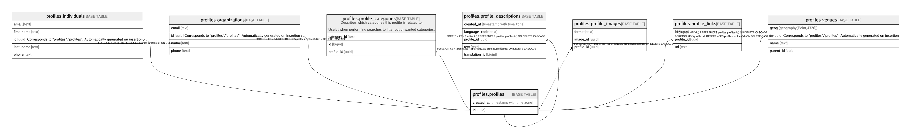

# profiles.profiles

## Description

## Columns

| Name | Type | Default | Nullable | Children | Parents | Comment |
| ---- | ---- | ------- | -------- | -------- | ------- | ------- |
| created_at | timestamp with time zone | (now() AT TIME ZONE 'utc'::text) | false |  |  |  |
| id | uuid | uuid_generate_v4() | false | [profiles.individuals](profiles.individuals.md) [profiles.organizations](profiles.organizations.md) [profiles.profile_categories](profiles.profile_categories.md) [profiles.profile_descriptions](profiles.profile_descriptions.md) [profiles.profile_images](profiles.profile_images.md) [profiles.profile_links](profiles.profile_links.md) [profiles.venues](profiles.venues.md) |  |  |

## Constraints

| Name | Type | Definition |
| ---- | ---- | ---------- |
| profiles_pkey | PRIMARY KEY | PRIMARY KEY (id) |

## Indexes

| Name | Definition |
| ---- | ---------- |
| profiles_pkey | CREATE UNIQUE INDEX profiles_pkey ON profiles.profiles USING btree (id) |

## Relations

---

> Generated by [tbls](https://github.com/k1LoW/tbls)
