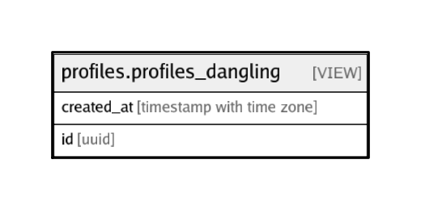

# profiles.profiles_dangling

## Description

<details>
<summary><strong>Table Definition</strong></summary>

```sql
CREATE VIEW profiles_dangling AS (
 SELECT p.id,
    p.created_at
   FROM profiles.profiles p
  WHERE ((NOT (EXISTS ( SELECT 1
           FROM profiles.organizations po
          WHERE (p.id = po.id)))) AND (NOT (EXISTS ( SELECT 1
           FROM profiles.individuals pi
          WHERE (p.id = pi.id)))) AND (NOT (EXISTS ( SELECT 1
           FROM profiles.venues pv
          WHERE (p.id = pv.id)))))
)
```

</details>

## Referenced Tables

- [profiles.profiles](profiles.profiles.md)
- [profiles.organizations](profiles.organizations.md)
- [profiles.individuals](profiles.individuals.md)
- [profiles.venues](profiles.venues.md)

## Columns

| Name | Type | Default | Nullable | Children | Parents | Comment |
| ---- | ---- | ------- | -------- | -------- | ------- | ------- |
| created_at | timestamp with time zone |  | true |  |  |  |
| id | uuid |  | true |  |  |  |

## Relations



---

> Generated by [tbls](https://github.com/k1LoW/tbls)
