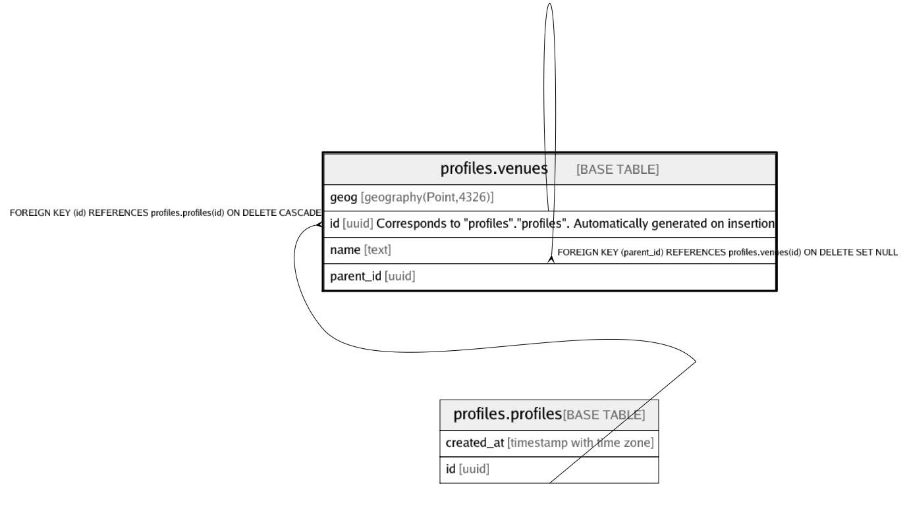

# profiles.venues

## Description

## Columns

| Name | Type | Default | Nullable | Children | Parents | Comment |
| ---- | ---- | ------- | -------- | -------- | ------- | ------- |
| geog | geography(Point,4326) |  | false |  |  |  |
| id | uuid |  | false | [profiles.venues](profiles.venues.md) | [profiles.profiles](profiles.profiles.md) | Corresponds to "profiles"."profiles". Automatically generated on insertion |
| name | text |  | false |  |  |  |
| parent_id | uuid |  | true |  | [profiles.venues](profiles.venues.md) |  |

## Constraints

| Name | Type | Definition |
| ---- | ---- | ---------- |
| profile_venues_id_fkey | FOREIGN KEY | FOREIGN KEY (id) REFERENCES profiles.profiles(id) ON DELETE CASCADE |
| venues_name_check | CHECK | CHECK ((is_strlen(name, 1, 50) AND is_singleline(name))) |
| venues_parent_id_fkey | FOREIGN KEY | FOREIGN KEY (parent_id) REFERENCES profiles.venues(id) ON DELETE SET NULL |
| venues_pkey | PRIMARY KEY | PRIMARY KEY (id) |

## Indexes

| Name | Definition |
| ---- | ---------- |
| venues_geog_gix | CREATE INDEX venues_geog_gix ON profiles.venues USING gist (geog) |
| venues_pkey | CREATE UNIQUE INDEX venues_pkey ON profiles.venues USING btree (id) |

## Triggers

| Name | Definition |
| ---- | ---------- |
| profiles_venues_create_trigger | CREATE TRIGGER profiles_venues_create_trigger BEFORE INSERT ON profiles.venues FOR EACH ROW EXECUTE FUNCTION profiles.create_associated_profile() |
| profiles_venues_delete_associated_profile_trigger | CREATE TRIGGER profiles_venues_delete_associated_profile_trigger AFTER DELETE ON profiles.venues FOR EACH ROW EXECUTE FUNCTION profiles.delete_associated_profile() |

## Relations

---

> Generated by [tbls](https://github.com/k1LoW/tbls)
